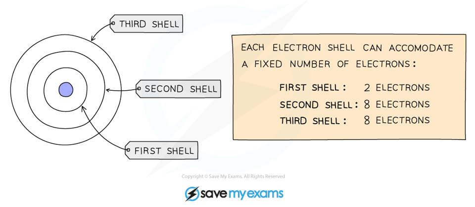
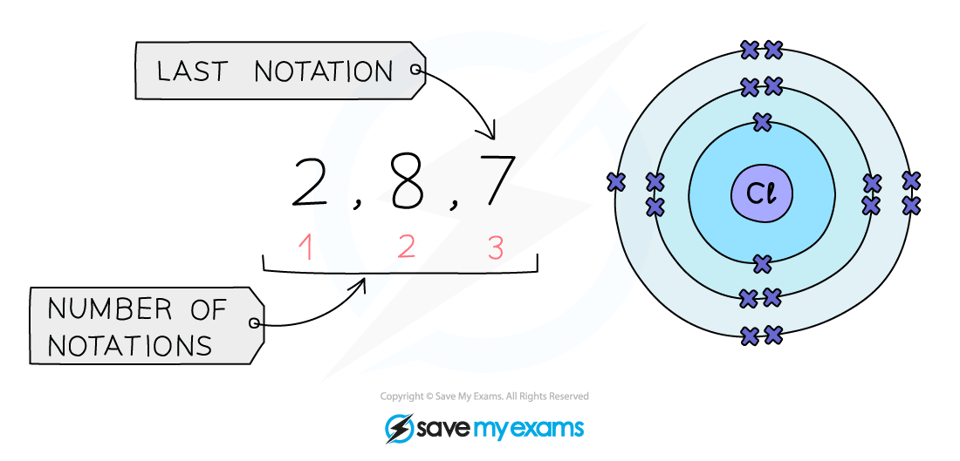
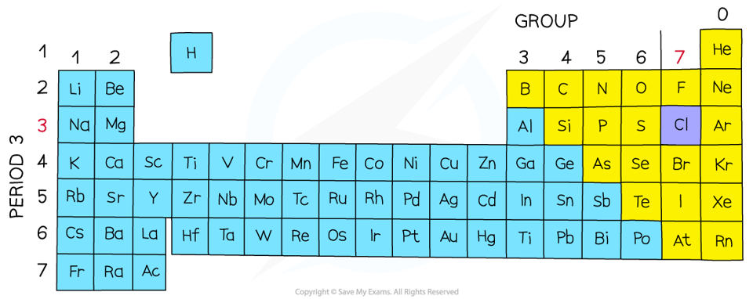

# Electronic Configurations

## Deducing Electronic Configurations

> **Spec point** — `spcpt_D3CvgSZXCYQNCmJb` · understand how to deduce the electronic configurations of the first 20 elements from their positions in the Periodic Table

## Electronic configuration of the first 20 elements

- We can represent the structure of the atom in two ways: using diagrams called **electron** **shell** **diagrams** or by writing out a special notation called the **electronic** **configuration **(or electronic structure or electron distribution)
- Electrons orbit the nucleus in **shells** (or **energy** **levels**) and each shell has a different amount of energy associated with it
- The further away from the nucleus, the more energy a shell has
- Electrons fill the shell closest to the nucleus
- When a shell becomes full of electrons, additional electrons have to be added to the next shell

  - The first shell can hold 2 electrons
  - The second shell can hold 8 electrons
  - For this course, a simplified model is used that suggests that the third shell can hold 8 electrons
  - For the first 20 elements, once the third shell has 8 electrons, the fourth shell begins to fill

#### Electron shell diagram

***A simplified model showing the electron shells***

- The arrangement of electrons in shells can also be explained using numbers
- Instead of drawing electron shell diagrams, the number of electrons in each electron shell can be written down, separated by commas
- This notation is called the electronic configuration (or electronic structure)

  - The electronic structure of carbon is 6 electrons, 2 in the 1st shell and 4 in the 2nd shell
  
    - So its electronic configuration is 2,4
- Electronic configurations can also be written for ions

  - E.g. A sodium atom has 11 electrons, a sodium ion has lost one electron, therefore has 10 electrons; 2 in the first shell and 8 in the 2nd shell
  
    - Its electronic configuration is 2,8
- You should be able to write the electron configuration for the first twenty elements

#### Electronic configurations of the first 20 elements

| **Element** | **Atomic Number ** | **Electronic Configuration** |
|---|---|---|
| hydrogen | 1 | 1 |
| helium | 2 | 2 |
| lithium | 3 | 2,1 |
| beryllium | 4 | 2,2 |
| boron | 5 | 2,3 |
| carbon | 6 | 2,4 |
| nitrogen | 7 | 2,5 |
| oxygen | 8 | 2,6 |
| fluorine | 9 | 2,7 |
| neon | 10 | 2,8 |
| sodium | 11 | 2,8,1 |
| magnesium | 12 | 2,8,2 |
| aluminium | 13 | 2,8,3 |
| silicon | 14 | 2,8,4 |
| phosphorus | 15 | 2,8,5 |
| sulfur | 16 | 2,8,6 |
| chlorine | 17 | 2,8,7 |
| argon | 18 | 2,8,8 |
| potassium | 19 | 2,8,8,1 |
| calcium | 20 | 2,8,8,2 |

**Note: **Although the third shell can hold up to 18 electrons, the filling of the shells follows a more complicated pattern after potassium and calcium. For these two elements, the third shell holds 8 and the remaining electrons (for reasons of stability) occupy the fourth shell first before filling the third shell

> **Exam Hint**
> You should be able to represent the first 20 elements using either electron shell diagrams or written electronic configuration.

## Electronic Configurations & the Periodic Table

> **Spec point** — `spcpt_3BFPwSVNF8yHMMRY` · understand how the electronic configuration of a main group element is related to its position in the Periodic Table

## Electronic configurations and the periodic table

- There is a clear relationship between the electronic configuration and how the Periodic Table is designed
- The number of notations in the electronic configuration tells us the number of occupied shells

  - This tells us what **period** an element is in
- The last notation shows the number of outer electrons the atom has

  - This tells us the **group** an element is in
- Elements in the same group have the same number of outer shell electrons

#### The relationship between the electronic configurations and periodic table

***The electronic configuration for chlorine***

- **Period: **The red numbers at the bottom show the number of notations

  - The number of notations is 3
  - Therefore chlorine has 3 occupied shells
- **Group: **The last notation, in this case 7

  - This means that chlorine has 7 electrons in its outer shell
  - Chlorine is therefore in Group 7

#### The position of chlorine on the periodic table

***Chlorine is in Group 7, Period 3***

> **Exam Hint**
> The group number will be labelled on the Periodic Table you are given in your exam, but the period number isn't so it is a good idea to write this on yourself at the beginning.
