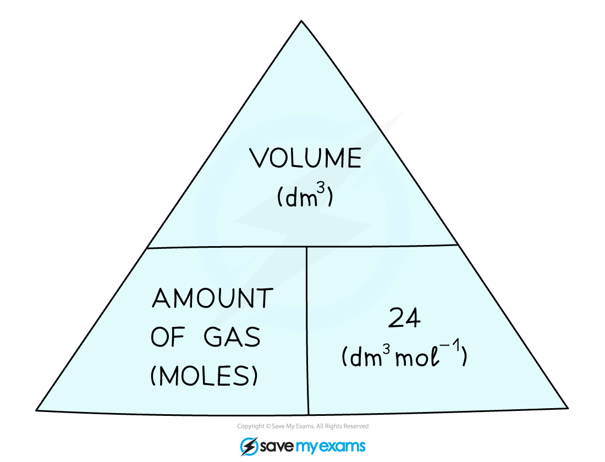
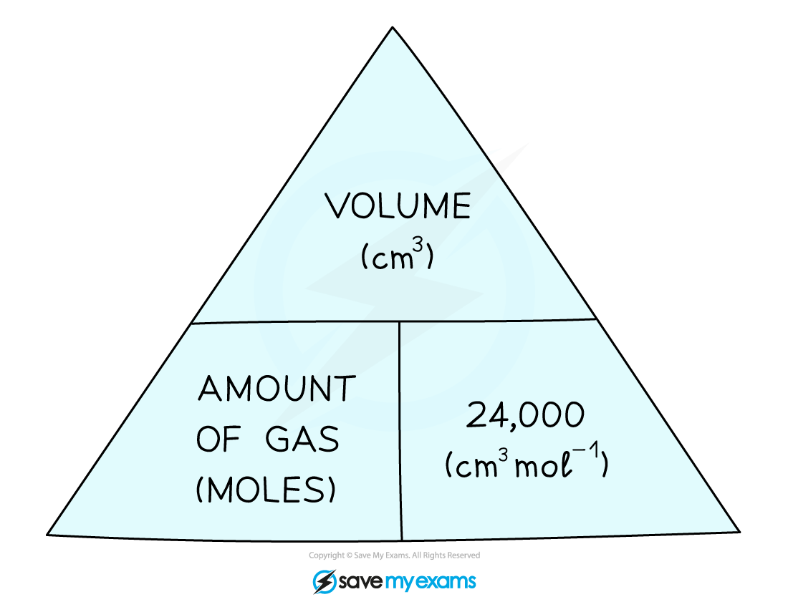

# Calculate Volumes of Gases

## Calculate Volumes of Gases

> **Spec point** — `spcpt_mB9r4d573JhNMXV3` · understand how to carry out calculations involving gas volumes and the molar volume of a gas (24 dm3 and 24 000 cm3 at room temperature and pressure (rtp))

## Calculate Volumes of Gases

#### Avogadro's Law

- **Avogadro’s Law** states that at the same conditions of **temperature** and **pressure**, equal amounts of gases occupy the **same volume** of space
- At room temperature and pressure, the volume occupied by one mole of any gas was found to be **24** dm3 or** 24,000** cm3
- This is known as the **molar gas volume at RTP**
- RTP stands for “room temperature and pressure” and the conditions are **20 ºC** and **1 atmosphere** (atm)
- From the molar gas volume the following formula triangle can be derived:

***Formula triangle showing the relationship between moles of gas, volume in dm******3****** and the molar volume***

- If the volume is given in cm3 instead of dm3, then divide by 24,000 instead of 24:

***Formula triangle showing the relationship between moles of gas, volume in cm******3 ******and the molar volume***

- The formula can be used to calculate the number of moles of gases from a given volume or vice versa Simply cover the one you want and the triangle tells you what to do

#### To find the volume

**Volume = Moles x Molar Volume**

#### Examples of Converting Moles into Volumes Table

| **Name of Gas** | **Amount of Gas** | **Volume of Gas** |
|---|---|---|
| Hydrogen | 3 mol | (3 x 24) = 72 dm3 |
| Carbon Dioxide | 0.25 mol | (0.25 x 24) = 6 dm3 |
| Oxygen | 5.4 mol | (5.4 x 24,000) = 129,600 cm3 |
| Ammonia | 0.02 mol | (0.02 x 24) = 0.48 dm3 |

#### To find the moles

**Moles = Volume ÷ Molar Volume**

#### Examples of Converting Volumes into Moles Table

| **Name of Gas** | **Volume of Gas** | **Amount of Gas** |
|---|---|---|
| Methane | 225.6 dm3 | (225.6 ÷ 24) = 9.4 mol |
| Carbon Monoxide | 7.2 dm3 | (7.2 ÷ 24) = 0.3 mol |
| Sulfur Dioxide | 960 dm3 | (960 ÷ 24) = 40 mol |
| Oxygen | 1200 cm3 | (1200 ÷ 24,000) = 0.05 mol |

### Using mass to calculate the volume of a gas

- You may be asked to calculate the volume of a gas from a given amount stated in grams instead of moles
- To answer these type of questions you must first convert grams to moles and then calculate the volume.

> **Worked Example**
> What is the volume of 154 g of nitrogen gas at RTP?
> 
> **Answer:**
> 
> - **Step 1: **Calculate the moles of nitrogen:
> 
>   - *M*r (N2) = 2 x 14 = 28
>   - Moles of N2 = $\frac{154}{28}$ = 5.5 mol
> - **Step 2: **Calculate the molar volume of nitrogen:
> 
>   - Volume = moles x 24
>   - Volume = 5.5 x 24 = 132 dm3

- A second style of gas calculation involves calculating the volumes of gaseous reactants and products from a balanced equation and a given volume of a gaseous reactant or product
- These problems are straightforward as you are applying **Avogadro's Law**, so the moles ( and coefficients) in equations are in the same ratio as the gas volumes

> **Worked Example**
> The complete combustion of propane gives carbon dioxide and water vapour as the products.
> 
> **C****3****H****8 ****(g) + 5O****2**** (g) → 3CO****2 ****(g) + 4H****2****O (g)**
> 
> Determine the volume of oxygen needed to react with 150 cm3 of propane and the total volume of the gaseous products
> 
> **Answer**
> 
> - The balanced equation shows that 5 moles of oxygen are needed to completely react with 1 mole of propane
> - Therefore, the volume of oxygen needed would be = 5 moles x 150 cm3 = **750 cm****3**
> - The total number of moles of gaseous products is = 3 + 4 = 7 moles
> - The total volume of gaseous products would be = 7 moles x 150 cm3 = **1050 cm****3**

> **Exam Hint**
> Make sure you use the correct units as asked by the question when working through reacting gas volume questions.
