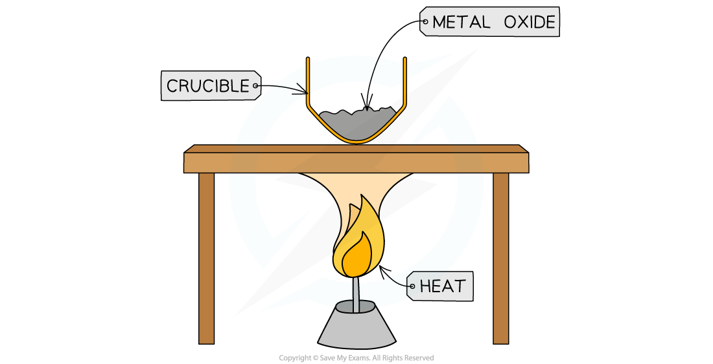
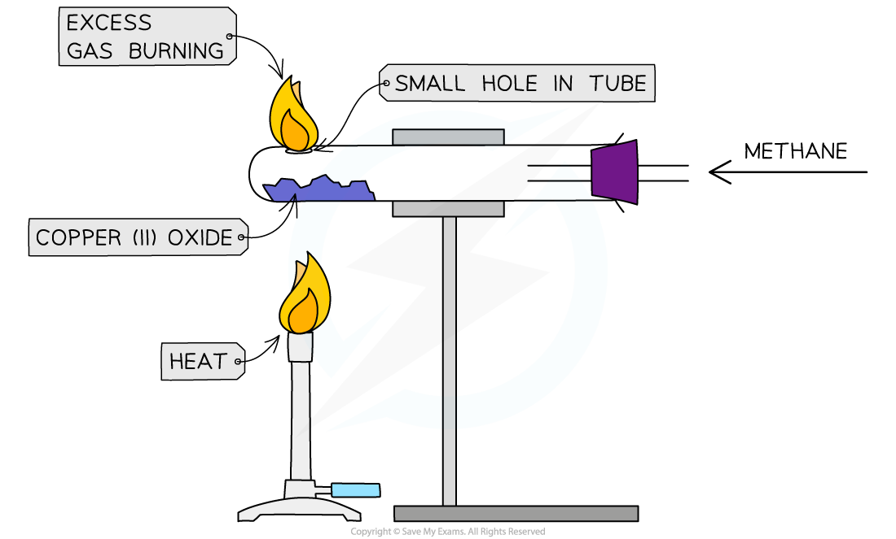

# Practical: Determine the Formula of a Metal Oxide

## Practical: Determine the Formula of Magnesium Oxide

> **Spec point** — `spcpt_yy6NpHxzCg22djFV` · practical: know how to determine the formula of a metal oxide by combustion (e.g. magnesium oxide) or by reduction (e.g. copper(II) oxide)

## Practical: Determine the formula of magnesium oxide

### Aim:

To determine the empirical formula of magnesium oxide by combustion of magnesium

### Diagram:

### Method:

1. Measure the mass of the crucible with the lid
2. Add a sample of magnesium into the crucible and measure the mass with the lid (calculate the mass of the metal by subtracting the mass of the empty crucible)
3. Strongly heat the crucible over a Bunsen burner for several minutes
4. Lift the lid frequently to allow sufficient air into the crucible for the magnesium to fully oxidise without letting magnesium oxide smoke escape
5. Continue heating until the mass of the crucible remains constant (maximum mass), indicating that the reaction is complete
6. Measure the mass of the crucible and its contents (calculate the mass of metal oxide by subtracting the mass of the empty crucible)

### Results

- ***Mass of metal:***

  - Subtract the mass of the crucible from magnesium and the mass of the empty crucible
- ***Mass of oxygen:***

  - Subtract the mass of the magnesium used from the mass of magnesium oxide
  - **Step 1 – **Divide each of the two masses by the relative atomic masses of the element
  - **Step 2 – **Simplify the ratio

|   | **magnesium** | **oxygen** |
|---|---|---|
| mass | a | b |
| moles | a / *A*r | a / *A*r |
|   | x | y |

Ratio = x : y

- **Step 3 – **Represent the ratio in the form ‘MxOy‘ E.g, MgO

## Practical: Determine the Formula of Copper(II)Oxide

> **Spec point** — `spcpt_XsTdsrB5567G2Mdm` · practical: know how to determine the formula of a metal oxide by combustion (e.g. magnesium oxide) or by reduction (e.g. copper(II) oxide)

## Practical: Determine the formula of copper(II) oxide

### Aim:

To determine the formula of copper(II)oxide by reduction with methane

### Diagram:

### Method:

1. Measure mass of the empty boiling tube
2. Place metal oxide into a horizontal boiling tube and measure the mass again
3. Support the tube in a horizontal position held by a clamp
4. A steady stream of natural gas(methane) is passed over the copper(II)oxide and the excess gas is burned off
5. The copper(II)oxide is heated strongly using a Bunsen burner
6. Heat until metal oxide completely changes colour, meaning that all the oxygen has been removed
7. Measure mass of the tube remaining metal powder and subtract the mass of the tube

### Results:

**Working out empirical formula:**

***Mass of Metal:***

- Measure mass of the remaining metal powder

  - ***Mass of Oxygen:***
  
    - Subtract mass of the remaining metal powder from the mass of metal oxide
    - **Step 1 – **Divide each of the two masses by the relative atomic masses of elements
    - **Step 2 – **Simplify the ratio:**                     **

|   | **metal** | **oxygen** |
|---|---|---|
| mass | a | b |
| moles | a / *M*r | b / *M*r |
| Ratio | x | y |

- **Step 3 – **Represent the ratio in the form ‘MxOy‘ E.g, CuO
