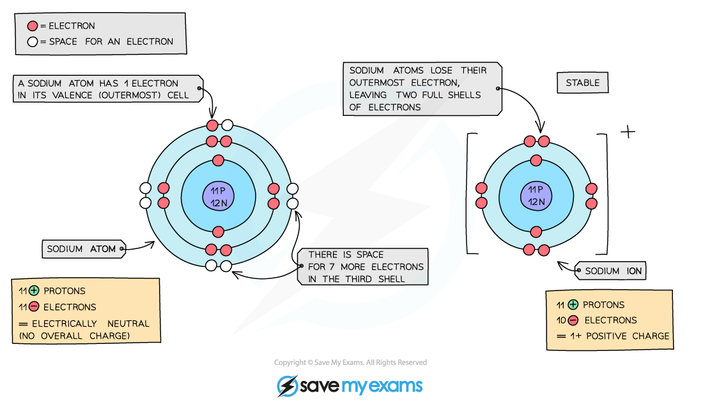

# Formation of Ions

## Formation of Ions

> **Spec point** — `spcpt_9rvG5n3RKRKBGT6r` · understand how ions are formed by electron loss or gain

## Formation of ions

- An ion is an **electrically** **charged** atom or group of atoms formed by the **loss** or **gain** of **electrons**
- This loss or gain of electrons takes place to obtain a **full** **outer** **shell** of electrons
- The electronic structure of ions of elements in groups 1, 2, 3, 5, 6 and 7 will be the same as that of a noble gas - such as helium, neon, and argon
- Negative ions are called **anions** and form when atoms **gain** electrons, meaning they have more electrons than protons
- Positive ions are called **cations** and form when atoms **lose** electrons, meaning they have more protons than electrons
- All metals **lose** electrons to other atoms to become positively charged ions
- All non-metals **gain** electrons from other atoms to become negatively charged ions

#### Formation of cations

***Diagram showing the formation of the sodium ion***

#### Formation of anions

***Diagram showing the formation of the chloride ion***

> **Exam Hint**
> The number of electrons that an atom gains or loses is the same as the charge.
> 
> For example, if a magnesium atom loses 2 electrons, then the charge will be 2+, if a bromine atom gains 1 electron then the charge will be 1-.
