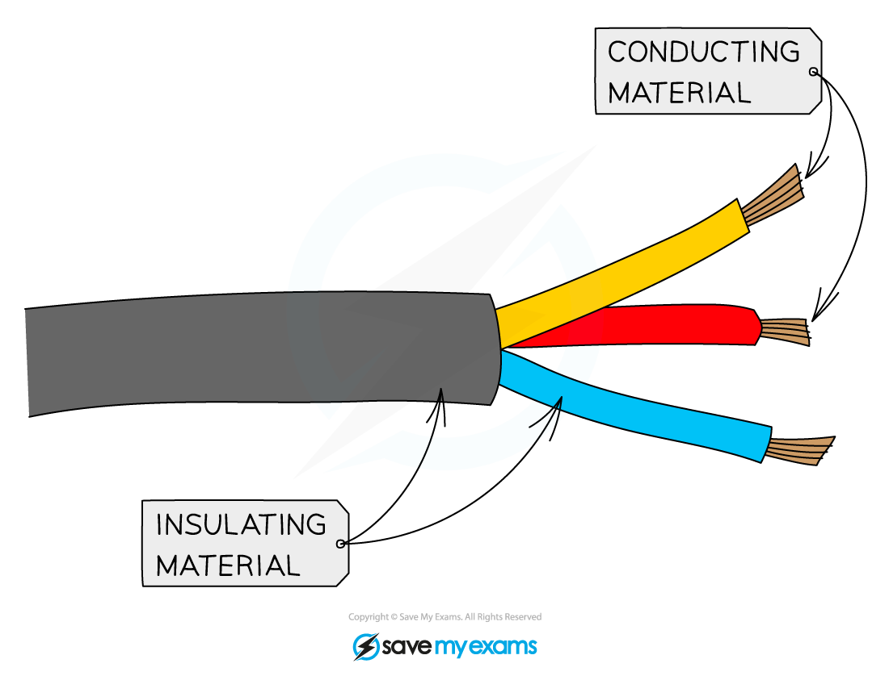

# Explaining Conductivity

## Conductivity of Covalent Compounds

> **Spec point** — `spcpt_q6sNBsWxyBcBdbcb` · understand why covalent compounds do not conduct electricity

## Conductivity of covalent compounds

- Electric current is the flow of** charged particles**
- This usually refers to electrons, but it could also mean the flow of ions
- Most covalent compounds do not conduct electricity as they have no freely moving charged particles to carry the current
- They act as **insulators** and have many applications which rely on that property
- Covalent substances are used as electrical insulators in solid, liquid and gaseous form

  - For example, sulfur hexafluoride is a dense gas used to insulate electrical transformers
  - Silicone oils and liquid hydrocarbons are also used in electrical equipment
- Common insulators include the plastic coating around household electrical wiring:

#### Covalent compounds are used as insulating materials

***Covalent compounds are unable to conduct due to having no freely moving charged particles***

## Conductivity of Ionic Compounds

> **Spec point** — `spcpt_YCbZBfYrK9DydQBH` · understand why ionic compounds conduct electricity only when molten or in aqueous solution

## Conductivity of ionic compounds

- Ionic compounds can conduct electricity in the **molten** state or in** solution**
- This is because they have ions that can move and carry charge
- They cannot conduct electricity in the solid state as the ions are in fixed positions within the lattice and are unable to move 

***Molten or aqueous particles move and conduct electricity but cannot in solid form***

## Anions & Cations

> **Spec point** — `spcpt_yYYXxNskQNQb6xPh` · know that anion and cation are terms used to refer to negative and positive ions respectively

## Cations and anions

- **Anions **are negatively charged ions

  - E.g. Cl-, O2-, SO42-
- **Cations **are positively charged ions

  - E.g. K+, Mg2+, H+

- During electrolysis the electrons move from the anode towards the cathode
- Cations within the electrolyte migrate towards the negatively charged electrode which is the cathode
- Anions within the electrolyte migrate towards the positively charged electrode which is the anode

#### Diagram showing the direction of movement of electrons and ions in the electrolysis of NaCl

***Cations are attracted to the cathode and anions to the anode due to their opposite charges***

> **Exam Hint**
> When a metal conducts it is the **electrons** that are moving through the metal. When a salt solution conducts it is the **ions** in the solution that move towards the electrodes while carrying the electrons.
