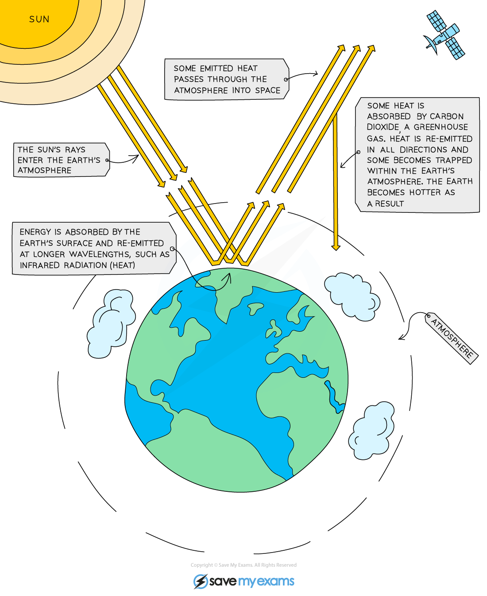

# The Greenhouse Effect

## The Greenhouse Effect

> **Spec point** — `spcpt_JYv4rr4DpQXmFPcF` · know that carbon dioxide is a greenhouse gas and that increasing amounts in the atmosphere may contribute to climate change

## The greenhouse effect

- Greenhouse gases maintain the temperatures on Earth high enough to support life
- This is known as the greenhouse effect
- Three greenhouse gases are:

  - **carbon dioxide**
  - **methane**
  - **water vapour **

### What is the greenhouse effect?

- **Short wavelength radiation** (ultraviolet radiation) is emitted from the sun
- When it strikes the earth's surface, some of it is absorbed and some is re-emitted from the surface of the Earth as** long wavelength radiation** (infrared radiation)
- Much of the radiation is **trapped** inside the Earth’s atmosphere by **greenhouse gases** which can absorb and store the energy
- Increasing levels of carbon dioxide and methane, although present in only small amounts, are causing significant upset to the Earth’s natural conditions by trapping extra heat energy

#### The greenhouse effect

***Greenhouse gases trap some of the Sun's radiation causing the Earth to warm up***

#### Carbon dioxide

- **Sources:**

  - Combustion of wood and fossil fuels
  - Respiration of plants and animals
  - Thermal decomposition of carbonate rocks and the effect of acids on carbonates
- Increasing amounts of carbon dioxide in the atmosphere may contribute to **climate change**

> **Exam Hint**
> It is important to understand the difference between the greenhouse effect and the enhanced greenhouse effect. The greenhouse effect ensures the mean global temperature is around 15oC and without greenhouse gases the surface of the Earth would swing between extreme heat and extreme cold. The enhanced greenhouse effect, due an increase in greenhouse gas concentrations, most scientists believe, is leading to global warming.
