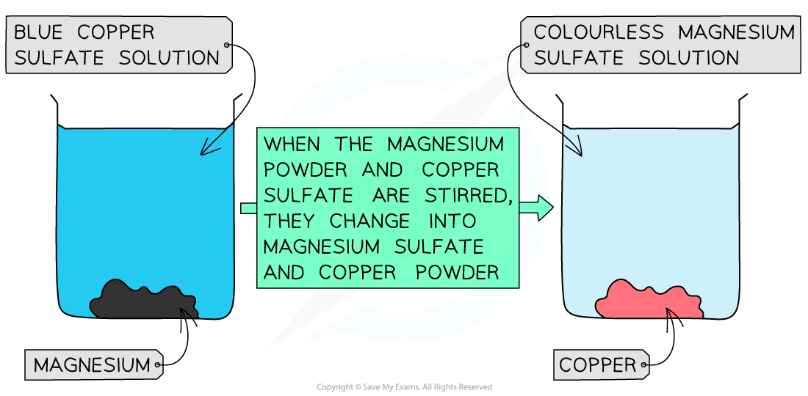

# Metal Displacement Reactions

## Metal Displacement Reactions

> **Spec point** — `spcpt_MmrMDCxT4h82kmz4` · understand how metals can be arranged in a reactivity series based on their displacement reactions between: 
• metals and metal oxides 
• metals and aqueous solutions of metal salts.

## Metal displacement reactions

- The reactivity of metals decreases going down the reactivity series. This means that a more reactive metal will **displace** a less reactive metal from its compounds Two examples are:

  - Reacting a metal with a metal oxide (by heating)
  - Reacting a metal with an aqueous solution of a metal compound
- For example it is possible to reduce copper(II) oxide by heating it with zinc.
- The reducing agent in the reaction is zinc:

**Zn    +     CuO    →    ZnO    +    Cu**

**zinc + copper(II) oxide → zinc oxide + copper**

#### Metal oxide displacement table

| **Mixture** | **Products** | **Equation for Reaction ** |
|---|---|---|
| Iron(III) oxide and aluminium - thermite reaction | Iron and aluminium oxide | Fe2O3 + 2Al  → 2Fe + Al2O3 |
| Sodium oxide and magnesium | No reaction as sodium is above magnesium | ----- |
| Silver oxide and copper | Silver and copper(II) oxide | Ag2O + Cu → 2Ag + CuO |
| Zinc oxide and calcium | Zinc and calcium oxide | ZnO + Ca → Zn + CaO |
| Lead(II) oxide and silver | No reaction as lead is more reactive than silver | ------ |
| Iron nail and copper(II) chloride | Copper and iron(II) chloride | Fe + CuCl2 → FeCl2 + Cu |

### Displacement reactions between metals & aqueous solutions of metal salts

- The reactivity between two metals can be compared using **displacement reactions** in salt solutions of one of the metals
- This is easily seen as the more reactive metal slowly **disappears** from the solution,** displacing** the less reactive metal
- For example, magnesium is a reactive metal and can displace copper from copper(II)sulfate solution:

**Mg + CuSO****4****→ MgSO****4**** + Cu**

- The blue colour of the CuSO4 solution **fades** as colourless magnesium sulfate solution is formed
- Copper coats the surface of the magnesium and also forms solid metal which falls to the bottom of the beaker

#### Displacement reaction between magnesium and copper(II) sulfate

***Diagram showing the colour change when magnesium displaces copper from copper(II) sulfate***

### Other displacement reactions

#### Metal solutions displacement table

| **Mixture** | **Products** | **Equation for Reaction** |
|---|---|---|
| Magnesium and iron(II) sulfate | Magnesium sulfate and iron | Mg + FeSO4 → MgSO4 + Fe |
| Zinc and sodium chloride | No reaction as sodium is above zinc | ------ |
| Lead and silver nitrate | Lead(II) nitrate and silver | Pb + AgNO3 → Pb(NO3)2 + Ag |
| Copper and calcium chloride | No reaction as calcium is above copper | ------- |
| Iron and copper(II) sulfate | Iron(II) sulfate and copper | Fe + CuSO4 → FeSO4 + Cu |

> **Exam Hint**
> Displacement reactions occur when the solid metal is more reactive than the metal that is in the compound.
