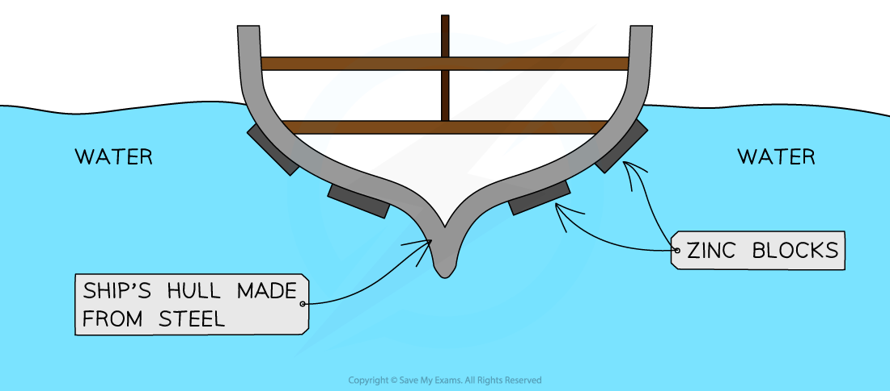

# Rusting of Iron

## Rusting of Iron

> **Spec point** — `spcpt_9KK3gpB5m7b85HDp` · know the conditions under which iron rusts

## Rusting of iron

### Investigating rusting

- **Oxygen** and** water** must be present for rust to occur
- You can investigate the conditions needed for rusting by setting up a series of control test tubes as shown below
- Boiled water removes any dissolved oxygen and calcium chloride is a drying agent

#### Investigating rusting

***Diagram showing how the conditions for rusting can be investigated***

- The nail on the left rusts

  - It is in contact with both air (which contains oxygen) and water
- The nail in the middle does not rust

  - It is not in contact with air because the oil provides a barrier to prevent oxygen diffusing into the boiled water
- The nail on the right does not rust

  - It is not in contact with water because calcium chloride absorbs any water molecules present due to moisture
- The results show that **both** air and water must be present for rusting to occur

#### Damage to Iron Structures

- Rust is a soft solid substance that **flakes** off the surface of iron easily, exposing fresh iron below which then undergoes rusting
- This means that over time all of the iron rusts and its structure becomes weakened

## Preventing Iron Rusting

> **Spec point** — `spcpt_BVxFWf2Rvqynh9Wf` · understand how the rusting of iron may be prevented by: 
• barrier methods 
• galvanising 
• sacrificial protection.

## Rust prevention

### Barrier Methods

- Rust can be prevented by coating iron with barriers that prevent the iron from coming into contact with water and oxygen
- However, if the coatings are washed away or scratched, the iron is once again exposed to water and oxygen and will rust
- Unlike some other metals, once iron begins to rust it will continue to corrode internally as rust is porous and allows both air and water to come into contact with fresh metal underneath any barrier surfaces that have been broken or scratched
- Common barrier methods include: **paint**, **oil**, **grease**, and** electroplating**

### Sacrificial Protection

- Iron can be prevented from rusting using the **reactivity** **series**
- A **more **reactive metal can be attached to a **less **reactive metal
- The more reactive metal will oxidise and therefore corrode first, protecting the less reactive metal from corrosion
- Zinc is more reactive than iron therefore will lose its electrons more easily than iron and is oxidised more easily
- For continued protection, the zinc bars have to be replaced before they completely corrode

#### Zinc bars on the side of steel ships

***Diagram to show the use of zinc bars on the sides of steel ships as a method of sacrificial protection***

### Galvanising

- **Galvanising** is a process where the iron to be protected is coated with a layer of zinc
- This can be done by **electroplating **or dipping it into molten zinc
- ZnCO3 is formed when zinc reacts with oxygen and carbon dioxide in the air and protects the iron by the barrier method
- If the coating is damaged or scratched, the iron is still protected from rusting by **sacrificial** **protection**

> **Exam Hint**
> Corrosion and rusting are not the same process. Corrosion is the general term used to describe the degradation of metal surfaces whereas rusting is the specific type of corrosion that happens to iron.
