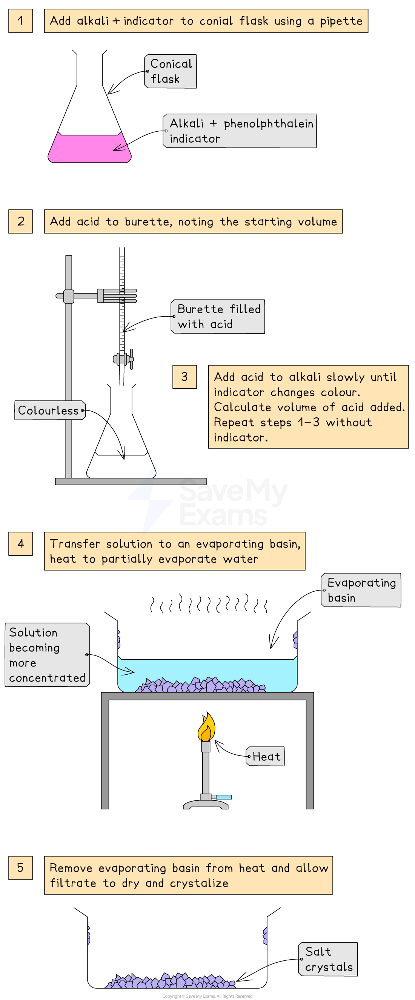

# Prepare a Soluble Salt II

## Prepare a Soluble Salt II

> **Spec point** — `spcpt_bGnpy8VfTsMdPqxm` · describe an experiment to prepare a pure, dry sample of a soluble salt, starting from an acid and alkali

## Prepare a soluble salt II

- It is also possible to prepare a sample of a dry salt starting from an acid and an alkali
- A titration can be used for this

#### Preparation of a soluble salt using a titration

***Diagram showing the apparatus needed to prepare a salt by titration***

### Method

- Use a pipette to measure the alkali into a conical flask and add a few drops of indicator (phenolphthalein or methyl orange)
- Add the acid into the burette and note the starting volume
- Add the acid very slowly from the burette to the conical flask until the indicator changes to appropriate colour
- Note and record the final volume of acid in burette and calculate the volume of acid added

  - Final volume of acid - initial volume of acid when using a **burette**
- Add this same volume of acid into the same volume of alkali without the indicator
- Heat to partially evaporate, leaving a saturated solution
- Leave to crystallise decant excess solution and allow crystals to dry

> **Exam Hint**
> When evaporating the solution some water is left behind to allow for water of crystallisation in some salts and also to prevent the salt from overheating and decomposing.
