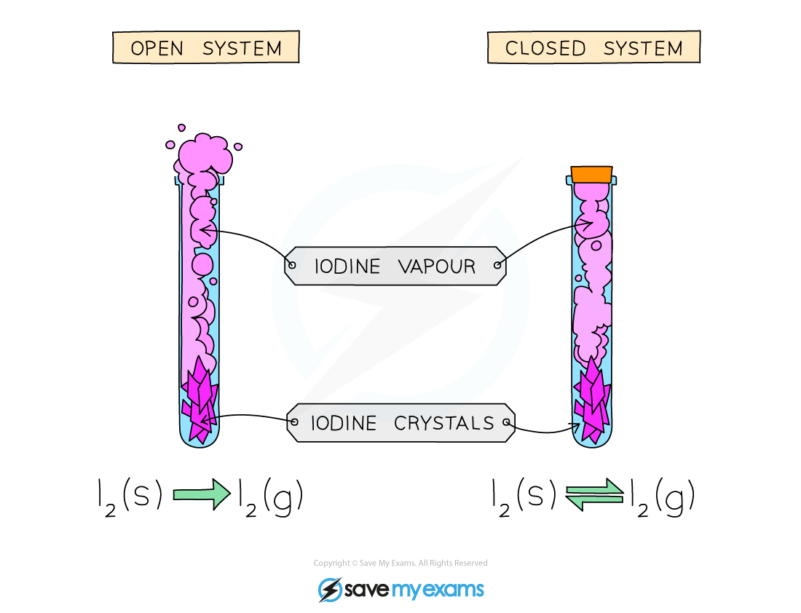

# Dynamic Equilibrium

## Dynamic Equilibrium

> **Spec point** — `spcpt_kSzC7JY5Q29mRBfC` · know that a reversible reaction can reach dynamic equilibrium in a sealed container
know that the characteristics of a reaction at dynamic equilibrium are: 
• the forward and reverse reactions occur at the same rate 
• the concentrations of reactants and products remain constant.

## Dynamic equilibrium

- A** reversible reaction** is one which occurs in both directions
- When the rate of the forward reaction **equals **the rate of the reverse reaction, the overall reaction is said to be in a state of **equilibrium**

  - Equilibrium is **dynamic** i.e. the molecules on the left and right of the equation are** changing** into each other by chemical reactions constantly and at the same rate
- The concentration of reactants and products remains **constant**

  - This is true if there is no other change to the system, such as temperature and pressure
- It only occurs in a **closed system**

  - This is so none of the participating chemical species can leave the reaction vessel and nothing else can enter

#### The difference between an open and closed system

***Equilibrium can only be reached in a closed container***

- An example of a reaction reaching equilibrium is the reaction between H2 and N2 in the Haber process:

  - At the start of the reaction, only nitrogen and hydrogen are present
  
    - This means that the rate of the forward reaction is at its **highest**, since the **concentrations** of hydrogen and nitrogen are at their **highest**
  - As the reaction proceeds, the **concentrations **of hydrogen and nitrogen gradually **decrease**
  
    - So, the rate of the forward reaction will **decrease**
  - However, the concentration of ammonia is gradually increasing and so the rate of the **backward** reaction will increase
  
    - Ammonia will decompose to reform hydrogen and nitrogen
  - In a closed system, the two reactions are interlinked and none of the gases can escape
  - So, the rate of the forward reaction and the rate of the backward reaction will eventually become** equal** and equilibrium is reached:

#### The rate of the forward and reverse reaction during the progress of a reaction

***At equilibrium, the rate of the forward reaction is equal to the rate of the reverse reaction***

> **Exam Hint**
> A common exam question will ask you to describe two features of a system at equilibrium. These are:
> 
> - The rate of the forward and reverse reactions are equal
> - The concentrations of the reactants and products remain unchanged
