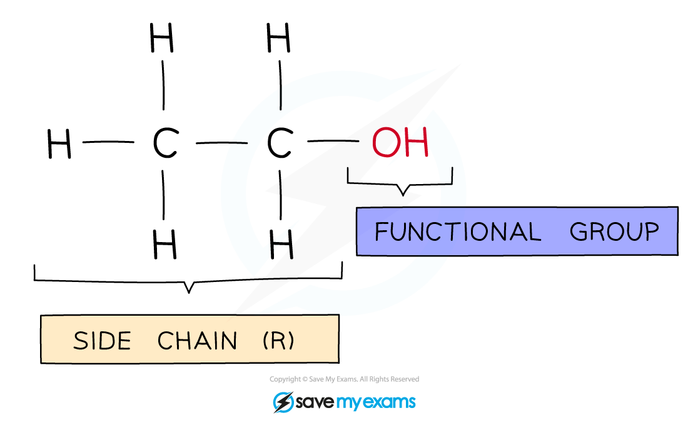

# Alcohols

## The Alcohols

> **Spec point** — `spcpt_zsqwJvrfd2ySsbJd` · know that alcohols contain the functional group −OH
understand how to draw structural and displayed formulae for methanol, ethanol, propanol (propan-1-ol only) and butanol (butan-1-ol only), and name each compound the names propanol and butanol are acceptable

## Alcohols

- Alcohols are colourless liquids that dissolve in water to form** neutral** solutions
- The first four alcohols are commonly used as **fuels**
- All alcohols contain the hydroxyl (**-OH**) functional group which is the part of alcohol molecules that is responsible for their **characteristic reactions**

#### A molecule of ethanol

***Diagram of the side chain and -OH group in ethanol which characterises its chemistry***

- The names and structures of the first four alcohols in the homologous series are shown below
- In terms of naming, the same system is used as for alkanes and alkenes, with the final ‘**e**’ being replaced with ‘**ol**’

| **Name** | **Formula** | **Displayed formula** |
|---|---|---|
| Methanol | CH3OH |  |
| Ethanol | C2H5OH |  |
| Propan-1-ol | C3H7OH |  |
| Butan-1-ol | C4H9OH |  |

> **Exam Hint**
> In your exam it is acceptable to write propan-1-ol and butan-1-ol as propanol and butanol respectively.
> 
> The 1 indicates that the -OH group is located on the first carbon atom in the molecule as it is possible to have it located on a different carbon atom, but you do not need to know this for your exam.
