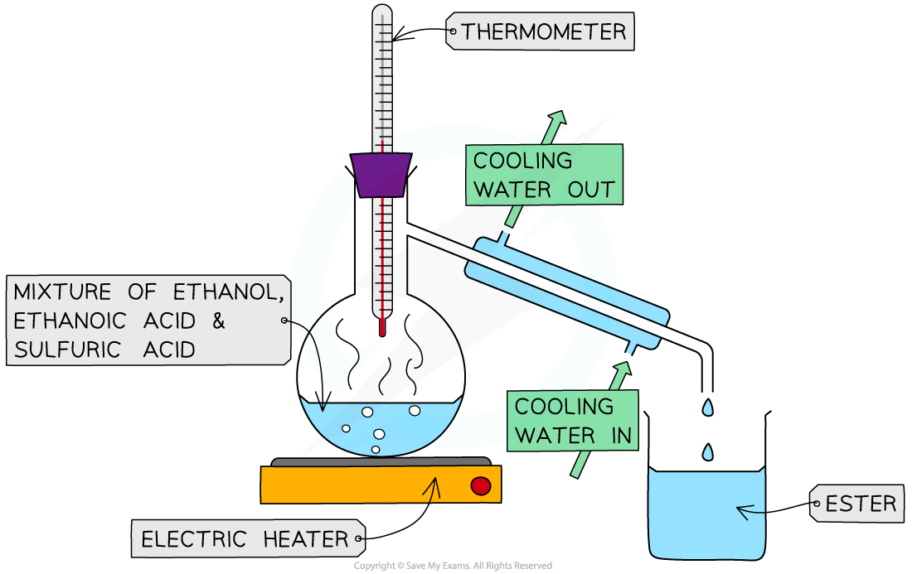

# Practical: Preparation of Ethyl Ethanoate

## Practical: Preparation of Ethyl Ethanoate

> **Spec point** — `spcpt_BzjqC6526mRv7ntv` · practical: prepare a sample of an ester such as ethyl ethanoate
know that ethyl ethanoate is the ester produced when ethanol and ethanoic acid react in the presence of an acid catalyst

## Practical: Preparation of ethyl ethanoate

### Aim:

To prepare a small sample of ethyl ethanoate

### Diagram:

***The preparation of ethyl ethanoate***

### Method:

1. A mixture of ethanoic acid, ethanol and concentrated sulfuric acid is gently heated by either a water bath or an electric heater (ethanol is flammable, so a Bunsen can’t be used!)
2. The ester is then distilled off as soon as it is formed and collected in a separate beaker by condensation
3. As esters have low boiling points (they are volatile), they are the first to evaporate from the reaction mixture. Removing them from the mixture by distillation prevents the reverse reaction from occurring

### Result:

- The distillate can be smelt to check whether an ester has been produced
- Small quantities of ethanoic acid, sulfuric acid and ethanol can also be collected in the process
- To remove acidic impurities, sodium carbonate solution can be added, until the mixture stops fizzing (no more carbon dioxide is evolved)
- To remove ethanol, calcium chloride solution can be added
