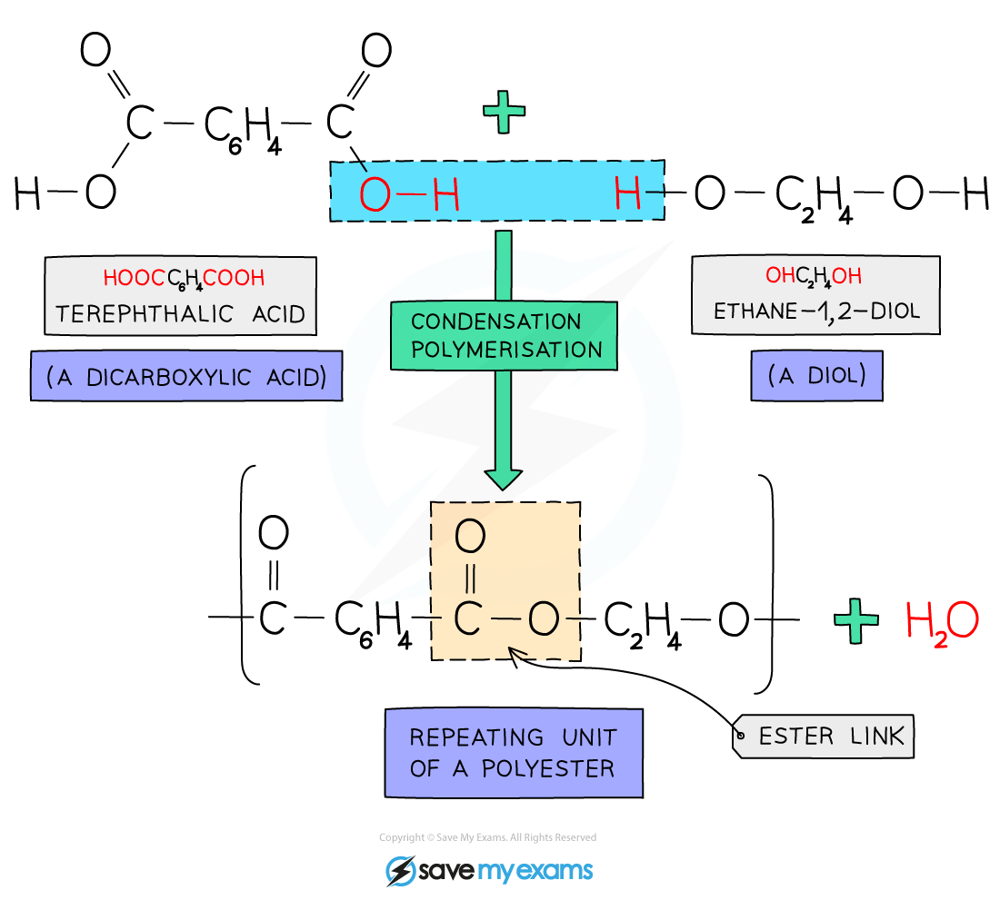
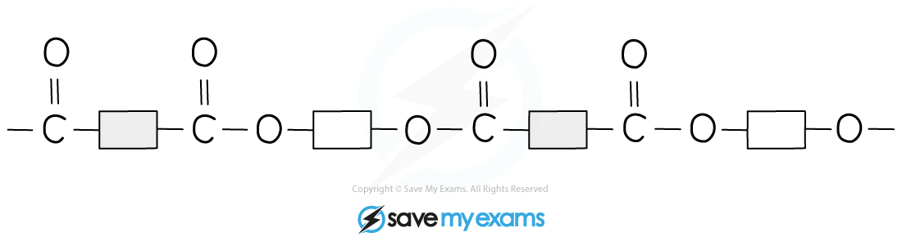
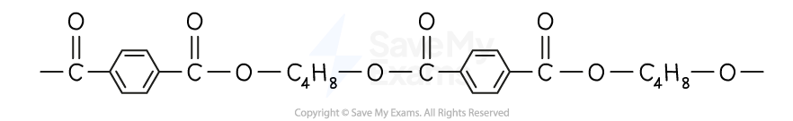
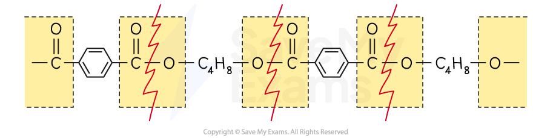
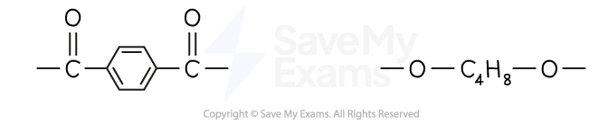
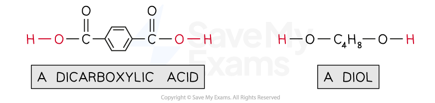
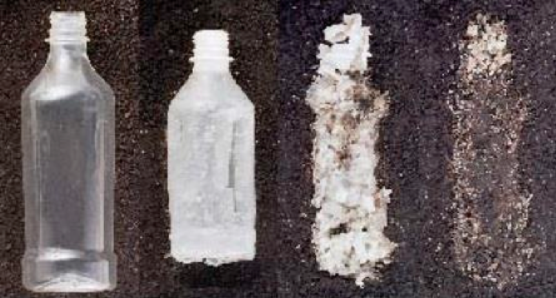

# Condensation Polymers

## Condensation Polymers

> **Spec point** — `spcpt_nmn5SDdjMrKGH2WB` · know that condensation polymerisation, in which a dicarboxylic acid reacts with a diol, produces a polyester and water
understand how to write the structural and displayed formula of a polyester, showing the repeat unit, given the formulae of the monomers from which it is formed including the reaction of ethanedioic acid and ethanediol:  

## Condensation polymers

- Condensation polymers are formed when **two different monomers** are linked together with the **removal** of a small molecule, usually **water**
- This is a key difference between condensation polymers and addition polymers:

  - Addition polymerisation forms the polymer molecule **only**
  - Condensation polymerisation forms the **polymer** molecule and one **water** molecule **per linkage**
- The monomers have two **functional** groups present, one on **each end**
- The functional groups at the ends of one monomer react with the functional group on the end of the other monomer, in so doing creating long chains of **alternating monomers**, forming the polymer
- Polyesters are formed from two different monomers and produce water
- For every ester linkage formed in condensation polymerisation, one molecule of water is formed from the combination of a -H and an -OH group
- An example is terylene which is a **polyester** made from **dicarboxylic** acid monomers (a carboxylic with a -COOH group at **either** end) and **diols** (an alcohol with an -OH group at **either** end)
- Each -COOH group reacts with another -OH group on another monomer
- An ester linkage is formed with the subsequent loss of** one** water molecule per link

***The condensation reaction in which the polyester terylene is produced***

- The structure of terylene can be represented by drawing out the polymer using boxes to represent the carbon chains
- This can be done for all polyesters

***Diagram showing a section of the polyester terylene***

> **Exam Hint**
> Notice that the sequence of bonding in the polyester is the mirror image at either end of the link, NOT the link repetition due to the monomers containing the same functional group at either end.

### Deducing the monomers from a polyester

- If you are given the structure of a polyester, you can deduce the diol and dicarboxylic acid used to form it
- It helps to think of this as the reversal of the formation of a polyester
- When a polyester is formed, small molecules of water are removed

  - The OH comes from the acid / -COOH groups of the dicarboxylic acid
  - The H comes from the alcohol / -OH groups of the diol
- To reverse this, water is added to the polyester which allows it to break back down into its monomers - this process is known as **hydrolysis**
- Take the polyester, polybutylene terephthalate (PBT), as an example:

***Diagram showing a section of the polyester polybutylene terephthalate, PBT***

- Identify the ester / -COO- linkages in the polymer
- Separate the polymer into its two component monomers by breaking the C-O single bond in the ester linkage

- This leaves 2 different structures:

- Water is used to complete the molecules

- **Remember: **When the polyester was made, the dicarboxylic acid lost OH groups and the diol lost H atoms

- OH groups are added to the C=O carbon on one structure forming the two carboxylic acid / -COOH groups of the dicarboxylic acid
- H atoms are added to the oxygen atoms on the other structure forming the two alcohol / -OH groups of the diol
- The resulting molecules are the two monomers that are used to form polybutylene terephthalate, PBT

***A diagram to show the two monomers used to form the polyester*** ***polybutylene terephthalate, PBT***

## Biopolyesters

> **Spec point** — `spcpt_GWtS6vkMBq3JpCcz` · know that some polyesters, known as biopolyesters, are biodegradable

## Biopolyesters

- Biopolyesters are a specific type of polymers that are synthesised from sugars and plant oils using microorganisms
- They are able to **biodegrade** naturally in the environment after their intended purpose
- The polymers are synthetically made, consisting of ester, amide and ether functional groups which gives them the characteristic of being biodegradable

***The biodegradation of a bottle made of biopolyesters***
