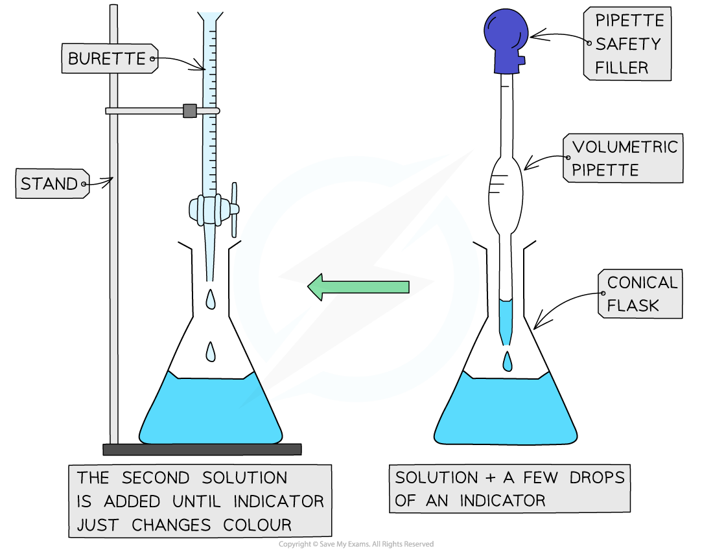

# Acid-Alkali Titrations

## Acid-Alkali Titrations

> **Spec point** — `spcpt_5ZkBPGYbZ4RfFFt3`

## What is a titration?

- Titrations are a method of analysing the **concentration** of solutions
- Acid-base titrations are one of the most important kinds of titrations
- They can determine exactly how much alkali is needed to neutralise a quantity of acid – and vice versa
- You may be asked to calculate the **moles** present in a given amount, the **concentration** or** volume** required to **neutralise** an acid or a base
- Titrations can also be used to prepare **salts**

#### How to carry out a titration

***Performing a titration***

### Method

1. Use the pipette and pipette filler and place exactly 25 cm3 sodium hydroxide solution into the conical flask
2. Fill the burette with hydrochloric acid, place an empty beaker underneath the tap. Run a small portion of acid through the burette to remove any air bubbles
3. Record the starting point on the burette to the nearest 0.05 cm3
4. Place the conical flask on a white tile so the tip of the burette is inside the flask
5. Add a few drops of a [suitable indicator](https://www.savemyexams.com/igcse/chemistry/edexcel/modular/24/unit-1/revision-notes/inorganic-chemistry/acids-alkalis-and-titrations/indicators/) to the solution in the conical flask
6. Perform a rough titration by taking the burette reading and running in the solution in 1 – 3 cm3 portions, while swirling the flask vigorously
7. Quickly close the tap when the end-point is reached (sharp colour change) and record the volume, placing your eye level with the meniscus
8. Now repeat the titration with a fresh batch of sodium hydroxide
9. As the rough end-point volume is approached, add the solution from the burette one drop at a time until the indicator just changes colour
10. Record the volume to the nearest 0.05 cm3
11. Repeat until you achieve two concordant results (two results that are within 0.1 cm3 of each other) to increase accuracy

### Results

#### Results table for a titration

| **Rough titre (cm****3****)** | **Titre 1 (cm****3****)** | **Titre 2 (cm****3****)** | **Mean (cm****3****)** |
|---|---|---|---|
| 15.50 | 14.90 | 15.00 | 14.95 |

> **Exam Hint**
> Use a funnel to fill the burette but be sure to remove it before starting the practical as it can drip liquid into the burette, making the initial reading false.
