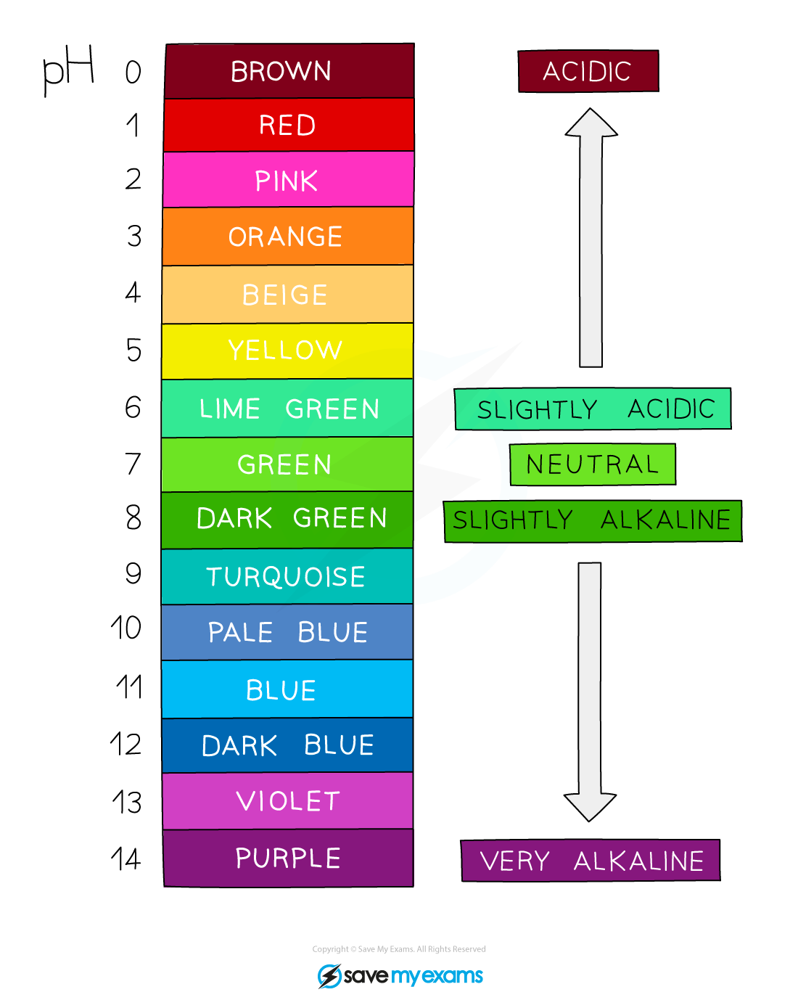

# Indicators

## Two Colour Indicators

> **Spec point** — `spcpt_cpBnmWZwd6vvbzFb`

## Indicators

### What are two colour indicators?

- Two colours indicators are used to distinguish between acids and alkalis
- Many plants contain substances that can act as indicators and the most common one is **litmus** which is extracted from lichens
- Synthetic indicators are organic compounds that are sensitive to changes in acidity and appear different colours in acids and alkalis
- **Phenolphthalein** and **methyl orange** are synthetic indicators frequently used in acid-alkali titrations
- Synthetic indicators are used to show the endpoint in titrations as they have a very sharp change of colour when an acid has been neutralised by an alkali and vice-versa
- Litmus is not suitable for titrations as the colour change is not sharp and it goes through a purple transition colour in neutral solutions making it difficult to determine an endpoint
- Litmus is very useful as an an indicator paper and comes in red and blue versions, for dipping into solutions or testing gases

#### Two Colour Indicators Table

| **Indicator** | **Colour in acid** | **Colour in alkali** |
|---|---|---|
| litmus | red | blue |
| phenolphthalein | colourless | pink |
| methyl orange | red | yellow |

## The pH Scale

> **Spec point** — `spcpt_G6Qz3sM8PztvVs3M`

## The pH scale

- The pH scale goes from 0 – 14
- All acids have pH values of **below** 7, all alkalis have pH values of **above** 7
- The** lower** the pH then the **more acidic** the solution is

  - pH 0-3 = strong acid
  
    - Extremely acidic substances can have values of below 1
  - pH 4-6 = weak acid
- The **higher** the pH then the **more alkaline** the solution is

  - pH 8-10 = weak alkali
  - pH 11-14 = strong alkali
- A solution of pH 7 is described as being **neutral**

## Universal Indicator

> **Spec point** — `spcpt_VTXRmNZhfK7NZmBR`

## Universal indicator

- Universal indicator is a wide range indicator and can give only an approximate value for pH It is made of a mixture of different plant **indicators** which operate across a broad pH range and is useful for estimating the pH of an **unknown solution** A few drops are added to the solution and the colour is matched with a colour chart which indicates the pH which matches with specific colours Universal indicator colours vary slightly between manufacturer so colour charts are usually provided for a specific indicator formulation

***pH scale with the Universal Indicator colours used to determine the pH of a solution***

> **Exam Hint**
> A common error is to suggest using universal indicator as a suitable indicator for an acid-base titration. This is incorrect as a** sharp colour change** is required to identify the end-point, which cannot be achieved with universal indicator.
