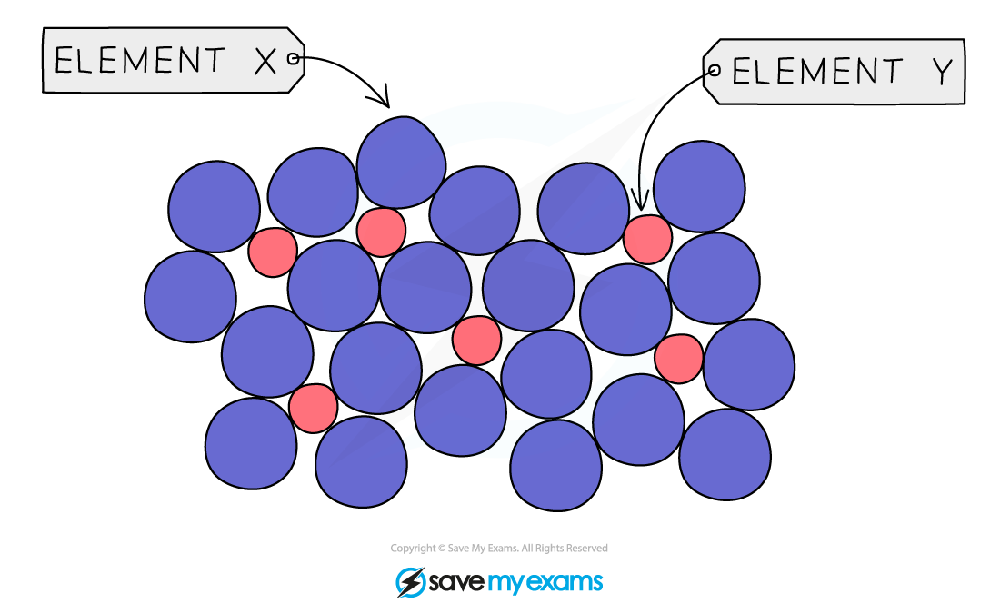

# Alloys

## Alloys

> **Spec point** — `spcpt_Wy4ZGtw52sFZDBYb`

## Alloys

- An alloy is a **mixture **of two or more metals or metal with a non-metal such as carbon

  - Steel is made from iron and carbon
- Alloys often have** **properties that can be very different from the metals they contain

  - They can be **stronger** and **harder**
  - They are **resistance** to **corrosion** or extreme **temperatures**
- These enhanced properties can make alloys more useful than pure metals
- Alloys are harder than pure metals because:

  - Alloys contain atoms of** different** sizes
  - This **distorts** the regular arrangements of atoms
  - So it is more difficult for the layers of atoms to slide over each other
- Brass is a common example of an alloy which contains 70% copper and 30% zinc

#### Alloy structure

***The regular arrangement of a metal lattice structure is distorted in alloys***

> **Exam Hint**
> Questions on this topic often give you a selection of particle diagrams and ask you to choose the one which represents an alloy. It will be the diagram with uneven sized particles and distorted layers or rows of particles.
