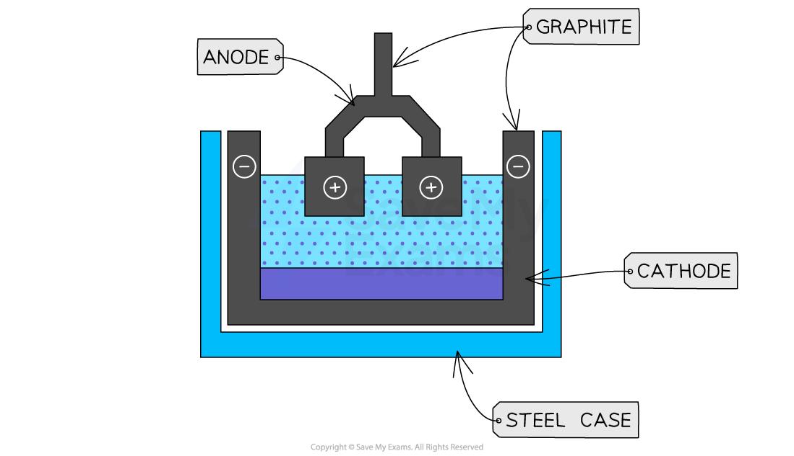

# Extracting Metals

## Extracting Metals

> **Spec point** — `spcpt_gpwDvPqZsxj2fwx7`

## Extracting Metals

### Extraction of metals and the reactivity series

- The most reactive metals are at the **top** of the series
- The tendency to become **oxidised** is thus linked to how **reactive** a metal is and therefore its **position** on the reactivity series
- Metals higher up are therefore **less resistant** to oxidation than the metals placed lower down which are **more resistant** to oxidation
- The position of the metal on the reactivity series determines the method of extraction

#### Metals extraction method table

| **Metal** | **Extraction method** |
|---|---|
| **Most reactive** |   |
| Potassium | Extracted by electrolysis of the molten chloride or oxide  Large amounts of electricity are required, which makes this an expensive process |
| Sodium |   |
| Lithium |   |
| Calcium |   |
| Magnesium |   |
| Aluminium |   |
| Zinc | Extracted by heating with a reducing agent such as carbon or carbon monoxide in a blast furnace  A cheap process as carbon is cheap and can also be a source of heat |
| Iron |   |
| Copper |   |
| Silver | Found as pure elements |
| Gold |   |
| **Least reactive** |   |

***The extraction method depends on the position of a metal in the reactivity series***

- Higher placed metals (above carbon) have to be extracted using **electrolysis** as they are too reactive and cannot be reduced by carbon
- Lower placed metals can be extracted by heating with carbon which** reduces** them

***The extraction method depends on the position of a metal in the reactivity series***

### Extraction of Iron from Hematite

- Iron is extracted in a large container called a blast furnace from its ore, hematite
- Modern blast furnaces produce approximately 10,000 tonnes of iron per day
- This is a continuous process with new raw materials added and products removed all the time due to the time and cost associated with getting the furnace up to temperature

#### The Blast Furnace

***There are three main zones in the blast furnace***

- The raw materials: iron ore (hematite), coke (an impure form of carbon), and limestone are added into the top of the blast furnace
- Hot air is blown into the bottom

#### Table of raw materials and their uses

| **Raw material** | **Formula** | **Use** |
|---|---|---|
| Iron ore (hematite) | Fe2O3 | Source of iron |
| Coke | C | To provide carbon |
| Limestone | CaCO3 | To neutralise acidic impurities |

#### Zone 1

- Coke **burns **in the hot air forming** carbon dioxide**
- The reaction is exothermic so it gives off heat, **heating** the furnace

**carbon + oxygen → carbon dioxide**

**C (s)  +  O****2**** (g)  →  CO****2**** (g)**

#### Zone 2

- At the high temperatures in the furnace, more coke reacts with carbon dioxide forming carbon monoxide
- Carbon dioxide has been **reduced **to carbon monoxide

**carbon + carbon dioxide → carbon monoxide**

**CO****2**** (g)  +  C (s)  →  2CO (g)**

#### Zone 3

- Carbon monoxide **reduces **the iron(III) oxide in the iron ore to form iron
- This will melt and collect at the bottom of the furnace, where it is tapped off:

**iron(III) oxide + carbon monoxide  →  iron + carbon dioxide**

**Fe****2****O****3**** (s)  +  3CO (g)  →  2Fe (I)  +  3CO****2**** (g)**

#### Removal of impurities

- Limestone (calcium carbonate) is added to the furnace to remove acidic impurities in the ore

  - The calcium carbonate in the limestone **thermally decomposes** to form calcium oxide

**calcium carbonate → calcium oxide + carbon dioxide**

**CaCO****3**** (s)  →  CaO (s)  +  CO****2 ****(g)**

- The calcium oxide formed reacts with the silicon dioxide, which is an impurity in the iron ore, to form calcium silicate by neutralisation

**calcium oxide + silicon dioxide →  calcium silicate**

**CaO (s)  +  SiO****2**** (s)  →  CaSiO****3 ****(l)**

- This melts and collects as a molten **slag **floating on top of the molten iron, which is tapped off separately

### Extraction of Aluminium

- Aluminium is a reactive metal, above carbon in the [reactivity series](https://www.savemyexams.com/gcse/chemistry/wjec/18/revision-notes/2-chemical-bonding-application-of-chemical-reactions-and-organic-chemistry/2-3-metals-and-their-extraction/metal-reactivity/)
- Its main ore, is **bauxite**, which contains aluminium oxide
- Aluminium is higher in the reactivity series than carbon, so it cannot be extracted by reduction using carbon
- Instead, aluminium is extracted by **electrolysis** ** **

#### The electrolytic cell for extraction of aluminium

***Diagram showing the extraction of aluminium by electrolysis***

- Bauxite is first **purified** to produce aluminium oxide, Al2O3
- Aluminium oxide is then dissolved in **molten cryolite **

  - This is because aluminium oxide has a melting point of over 2000°C which would use a lot of energy and be very expensive
  - The resulting mixture has a lower melting point without interfering with the reaction
- The mixture is placed in an electrolysis cell, made from steel, lined with graphite
- The **graphite** lining acts as the negative electrode, with several large graphite blocks as the positive electrodes
- At the **cathode** (negative electrode)**: **

  - Aluminium ions gain electrons ([reduction](https://www.savemyexams.com/gcse/chemistry/wjec/18/revision-notes/2-chemical-bonding-application-of-chemical-reactions-and-organic-chemistry/2-3-metals-and-their-extraction/oxidation-and-reduction-using-electrons/))
  - Molten aluminium forms at the bottom of the cell
  - The molten aluminium is siphoned off from time to time and fresh aluminium oxide is added to the cell

**Al****3+**** +  3e****–  ****→ Al **

- At the **anode **(positive electrode)**:**

  - Oxide ions lose electrons ([oxidation](https://www.savemyexams.com/gcse/chemistry/wjec/18/revision-notes/2-chemical-bonding-application-of-chemical-reactions-and-organic-chemistry/2-3-metals-and-their-extraction/oxidation-and-reduction-using-electrons/))
  - Oxygen is produced at the anode:

**2O****2– ****→ O****2**** + 4e****–**

- The carbon in the **graphite** anodes reacts with the oxygen produced to produce **CO****2**

**C (s) + O****2**** (g)  **** ****→   CO****2**** (g)**

- As a result the anode wears away and has to be replaced regularly
- A lot of **electricity** is required for this process of extraction, this is a major **expense**

> **Exam Hint**
> Make sure you can explain why aluminium is extracted by electrolysis while iron is extracted by reduction as it is a question that often comes up.
