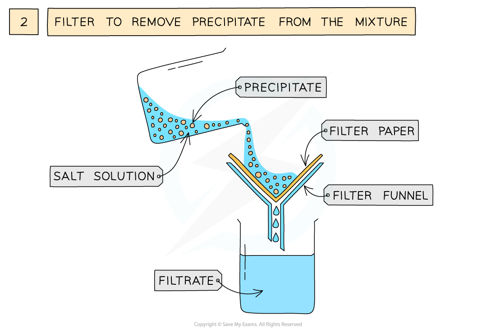

# Practical: Prepare Lead(II) Sulfate

## Practical: Prepare Lead(II)Sulfate

> **Spec point** — `spcpt_4dzwkpJDY5X3BChr`

## Practical: Prepare Lead(II)Sulfate

### Aim

- To prepare a dry sample of lead(II) sulfate
- The solid salt obtained is the precipitate, thus in order to successfully use this method the solid salt being formed must be insoluble in water, and the reactants must be soluble

### Diagram

#### Preparation of an insoluble salt via precipitation

***The preparation of lead(II)sulfate by precipitation from two soluble salts***

### Method

1. Measure out 25 cm3 of 0.5 mol dm3 lead(II)nitrate solution and add it to a small beaker
2. Measure out 25 cm3 of 0.5 mol dm3 of potassium sulfate add it to the beaker and mix together using a stirring rod
3. Filter to remove precipitate from mixture
4. Wash filtrate with distilled water to remove traces of other solutions
5. Leave in an oven to dry

**Soluble salt 1 = **lead(II) nitrate**       **

**Soluble salt 2 = **potassium sulfate

**lead(II) nitrate + potassium sulfate → lead(II) sulfate + potassium nitrate**

**Pb(NO****3****)****2****  (aq) + K****2****SO****4**** (aq) → PbSO****4**** (s) + 2KNO****3**** (aq)**

> **Exam Hint**
> Care should be taken with handling lead salts as they are toxic.
