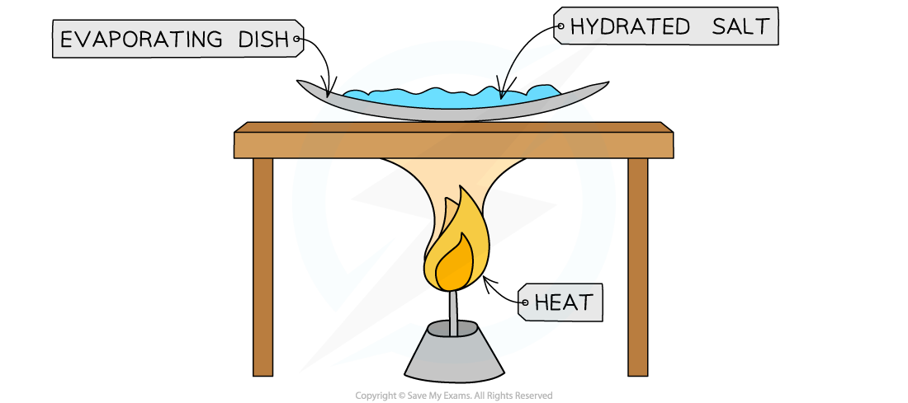

# Experiment: Finding Formulae of Simple Compounds

## Formulae of Simple Compounds by Experiment

> **Spec point** — `spcpt_J7VSXTGspSWNH2FC`

## Formulae of a simple compound by experiment

- The formulae of simple compounds can be found by careful experimentation and accurate measurements of mass changes
- The principle is to use mass measurements before and after a reaction and then convert masses into moles
- Using the moles of reactants and products it is possible to deduce molar ratios and hence an empirical formula
- Experiments which are easier to do using this process involve gases being lost or gained
- In this example a hydrated salt is heated to drive off the water as water vapour

### The formula of a hydrated salt

#### Aim:

- To determine the formula of hydrated copper sulfate, CuSO4. *x*H2O

#### Diagram:

***Heating a hydrated salt to remove the water of crystallisation***

#### Method

1. Measure the mass of evaporating dish
2. Add a known mass of hydrated salt
3. Heat over a Bunsen burner, gently stirring, until the blue salt turns completely white, indicating that all the water has been lost
4. Record the mass of the evaporating dish and its contents

#### Practical tip:

- Avoid overheating the salt as it could decompose and give you a larger mass change

#### Results:

- **Mass of the white anhydrous salt**

  - Measure the mass of white anhydrous salt remaining
- **Mass of water**

  - Subtract the mass of the white anhydrous salt remaining from the mass of known hydrated salt
  - **Step 1 – **Divide the mass of the copper sulfate and the water by their respective molar masses
  - **Step 2 – **Simplify the ratio of water to copper sulfate: |   | **anhydrous salt** | **water** |
  |---|---|---|
  | Mass | a | b |
  | Moles **(Step 1)** | a / *M*r  = y | b / *M*r  =x |
  | Ratio **(Step 2)** | 1 : | x |
  - **Step 3 – **Represent the ratio in the form ‘salt.xH2O’

> **Exam Hint**
> It is unlikely that you will get a whole number for the number of moles of water in the ratio, so you will need to round up or down to the nearest whole number.
