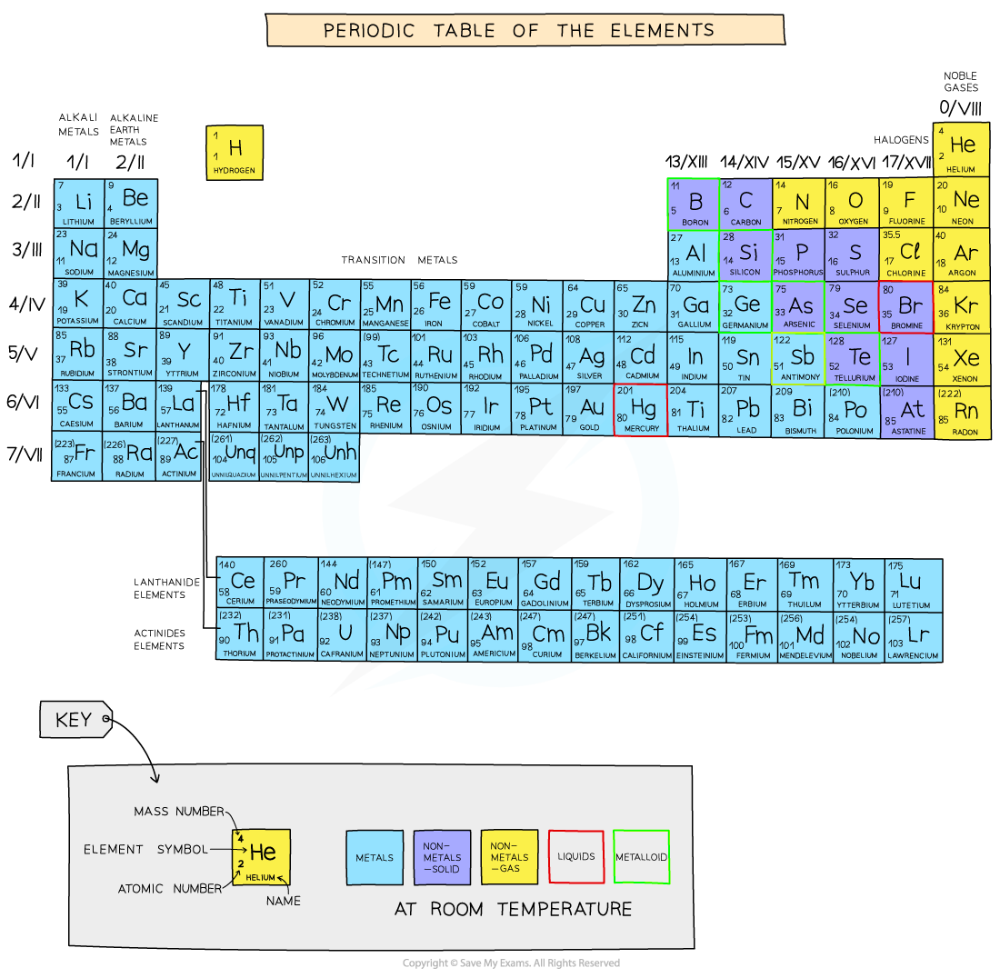

# Classify Metals & Non-Metals

## Classify Metals & Non-Metals

> **Spec point** — `spcpt_qH39c5p2KZXPnbVD`

## Properties of metals and non-metals

- We can use properties such as electrical conductivity and acid-base character to classify elements as metals or non-metals

#### Properties of metals and non-metals

| **Property** | **Metals** | **Non-metals** |
|---|---|---|
| Electron arrangement | 1-3 outer shell electrons | 4-7 outer shell electrons |
| Bonding | Metallic bonding due to loss of electrons | Covalent by sharing of outer shell electrons |
| Electrical conductivity | Good conductor of electricity | Poor conductors of electricity |
| Type of oxide | Basic oxides | Acidic oxides (some are neutral) |
| Reaction with acids | Many react with acids | Usually do not react with acids |
| Physical characteristics | - Usually lustrous (shiny) - Solid at room temperature (excluding mercury) - Malleable, can be bent and shaped - High melting and boiling point | - Dull, non-reflective - Different states at room temperature - Flaky, brittle - Low melting and boiling points |

## Metals & Non-Metals in the Periodic Table

> **Spec point** — `spcpt_GJmVsZVqMFgNn4bx`

## Metals and non-metals in the Periodic Table

- The location of the metals and non-metals shows a clear pattern when highlighted on a periodic table Another thing that is striking, is that you can see that the vast majority of elements are metals

***Metals are on the left of the Periodic Table and non-metals on the right***

> **Exam Hint**
> A zig-zag line between the blue and purple elements separates the metals on the left, from the non-metals on the right.
> 
> Elements which border the line are hard to classify as they have characteristics of both sides, so the term semi-metal or metalloid is used.
