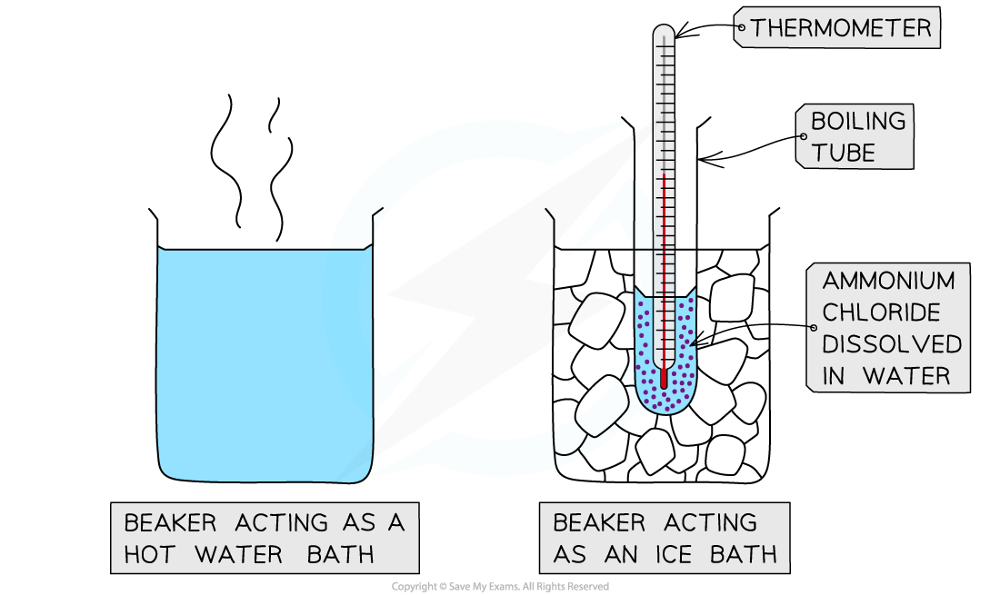

# Practical: Investigate The Solubility of a Solid In Water at a Specific Temperature

## Practical: Investigate the Solubility of a Solid in Water at a Specific Temperature

> **Spec point** — `spcpt_49Cz8Y96T2VCk2KD`

## Practical: Investigate the solubility of a solid in water at a specific temperature

### Aim

- To measure the solubility of a salt at different temperatures

### Method

1. Prepare two beakers, one as a hot water bath and one as an ice bath
2. Using a small measuring cylinder, measure out 4 cm3 of distilled water into a boiling tube.
3. On a balance weigh out 2.6 g of ammonium chloride and add it to the boiling tube
4. Place the boiling tube into the hot water bath and stir until the solid dissolves
5. Transfer the boiling tube to the ice bath and allow it to cool while stirring
6. Note the temperature at which crystals first appear and record it in a table of results
7. Add 1 cm3 of distilled water to the same boiling tube, then warm the solution again to dissolve the crystals
8. Repeat the cooling process again noting the temperature at which crystals first appear
9. Continue the steps until a total of 10 cm3 of water has been added

***Apparatus for investigating the solubility of a salt with temperature***

### Results

- The results can be recorded in a table
- The solubility in g / 100g is calculated by dividing the mass of the solute by the volume and multiplying by 100

#### Example results table

| ** Volume of water in boiling tube / cm****3** | ** Solubility in g per 100 g** | ** Temperature at which crystals appear / ****o****C** |
|---|---|---|
| 4 | 65 |   |
| 5 | 52 |   |
| 6 | 43 |   |
| 7 | 37 |   |
| 8 | 32 |   |
| 9 | 29 |   |
| 10 | 26 |   |

### Graph

- The results can be used to plot a solubility curve for ammonium chloride at different temperatures

  - Solubility is on the *y*-axis and temperature is on the* x*-axis

### Conclusion

- The shape of the graph will allow us to state how the solubility varies with temperature
