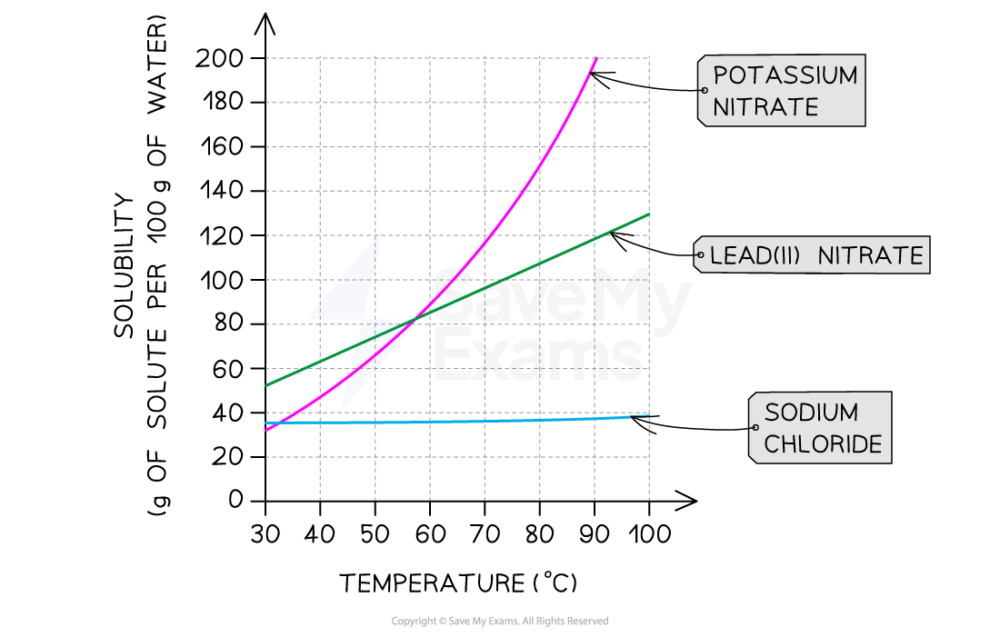

# Solubility

## Solubility

> **Spec point** — `spcpt_g3gjyZyVkh32ZnTk`

## Solubility

- Solubility is **a measurement of how much of a substance will dissolve in a given volume of a liquid**

  - The liquid is called the solvent
  - The solubility of a gas depends on pressure and temperature
- Different substances have different solubilities
- Solubility can be expressed in **g per 100 g of solvent**
- Solubility of solids is affected by temperature

  - As **temperature increases**, solids usually become **more soluble**
- Solubility of gases is affected by temperature and pressure; in general:

  - As **pressure increases**, gases become **more soluble**
  - As **temperature increases**, gases become **less soluble**

## Solubility Curves

> **Spec point** — `spcpt_zNZrFNd2hBJ8mBpt`

## Solubility curves

- Solubility graphs or curves represent solubility in g per 100 g of water plotted against temperature
- To plot a solubility curve, the maximum mass of solute that can be dissolved in 100 g of water before a saturated solution is formed, is determined at a series of different temperatures

#### Solubility curve for three salts

***While the solubility of most salts increases with temperature, sodium chloride, or common salt, hardly changes at all***

> **Worked Example**
> Use the solubility curve to answer these questions:
> 
> 1. Determine how much potassium nitrate will dissolve in 20 g of water at 50 °C?
> 2. 200 cm3 of saturated lead(II) nitrate solution was prepared at a temperature of 90 °C. What mass of lead(II) nitrate crystals form if the solution was cooled to 40 °C?
> 
> **Final answer:** **Answers:**
> 
> 1. At 50 °C, the solubility of potassium nitrate is 68 g per 100 g of water
> So scaling, 68 x (20 / 100) = **13.6 g** of potassium nitrate will dissolve in 20 g of water
> 2. Solubility of lead(II) nitrate at 90 oC is 118 g / 100 g water, and 64 g / 100 g water at 40 °C.
> Therefore for mass of crystals formed = 118 – 64 = 54 g (for 100 cm3 of solution).
> However, 200 cm3 of solution was prepared,
> So total mass of lead(II) nitrate crystallised = 2 x 54 = **108** **g**

> **Exam Hint**
> As temperature increases, solids usually become more soluble and gases become less soluble.
