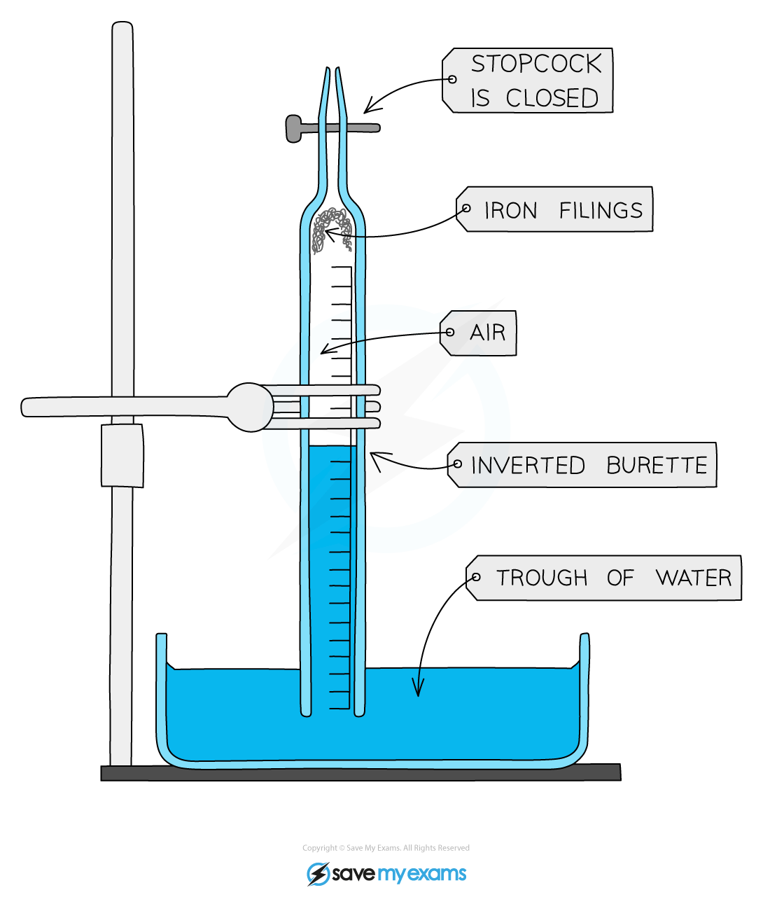

# Practical: Determine the % of Oxygen in Air

## Practical: Determine the Percentage of Oxygen in Air

> **Spec point** — `spcpt_qMtxM62wZDtxJKjD`

## Practical: Determine the percentage of oxygen in air

### Aim

To determine the percentage of oxygen in air using the oxidation of iron

### Diagram

#### Apparatus to measure the percentage of oxygen in the atmosphere

***Apparatus to determine the percentage of oxygen in the air***

### Method

1. Firstly, you will need to measure the volume between the final mark on the scale and the tap (stopcock)
2. Fill the burette with water up to lowest mark, 50.0 mL, and then let it drain into a small measuring cylinder
3. Measure the volume of water
4. Add a little water to moisten the inside of the burette
5. Make sure the tap is closed and sprinkle some iron filings or push a piece of iron wool into the bottom of the burette
6. Invert the burette into a trough of water and clamp the burette vertically
7. Note and record the position of the water level
8. After 3-4 days note the new position of the water level

### Results

- Volume occupied between 50 mL & the tap = 3.8 mL
- Initial water level = 2.6 mL
- Final water level = 12.7 mL

#### Calculation

- Initial volume of air = (50.0 + 3.8) - 2.6 = 51.2 mL
- Final volume of air = 53.8 - 12.7 = 41.1 mL
- Volume of oxygen = 51.2 - 41.1 = 10.1 mL
- Percentage of oxygen = (10.1 ÷ 51.2) x 100 = **19.7%**

### Conclusion

- The oxygen takes up approximately 20% of the air
