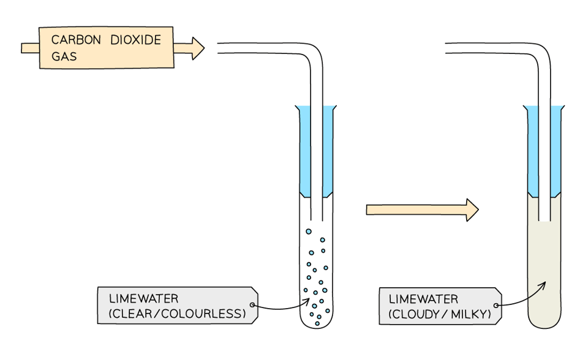
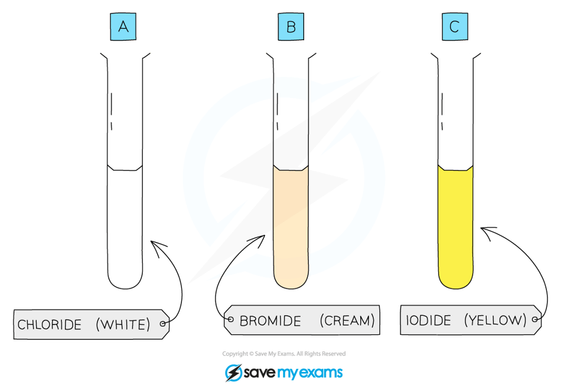
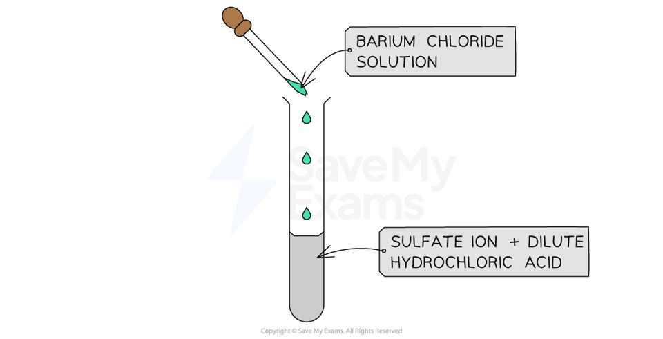

# How to Test for Anions

## Tests for Anions

> **Spec point** — `spcpt_TYHtv8DTDMCHB2Ct`

## Tests for anions

- Negatively charged non-metal ions are known as **anions**
- You must be able to **describe **the tests for the following ions:

  - Carbonate ions, CO32–
  - Halide ions, Cl– , Br– , I–
  - Sulfate ions, SO42–

### Test for carbonate ions

- Carbonate compounds contain the carbonate ion, CO32-
- The test for the carbonate ion is:

  - Add **dilute acid**
  - Bubble the **gas** released through limewater
  - Limewater turns cloudy if the carbonate ion is present
- If a carbonate compound is present then fizzing / effervescence should be seen as **CO****2** gas is produced, which forms a white precipitate of calcium carbonate when bubbled through limewater:

**CO****3****2- ****(aq) + 2H****+ ****(aq) → CO****2 ****(g) + H****2****O (l)**

**CO****2 ****(g) + Ca(OH)****2**** (aq) → CaCO****3****(s) + H****2****O(l)**

- The white precipitate turns limewater** cloudy **

#### Testing for carbonate ions

***Limewater turns milky in the presence of carbon dioxide caused by the formation of insoluble calcium carbonate***

> **Exam Hint**
> - If you are asked to describe the test for carbonate ions, make sure that you say:
> 
>   - Bubble the gas produced through limewater, which turns cloudy if the carbonate ion is present
> - Just saying that limewater turns cloudy is not enough
> 
>   - This isn't describing the test, it is stating the result

### Test for halide ions

- Halide ions are the negative ions / anions formed by the elements in Group 7
- The test for the halide ions is:

  - Acidify the sample with nitric acid
  - Add **silver nitrate solution,** AgNO3, ** **
  - A silver halide **precipitate **forms if a halide ion is present
  
    - The precipitate is indicated by the state symbol (s)
- The colour of the silver halide precipitate depends on the halide ion:

  - The chloride ion forms a **white **precipitate of silver chloride

**potassium chloride +  silver nitrate   →  potassium nitrate + silver chloride **

**KCl (aq)   +     AgNO****3**** (aq)   →  KNO****3**** (aq)  +  AgCl (s) **

- The bromide ion forms a **cream** precipitate of silver bromide

**potassium bromide +  silver nitrate   →  potassium nitrate + silver bromide**

**KBr (aq)   +     AgNO****3**** (aq)   →  KNO****3**** (aq)  +  AgBr (s) **

- The iodide ions forms a **yellow **precipitate of silver iodide

**potassium iodide +  silver nitrate   →  potassium nitrate + silver iodide**

**KI (aq)   +     AgNO****3**** (aq)   →  KNO****3**** (aq)  +  AgI (s) **

#### Testing for halide ions

***Each silver halide produces a precipitate of a different colour***

> **Exam Hint**
> The acidification step in the halide ion test must be done with nitric acid rather than hydrochloric acid.
> 
> HCl contains the chloride ion which would interfere with the results.

### Test for sulfate ions

- Sulfate compounds contain the sulfate ion, SO42-
- The test for the sulfate ion is:

  - Acidify the sample with **dilute hydrochloric acid**
  - Add a few drops of** barium chloride solution**
  - A **white** precipitate of barium sulfate is formed, if the sulfate ion is present

**Ba****2+**** (aq) + SO****4****2-**** (aq) → BaSO****4**** (s)**

- The test can also be carried out with barium nitrate solution

#### Testing for sulfate ions

***A white precipitate of barium sulfate is a positive result for the presence of sulfate ions***

> **Exam Hint**
> HCl is added first to remove any **carbonates **which may be present which would also produce a precipitate and interfere with the results.
