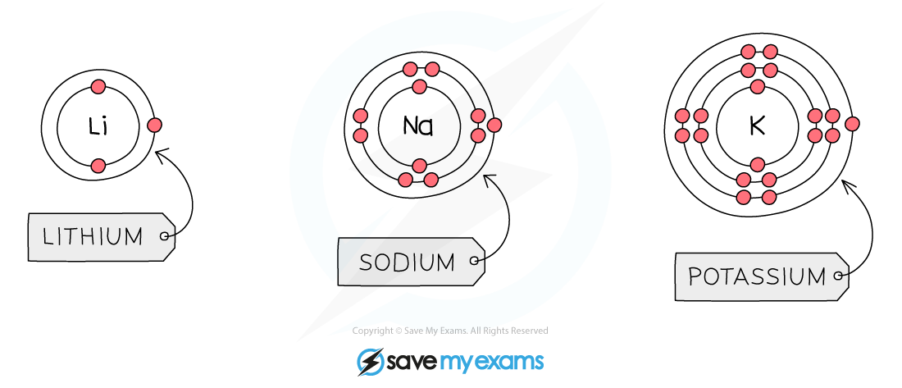

# Group 1: Reactivity & Electronic Configurations

## Group 1: Reactivity & Electronic Configurations

> **Spec point** — `spcpt_8scGmHM9tM7jcpHt`

## Electronic configuration of Group 1 elements

- The reactivity of the Group 1 metals **increases** as you go down the group
- When a Group 1 element reacts its atoms only need to lose electron, as there is only 1 electron in the outer shell

  - When this happens, 1+ ions are formed
- The next shell down automatically becomes the outermost shell and since it is **already full,** a Group 1 ion obtains **noble gas configuration**
- As you go down Group 1, the number of shells of electrons increases by 1

  - This means that the outermost electron gets **further** away from the nucleus, so there are **weaker** **forces of attraction **between the outermost electron and the nucleus
  - **Less energy** is required to overcome the force of attraction as it gets weaker, so the outer electron is lost **more easily**
  - So, the alkali metals get more reactive as you descend the group

#### Electronic configuration of Group 1 elements

***These electron shell diagrams of the first 3 alkali metals show that the Group 1 metals have 1 electron in their outer shell***

> **Exam Hint**
> In your exams, you could be asked to explain the trend in reactivity of the alkali metals - make sure you answer this question using their electronic configuration to support your answer.
