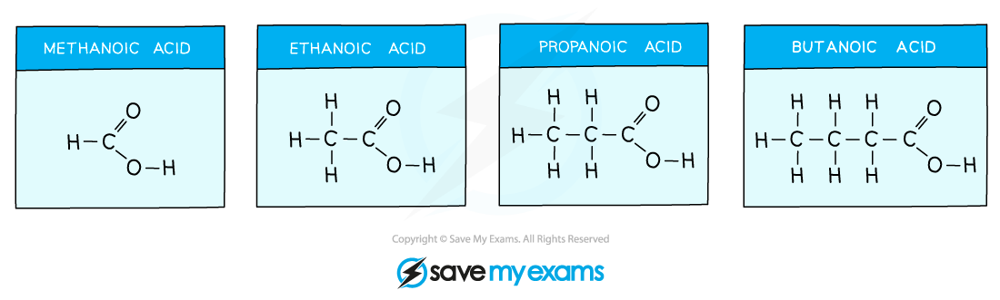

# What are Carboxylic Acids?

## The Carboxylic Acids

> **Spec point** — `spcpt_4Qz3GhHWYT9DYVrZ`

## Carboxylic acids

- **Carboxylic acids** is the name given to compounds containing the functional group **carboxyl, -COOH**
- The general formula of a carboxylic acid is **C****n****H****2n+1****COOH **which can be shortened to just **RCOOH**

#### Carboxylic acid functional group

***Diagram of the general structure of a carboxylic acid. The R- represents a varying hydrocarbon chain***

- The naming of a **carboxylic acid** follows the pattern** alkan + oic acid**
- The names and structure of the first four carboxylic acids are shown below
- Vinegar is an aqueous solution of ethanoic acid and contains about 5% of the acid by volume.

***The structures and formulae of the first four carboxylic acids***

- The formula for each carboxylic acid is:

  - Methanoic acid- HCOOH
  - Ethanoic acid- CH3COOH
  - Propanoic acid- CH3CH2COOH
  - Butanoic acid- CH3CH2CH2COOH

> **Exam Hint**
> The carbon atom in the -COOH functional group is counted as part of the molecule and not just the functional group. E.g. CH3CH2CH2COOH has 4 carbon atoms so is called butanoic acid, not propanoic acid.
