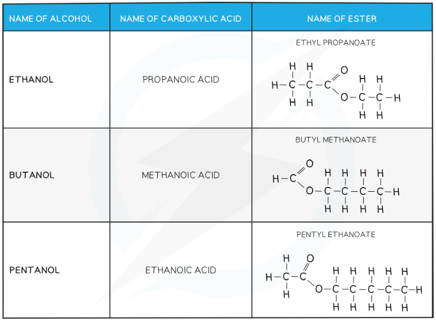

# What are Esters?

## The Esters

> **Spec point** — `spcpt_d4GgXF9GWcGKKZNs`

## Esters

### Making esters

- Alcohols and carboxylic acids react to make esters in **esterification** reactions
- Esters are compounds with the functional group R-COO-R 
- Esters are sweet-smelling oily liquids used in** food flavourings** and **perfumes**
- Ethanoic acid will react with ethanol in the presence of concentrated sulfuric acid (catalyst) to form the ester, **ethyl ethanoate:**

**CH****3****COOH + C****2****H****5****OH → CH****3****COOC****2****H****5**** + H****2****O**

#### Diagram showing the formation of ethyl ethanoate

***During this esterification reaction, a molecule of water is also produced***

### Naming Esters

- An ester is made from an alcohol and carboxylic acid
- The first part of the name indicates the length of the carbon chain in the alcohol, and it ends with the letters ‘- yl’
- The second part of the name indicates the length of the carbon chain in the carboxylic acid, and it ends with the letters ‘- oate’

  - E.g. The ester formed from** pent**anol and **butan**oic acid is called **pent**yl **butan**oate

***Diagram showing the origin of each carbon chain in ester***

- Some examples of common esters:

#### Examples of Esters Table

> **Exam Hint**
> You must be able to write the structure and displayed formula for an ester, given the name or formula of the alcohol and carboxylic acid from which it is formed and vice versa.
