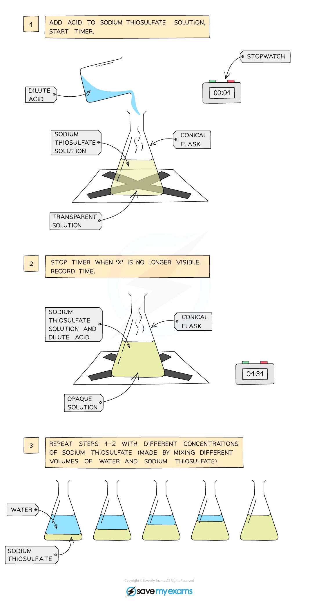
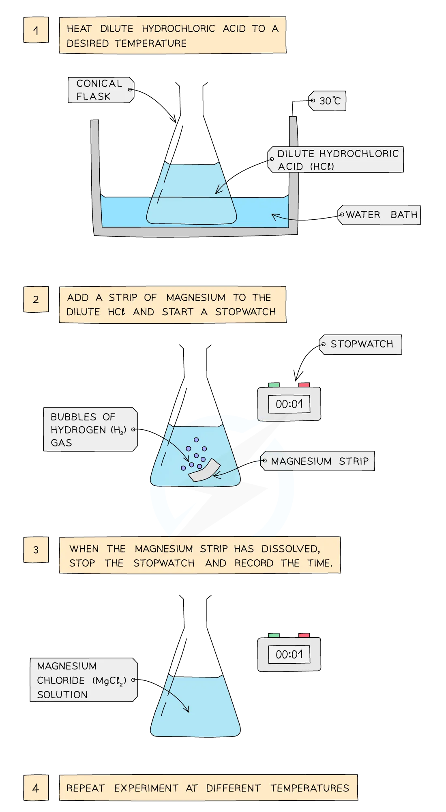
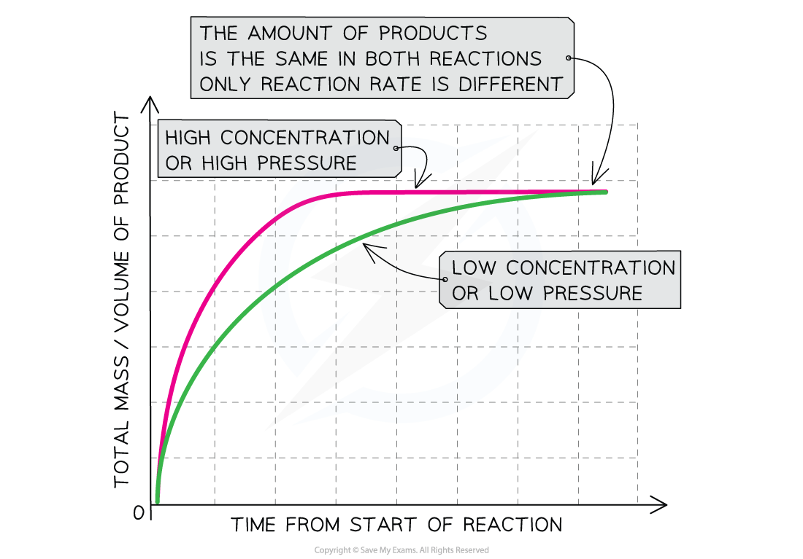
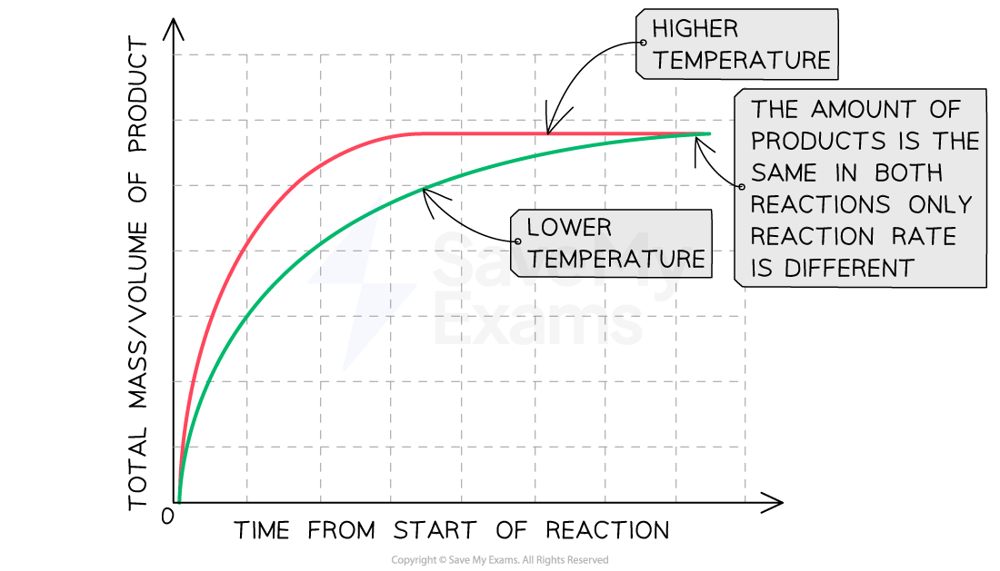
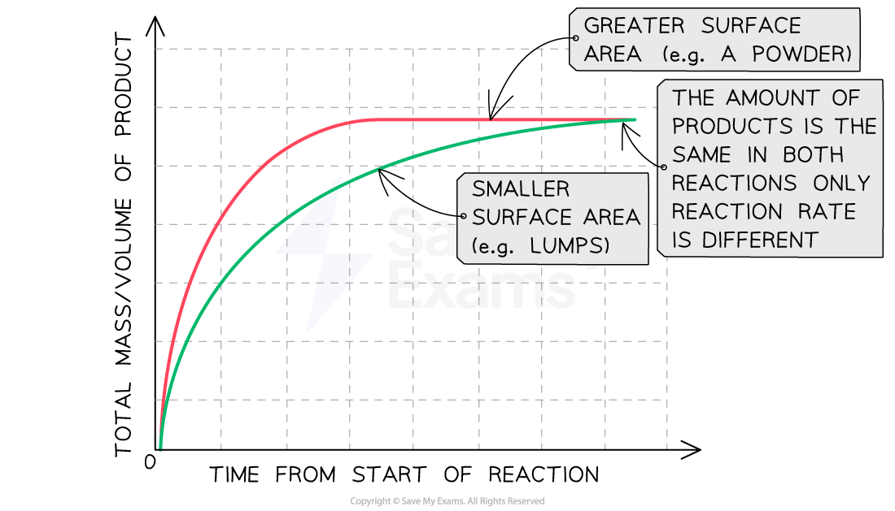
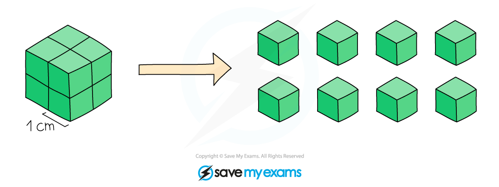

# Measuring Rates of Reactions

## Measuring Rates

> **Spec point** — `spcpt_Bkz2pSbQCdrF75dF`

## Measuring rates of reaction

- Reactions take place at different rates depending on the chemicals involved and the conditions

  - Some are extremely slow e.g. rusting and others are extremely fast e.g. explosives

- You should be able to describe experiments to investigate the effect of surface area, concentration, temperature and a catalyst on a rate of reaction

### Effect of surface area of a solid on the rate of reaction

***The process of downwards displacement to investigate the effect of the surface area of a solid on the rate of reaction***

#### Method:

- Add dilute hydrochloric acid to the conical flask
- Use a delivery tube to connect this flask to an inverted measuring cylinder upside down in a water trough
- Add calcium carbonate chips into the conical flask and close the bung
- Measure the volume of gas produced in a fixed time using the measuring cylinder
- Repeat with different sizes of calcium carbonate chips

### Effect of concentration of a solution on the rate of reaction

***The apparatus needed to investigate the effect of concentration on the rate of reaction***

#### Method:

- Measure 50 cm3 of sodium thiosulfate solution into a flask
- Measure 5 cm3 of dilute hydrochloric acid into a measuring cylinder
- Draw a cross on a piece of paper and put it underneath the flask
- Add the acid into the flask and immediately start the stopwatch
- Look down at the cross from above and stop the stopwatch when the cross can no longer be seen
- Repeat using different concentrations of sodium thiosulfate solution (mix different volumes of sodium thiosulfate solution with water to dilute it)

#### Result:

- With an increase in the concentration of a solution, the rate of reaction will increase
- This is because there will be more reactant particles in a given volume, allowing more frequent and successful collisions, increasing the rate of reaction

### Effect of temperature on the rate of reaction

***Diagram showing the apparatus needed to investigate the effect of temperature on the rate of reaction***

#### Method:

- Dilute hydrochloric acid is heated to a set temperature using a water bath
- Add the dilute hydrochloric acid into a conical flask
- Add a strip of magnesium and start the stopwatch
- Stop the time when the magnesium fully dissolves
- Repeat at different temperatures and compare results

#### Result:

- With an increase in the temperature, the rate of reaction will increase
- This is because the particles will have more kinetic energy than the required activation energy, therefore more frequent and successful collisions will occur, increasing the rate of reaction

### Effect of a catalyst on the rate of reaction

***Diagram showing the apparatus needed to investigate the effect of a catalyst on the rate of reaction***

#### Method:

- Add hydrogen peroxide into a conical flask
- Use a delivery tube to connect this flask to a measuring cylinder upside down in water trough
- Add the catalyst manganese(IV) oxide into the conical flask and close the bung
- Measure the volume of gas produced in a fixed time using the measuring cylinder
- Repeat experiment without the catalyst of manganese(IV) oxide and compare results

## Factors Affecting Rates

> **Spec point** — `spcpt_tt9J38w3QzyqM9YB`

## Factors affecting rates of reaction

- Factors that can affect the rate of a reaction are:

  - The **concentration **of the reactants in solution or the **pressure **of reacting gases
  - The **temperature **of the reaction
  - **Surface area **of solid reactants
  - The presence of a **catalyst**
- Changes in these factors directly influence the rate of a reaction
- It is of **economic interest** to have a higher rate of reaction as this implies a higher rate of production and hence a more efficient and sustainable process

### The effect of increased concentration or pressure

#### Graph showing the effect of concentration on rate of reaction

***Increasing the concentration of a solution or gas pressure increases the rate of reaction***

**Explanation:**

- Compared to a reaction with a reactant at a low concentration (or pressure), the line graph for the same reaction at a higher concentration (or pressure):

  - Has a steeper gradient at the start
  - Becomes horizontal sooner
  - Forms the same amount of product
- This shows that **increasing the concentration (or pressure) increases the rate of reaction **

### The effect of increasing temperature

#### Graph showing the effect of temperature on rate of reaction

***Increasing the temperature increases the rate of reaction***

**Explanation:**

- Compared to a reaction at a low temperature, the line graph for the same reaction at a higher temperature:

  - Has a steeper gradient at the start
  - Becomes horizontal sooner
  - Forms the same amount of product

- This shows that **increasing the temperature increases the rate of reaction **

### The effect of increasing surface area

#### Graph showing the effect of surface area on rate of reaction

***Increasing the surface area increases the rate of reaction***

**Explanation:**

- Compared to a reaction with lumps of reactant, the line graph for the same reaction with powdered reactant:

  - Has a steeper gradient at the start
  - Becomes horizontal sooner
  - Forms the same amount of product
- This shows that **increasing the surface area increases the rate of reaction **

  - Increasing surface area can sometimes be described as decreasing solid particle size

#### Surface area and particle size

***Surface area increases as particle size decreases. A 2 cm******3 ******cube has a surface area of 24 cm******2 ******and the same cube cut up into 8 cubes has a surface area of 48 cm******2***

> **Exam Hint**
> You should be able to recall how changing the concentration, pressure, temperature, and surface area affect the rate of a reaction.
