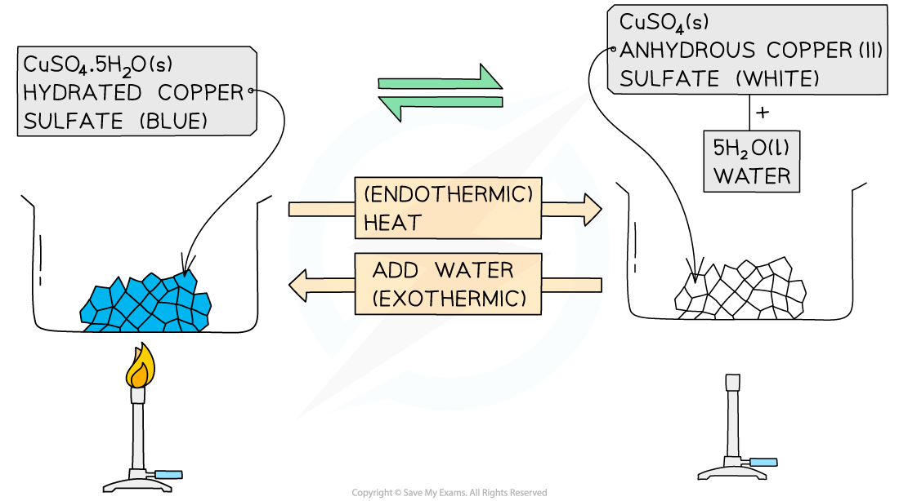

# What are Reversible Reactions?

## Reversible Reactions

> **Spec point** — `spcpt_mzh6RzjSBdh6PpDW`

## Reversible reactions

- Some reactions go to **completion**, where the reactants are used up to form the product molecules and the reaction stops when all of the reactants are used up
- In **reversible reactions**, the product molecules can themselves react with each other or decompose and form the reactant molecules again
- It is said that the reaction can occur in **both** **directions**:

  - The **forward **reaction forming the products
  - The **reverse **reaction forming the reactants
- When writing chemical equations for reversible reactions, two opposing arrows are used to indicate the forward and reverse reactions occurring at the same time

**⇌  **

- Each one is drawn with just half an arrowhead – the top one points to the right, and the bottom one points to the left
- The direction a reversible reaction takes can be changed by changing the reaction conditions

### Thermal decomposition of ammonium chloride

- Heating ammonium chloride produces ammonia and hydrogen chloride gases:

**NH****4****Cl (s) → NH****3 ****(g) + HCl (g)**

- As the hot gases cool down they recombine to form solid ammonium chloride

**NH****3 ****(g) + HCl (g) → NH****4****Cl (s)  **

- So, the reversible reaction is represented like this:

**NH****4****Cl (s) ⇌ NH****3 ****(g) + HCl (g)**

### Dehydration of hydrated copper(II) sulfate

- Reversible reactions can be seen in some hydrated salts
- These are salts that contain **water of crystallisation** which affects their shape and colour

  - Water of crystallisation is the water that is included in the structure of some salts during the crystallisation process

- One example is copper(II) sulfate:

**hydrated copper(II) sulfate ⇌ anhydrous copper(II) sulfate + water**

**CuSO****4****•5H****2****O ⇌ CuSO****4**** + 5H****2****O**

- The hydrated salt is copper(II) sulfate pentahydrate, CuSO4•5H2O

  - These are usually seen as **blue crystals**
  - The hydrated salt can be heated / dehydrated to form anhydrous copper(II) sulfate, CuSO4
  - This reaction is endothermic as energy is taken in to remove the water
- The anhydrous salt is copper(II) sulfate

  - This is usually seen as **white crystals / powder**
  - Adding water to the anhydrous salt forms the hydrated copper(II) sulfate pentahydrate, CuSO4•5H2O
  - This reaction is highly exothermic

#### The dehydration of hydrated copper(II) sulfate

***The dehydration of hydrated salts is often a reversible reaction***

> **Exam Hint**
> The reverse reaction may also be called the backwards reaction. A generic reversible reaction is shown as
> 
> **A + B ⇌ C + D**
