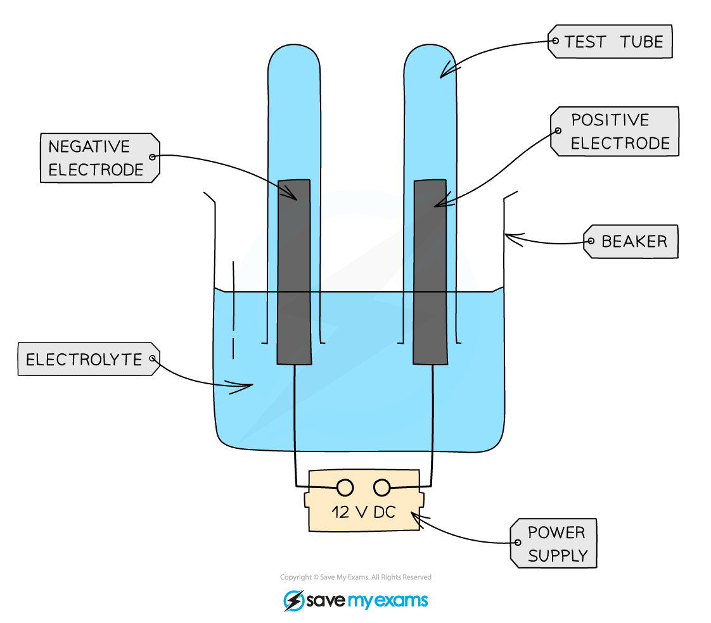

# Practical: Investigate the Electrolysis of Aqueous Solutions

## Practical: Investigate the Electrolysis of Aqueous Solutions

> **Spec point** — `spcpt_ygqNs33cnPyWj5XS`

## Practical: Investigate the electrolysis of aqueous solutions

### Aim:

To electrolyse aqueous solutions of sodium chloride, sulfuric acid and copper(II)sulfate, and to collect and identify the products at each electrode

### Diagram:

#### Electrolysis cell for collecting gaseous products from aqueous solutions

### Method:

1. Add the aqueous solution to a beaker and cover the electrodes with the solution
2. Invert two small test tubes to collect any gaseous products
3. Connect the electrodes to a power pack or battery
4. Turn on the power pack or battery and allow electrolysis to take place
5. Observations at each electrode are made
6. Gases collected in the test tube can be tested and identified

#### Testing the products

- If the gas produced at the **cathode** burns with a ‘pop’ when a sample is lit with a lighted splint, the gas is **hydrogen**
- If the gas produced at the **anode** relights a glowing splint dipped into a sample of the gas, the gas is **oxygen**
- If the anode gas bleaches of a piece of litmus paper, chlorine has been produced
- If a solid forms around the electrode, the metal have been formed

  - The colour can indicate the metal formed

### Results:

| **Solution** | **Cathode observation** | **Anode observation** |
|---|---|---|
| Sodium chloride | Colourless gas evolved which goes 'pop' with a lighted splint | Gas evolved which bleaches litmus paper |
| Dilute sulfuric acid | Colourless gas evolved which goes 'pop' with a lighted splint | Colourless gas evolved which relights a glowing splint |
| Copper(II) sulfate | Pink-brown deposit seen on the electrode | Colourless gas evolved which relights a glowing splint |

### Conclusions:

1. **Sodium chloride** solutions produces **hydrogen** at the cathode and **chlorine** at the anode
2. Dilute **sulfuric acid** produces **hydrogen** at the cathode and **oxygen** at the anode
3. **Copper(II)sulfate** solution produces **copper** at the cathode an **oxygen** at the anode
