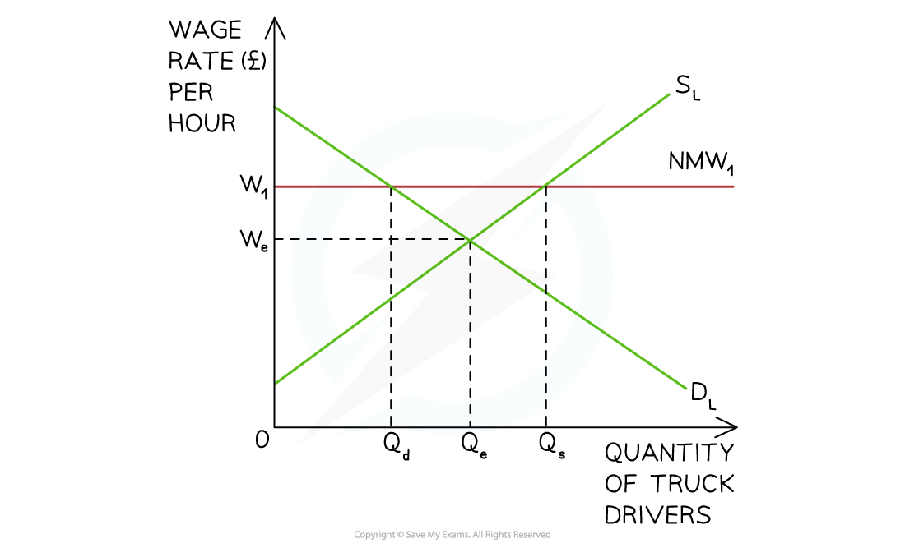
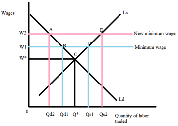

# Government Intervention: Labour Market

## Reasons for a National Minimum Wage

> **Spec point** — `spcpt_JqvBd7q9h2WbjTc5`

## Reasons for a National Minimum Wage

- Government's often **intervene in the labour market** by setting a minimum wage
- A **minimum wage **is a **legally imposed wage level** that employers must pay their workers

  - It is set **above** the market rate
  - The minimum wage/hour often varies **based on age**
- The aim is to **improve equity** and avoid the **exploitation** of workers

  - It protects **low income earners** as it ensures workers receive a fair wage, supporting their **basic needs**
  - This protection is likely to impact workers in **lower-paid sectors**
  
    - These sectors include **retail, hospitality and agriculture industries**
- A higher minimum wage can act as an **incentive** for workers to supply labour

  - More workers are prepared to supply themselves to the market for work
  - Workers may have improved **productivity **as they feel more motivated to work with higher wages

## National Minimum Wage Diagram

> **Spec point** — `spcpt_5mZ9wHbDt2s2dXDy`

## National Minimum Wage Diagram

- Australia set the **national minimum wage** at **\$23.23 per hour** in 2024

  - This is above the market wage rate

*A national minimum wage (NMW1) is imposed above the market wage rate (We) at W1*

### Diagram analysis

- The **market equilibrium** wage and quantity for truck drivers in Australia is at **W****e****Q****e**
- The government imposes a **national minimum wage** (NMW) at **W****1**
- Incentivised by higher wages, the **supply of labour increases** from Qe to Qs
- Facing higher production costs, the **demand for labour** by firms **decreases **from Qe to Qd
- This means that **at a wage rate of W****1** there is** excess supply of labour** and the potential for **unemployment is **equal to **Q****d****Q****s**

### Increasing the minimum wage level

- Should a country decide to increase the minimum wage, it will further distort the market, resulting in an increase in the excess supply of labour

*The initial excess supply was equal to BD. The new minimum wage is higher and increases the excess supply to AE*

#### Diagram analysis

- With the original minimum wage set at W1, the excess supply of labour in the market is equal to Qs1-Qd1
- An increase in the minimum wage to W2 has the following effects:

  - The quantity of labour demanded by firms **contracts from Q****d1**** to Q****d2**
  - The quantity of labour supplied by workers **extends from Q****s1**** to Q****s2**
  - There is an even greater **excess supply of labour (unemployment)** equal to Qs2-Qd2

## Evaluation of a National Minimum Wage

> **Spec point** — `spcpt_tNRcg5FWr7F4yRDg`

## Evaluation of a National Minimum Wage

- A minimum wage can be controversial, as it has **different impacts on stakeholders**

**Evaluating the use of minimum wages**

| **Advantages** | **Disadvantages** |
|---|---|
| - Guarantees a **minimum income** for the lowest paid workers - Higher income levels help to **increase consumption** in the economy - May **incentivise** workers to be more productive - The increase in productivity may allow the firms to offset the increase in wages - The overall standard of living in the economy may improve | - Raises the **costs of production** for firms that may respond by **raising the price of goods and services ** - If firms are unable to raise their prices, the introduction of a minimum wage may force them to lay off some workers, **increasing unemployment** - If unemployment increases, then **government tax revenues will fall **(and benefit payments will increase) |

> **Exam Hint**
> When evaluating the use of minimum wages, do not assume that they will automatically increase unemployment. Question that assumption.
> 
> Many studies have shown that **unemployment does not increase**, and in some instances, employment increases. This is because some workers are receiving higher wages and choosing to consume more. This **increases total demand **in the economy, which in turn **increases the demand for labour by firms**, thus reducing/eliminating any potential unemployment.
