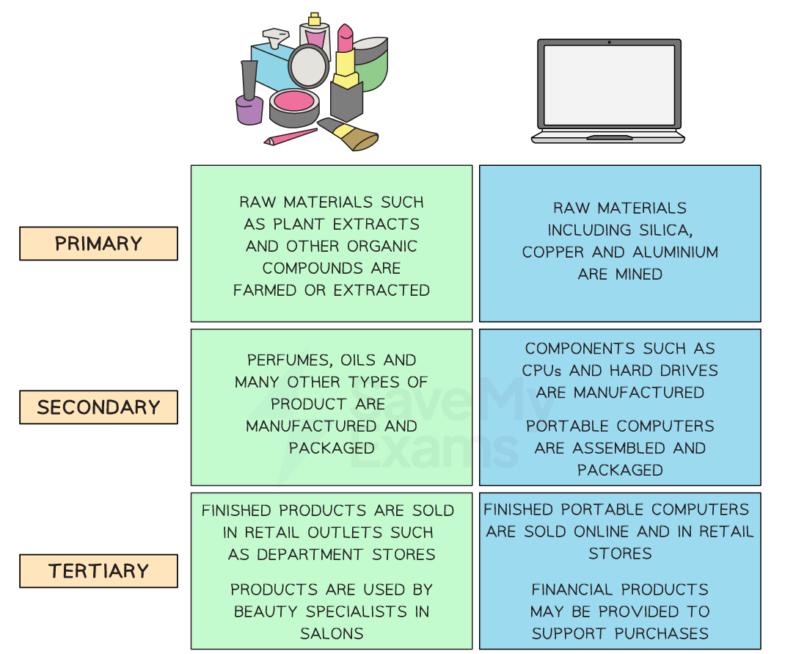
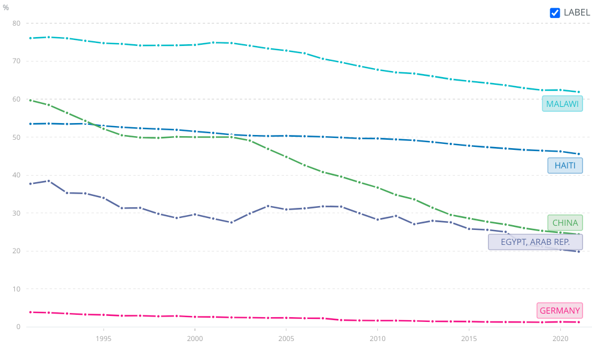
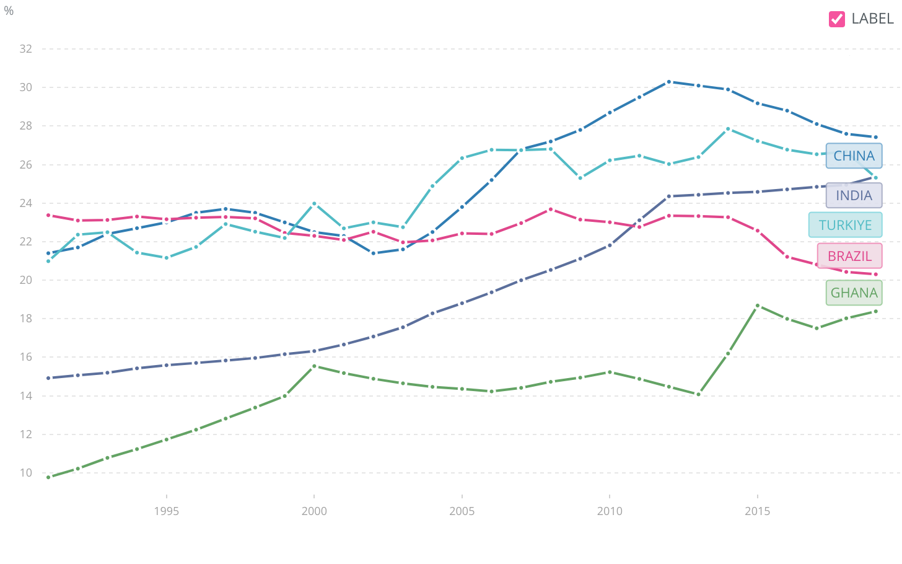
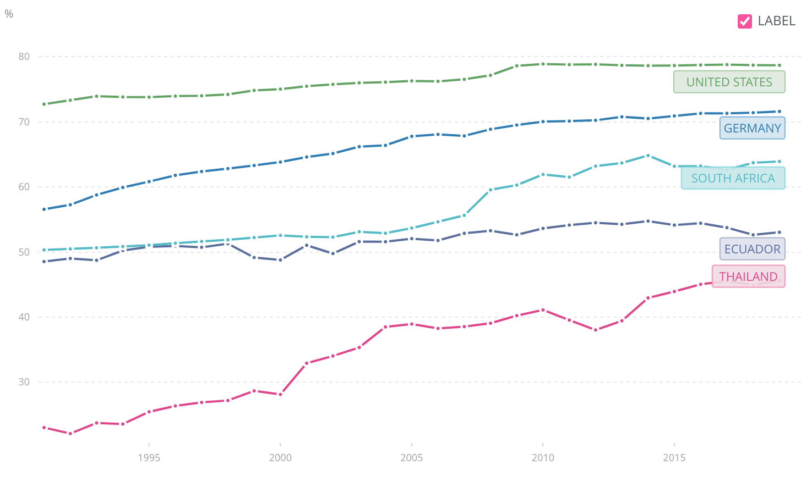

# Economic Sectors & Their Relative Importance Over Time

## Primary, Secondary & Tertiary Sectors

> **Spec point** — `spcpt_tXJx2G4ZsJqSXt4Y`

## Primary, Secondary & Tertiary Sectors

- Businesses can operate in different **types of economic sectors**, which include:

  - The primary sector
  - The secondary sector
  - The tertiary sector
- Classification into these sectors is a **simplified way of categorising industries**

  - It helps to provide a means of making comparisons between firms in the same sector
  - It does not capture the full complexity and interconnectedness of the business world
  - Many businesses operate across multiple sectors or may not fit neatly into a single category

*Farming in the primary sector, manufacturing in the secondary sector and hairdressing in the service sector*

- The **primary** sector is concerned with the **extraction** of raw materials from land, sea or air, such as farming, mining or fishing
- The **secondary** sector is concerned with the **processing** of raw materials, such as oil refinement, and the **manufacture** of goods such as vehicles
- The **tertiary** sector is concerned with the provision of a wide range **services** for consumers and other businesses, such as leisure, banking or hospitality

### The chain of production

- The three sectors are linked in the **chain of production,** which is the series of steps taken to** turn raw materials into a finished product** that can be marketed and sold

*The chain of production for make-up and computers*

## Changes in Sector Importance

> **Spec point** — `spcpt_CQFRG45RyHBTynfN`

## Changes in Sector Importance

- As economies **grow and develop**, many of the firms within that economy will **change their sector of operation **(sectoral change)
- Generally speaking, their are successively higher levels of profits to be made in **each subsequent sector**

  - The reason for this is that each sector** adds more value** than the previous sector
  - Higher ***added value*** equates to higher profits

### Less developed economies

- A **less developed economy **will primarily be focused on the **primary sector**, with most people employed in agriculture and the production of food

  - There has been a global trend away from employment in primary sector industries over the last two decades
  - Only in the least developed nations is the proportion of the workforce employed in the primary sector consistently high
  - This is partly as a result of** lower participation rates in education **and a **lack of *****infrastructure*** to support manufacturing or service provision

#### Diagram: employment in agriculture since 1991

*The graph shows a comparison of levels of employment in the primary sector between countries at varying stages of development *

(Source: [WorldBank](https://data.worldbank.org/indicator/SL.AGR.EMPL.ZS?end=2021&locations=HT-CN-EG-DE-MW&start=1991&view=chart))

#### Diagram analysis

- Malawi still retains the highest proportion of employment in the primary sector
- China has seen a significant decrease in primary sector activity
- Germany has had very low primary sector and will likely have been in manufacturing and services well before 1991

### Emerging economies

- In **emerging economies,** improved technology means that less labour is required in the primary sector and more workers are employed in manufacturing

  - The proportion of workers employed in manufacturing has risen over the last few decades
  - Many businesses have relocated production facilities to take advantage of the **lower average wage rates** in these economies
- **Emerging economies **have experienced growth in the tertiary and quaternary sectors in recent years, with many businesses now focused on the provision of consumer services

#### Diagram: secondary sector employment since 1991

*The graph shows a comparison of levels of employment in industry between countries at varying stages of development *

(Source: [WorldBank](https://data.worldbank.org/indicator/SL.AGR.EMPL.ZS?end=2021&locations=HT-CN-EG-DE-MW&start=1991&view=chart))

#### Diagram analysis

- China has the highest proportion of employment in the secondary sector
- Ghana and India have seen significant increases in secondary sector activity
- Brazil and Turkey's secondary sectors have remained relatively stable over the period 1991 to 2019

### Developed economies

- The **most developed economies **have a very high proportion of the workforce employed in the provision of services

  - Developed economies use their wealth to fund advanced **education** and **higher-level skills training,** which further supports the growth of these industries
  - Some **exceptions,** such as Australia (viticulture, or wine production) and Norway (forestry and oil extraction), continue to have significant primary sectors

#### Diagram: employment in services since 1991

*The graph shows a comparison of levels of employment in services between countries at varying stages of development*

(Source: [WorldBank](https://data.worldbank.org/indicator/SL.SRV.EMPL.ZS?end=2019&locations=DE-US-EC-TH-ZA&most_recent_year_desc=false&start=1991&view=chart))

#### Diagram analysis

- The most developed countries have the highest proportion of their workforces employed in the service industry
- Thailand's service sector employs twice as many workers in 2019 as it did in 1991
- Around half of Ecuador's workforce is now employed in service delivery

> **Exam Hint**
> As economies develop, we see a movement away from the primary sector towards the secondary sector. Post-industrial economies are focused on the tertiary sector.
> 
> It is easy to assume that tertiary sector employment is higher-paid than jobs in the secondary sector. This is not necessarily the case. Value-added is certainly higher in most tertiary industries than in secondary sector industries, but in many tertiary sectors (such as hospitality and healthcare), pay is very low and a cause for concern.
> 
> Portugal and Greece, whose economies depend upon tourism, as well as the UK suffer from low pay in the tertiary sector with many workers relying on government support to cover basic living costs.
> 
> In contrast, high-paid secondary sector engineering and construction sectors in economies such as Germany and Norway make employees in these economies some of the highest-paid in the world.
