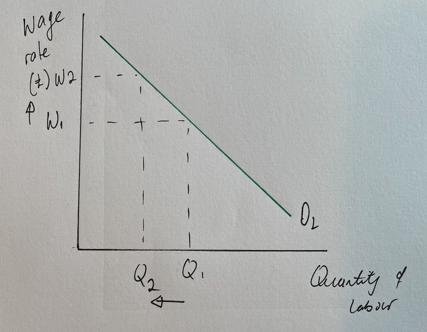

# Factors Influencing the Demand for Labour 

## The Demand for Labour is a Derived Demand

> **Spec point** — `spcpt_JN9gNrB9wSNxrcmQ`

## The Demand for Labour is a Derived Demand

- The **labour market** is composed of **sellers of labour** (households) and **buyers of labour** (firms)

  - **Workers supply **their labour, and **firms demand** labour to produce an output
- The demand for labour is a ***derived demand***

  - This means the level of labour demand** depends on the demand for goods and services**
  
    - If demand for goods and services increases, then demand for labour will increase, and vice versa
    - E.g. As the demand for technology devices increases, technology firms require more skilled labour to design, manufacture and market the tech products

## The Demand Curve for Labour

> **Spec point** — `spcpt_tqvKn2xsyRqSVjFF`

## The Demand Curve for Labour

- There is an inverse relationship between **wage rate** and the **quantity  of labour demanded**

*As wages rise, the quantity demanded of labour falls*

### Diagram analysis

- The **demand curve for Labour (D****L****)** shows that firms **demand more** labour as the wage rate decreases, which results in a downward sloping demand curve

  - If the wage rate increases **(W1 to W2)**, then the demand for labour falls **(Q1 to Q2)**

## Factors That Influence the Demand for Labour

> **Spec point** — `spcpt_KB4fZvP6BWqPS5PG`

## Factors That Influence the Demand for Labour

- If the wage rate is the only factor that changes, there will be a **movement along** the demand curve for labour
- However, a range of factors can** shift **the entire demand curve for labour to the left or right **Factors that Influence the Demand for Labour**

  - When the demand curve for labour shifts to the **left,** it indicates that **fewer workers** are employed at each wage rate
  - When the demand curve for labour shifts to the **right,** it indicates that **more workers** are employed at each wage rate

| Factor | Explanation |
|---|---|
| **The price of the product being produced** | - If the **selling price** of the product** increases**, then the firm will be incentivised to supply more, and the firm's demand for labour will increase - The demand for labour curve will **shift right** |
| **The demand for the final product** | - As demand for labour is a derived demand, when an economy is booming, **demand for most goods and services will rise**, and the **demand for labour will increase** - The demand curve for labour will **shift right** - Conversely, when an economy is in a ***recession***, demand for most goods and services will fall, and the **demand for labour will decrease**    - The demand curve for labour will **shift left** |
| **The ability to substitute capital (machinery) for labour** | - Firms will constantly evaluate if it will be possible and **more cost effective** to switch production from using labour to capital (machinery) - If it is more cost effective, then **demand for labour will decrease**    - The demand curve for labour will **shift left** |
| **The productivity of labour** | - If the ***productivity*** of labour increases (possibly through **training**), this will lower average costs, and firms will likely demand more labour - The demand curve for labour will **shift right** |

## An Increase in Demand for Labour

> **Spec point** — `spcpt_bNrVtXqt3ybdg8jD`

## Example: An Increase in Demand for Labour

- An increase in** online shopping** has led to an increase in demand for labour to deliver goods

*Increase in demand for labour due to the increased demand generated by online shopping*

### Diagram analysis

- Due to the increases in e-commerce, online companies have experienced **high demand **for goods
- This had led to a **demand** for labour to deliver these goods

  - There is a **shift in demand for labour **from DL → D1
  - The wage remains unchanged at W1, but the **demand has increased** from Q to Q1 workers

## A Decrease in Demand for Labour

> **Spec point** — `spcpt_wbRrMxYhQRSTGYjH`

## Example: A Decrease in Demand for Labour

- Clothing manufacturers in countries like Bangladesh and Vietnam have been investing in **automated production **to reduce the demand for labour in order to save on labour costs

*Decrease in demand for labour as machinery replaces labour*

### Diagram analysis

- Due to the** ability to substitute capital for labour, **there has been a fall in demand for labour to make clothes

  - There is a **shift in demand for labour **from D → D2
  - The wage remains unchanged at W1, but the **demand has decreased** from Q to Q2 workers
