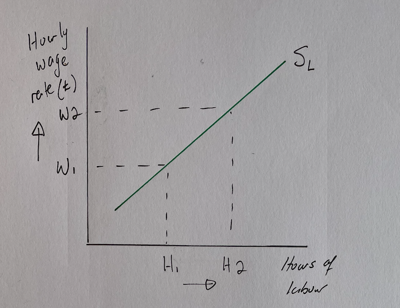

# Factors Influencing the Supply of Labour

## The Supply Curve for Labour

> **Spec point** — `spcpt_qzzDWNjtqTSypVpF`

## The Supply Curve for Labour

- The** supply curve** for labour  (SL) shows the relationship between the** wage rate** and **number of workers** willing to work in an occupation

  - The SL shows that more labour is supplied as the wage rate increases, which results in an **upward sloping supply curve**

*There is a positive relationship between supply of labour and wage rate *

### Diagram analysis

- The hourly **wage rate** increases from** W****1 ****to W****2**

  - There is an incentive for workers to supply more labour from **Q****1**** to Q****2**
- There is a** positive relationship** between market supply of labour and wage rate

  - The higher the wage rate, the higher the supply of labour in that occupation (and vice versa)

## Factors that Influence the Supply of Labour

> **Spec point** — `spcpt_t7MdhpTrk3h84BVw`

## Factors that Influence the Supply of Labour

- There are **numerous factors** that influence the amount of labour supplied to a **particular industry**

  - The supply curve shows the **market supply of labour**, not the individual supply of labour

**Factors Influencing the Supply Of Labour**

| Factor | Explanation |
|---|---|
| Population size | - A larger population means more people are potentially **available for work** - E.g. India's growing population has led to increase in supply of labour |
| Age distribution of the population | - More developed countries, such as Japan, have an **ageing population **that reduces labour supply - Less developed countries often have a more **youthful population**, increasing supply of labour |
| Migration | - Policies that increase the ***net migration rate *** increase the supply of labour to certain industries - E.g. In 2022, 36% of Singapore's labour force were migrants |
| Participation rate | - This is the number of people willing to work within the working age  group. This can change depending on    - Amount of** female participation **   - Changes to **retirement age **   - **School leaving age** |
| **School-leaving age** | - A rise in the **school leaving age **can lead to a reduction in the supply of labour and vice versa - E.g. There has been a decline in school leavers in South Korea, which has led to concern for future labour supply |
| Skills and qualifications | - The level of skills and qualifications generally undertaken can increase the supply of available workers for** specific industries **    - E.g. The more medical graduates, the greater the labour supply of nurses and doctors   - However, if school leaving age tends to be very low, workers are likely to be more unskilled |
| Mobility of labour | - **Geographical mobility of labour** is the ease with which workers can move from one geographical area to another in order to secure employment    - It can depend on  family ties, **being able to secure/afford accommodation** in an unknown location, cost of moving or quality of transport links - **Occupational mobility of labour** is the ability of a worker to **change occupations** when they lose a job    - If their **skill base is transferable** between different occupations, then their **occupational mobility is high** |

## An Increase in the Supply of Labour

> **Spec point** — `spcpt_fshjm9NDTQFMZkC3`

## Example: An increase in the Supply of Labour

- Changes to any of the factors affecting the supply of labour **shifts the entire supply curve** (as opposed to a movement along the supply curve)

*Changes in the supply of labour *

### Diagram analysis

- India's growing population has led to an ** increase in the supply of labour**

  - More people are now available to work
- This caused a **shift in supply **from S to S1

  - The wage rate remains unchanged at W1 but the **supply has increased** from Q to Q1

## A Decrease in the Supply of Labour

> **Spec point** — `spcpt_rg9NtB3Gs7yxRkjH`

## Example: A Decrease in the Supply of Labour

- Changes to any of the factors of supply of labour **shifts the entire supply curve** (as opposed to a movement along the supply curve)

*Decrease in supply of labour due to changes in population*

### Diagram analysis

- The UK raised the school leaving age from 16 to 18, which has led to a **decrease in the supply of labour**

  - This caused a **shift in supply **from S to S2
- The wage rate remains unchanged at W1 but the **supply has decreased** from Q to Q2

> **Worked Example**
> Which one of the following would lead to a decrease in the supply of labour? (1)
> 
> - A. Policies to increase net migration
> - B. Increase in the retirement age from 65 to 67
> - C. Increase in demand for final product
> - D. A shrinking population
> 
> The only correct answer is:** D. A shrinking population **
> 
> **Explanation **
> 
> A fall in population decreases the supply of labour
> 
> - A is not correct because this would lead to an increase in the supply of labour
> - B is not correct because this would lead to an increase in the supply of labour as people will retire at a later age, staying in the labour  market
> - C is not correct because this would lead to an increase in the demand for labour
