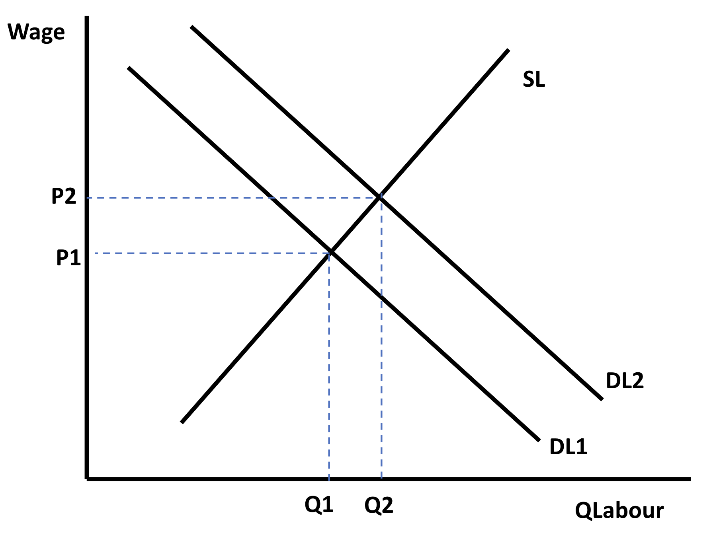
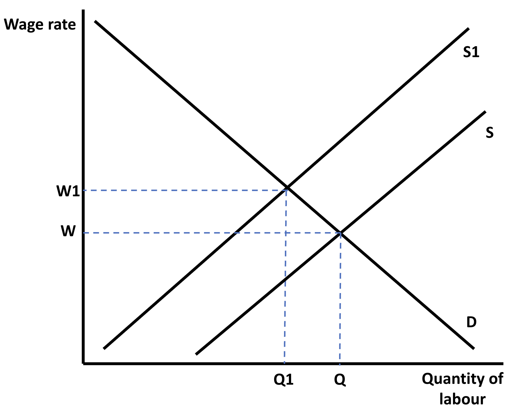

# Wage Determination

## Diagrammatic Analysis of the Labour Market

> **Spec point** — `spcpt_Z7WdGn3dXgQmvKkD`

## Diagrammatic Analysis of the Labour Market

- **Labour market equilibrium** occurs when the **demand for labour (D****L****)** is equal to the **supply of labour (S****L****)**

  - The DL is the demand **by firms** for workers
  - The SL is the supply of labour **by workers**
- Individual firms are ***price takers*** in the labour market as they have to accept the **wage rate **that workers are being paid in the industry

  - If they offer a** lower wage,** they will likely struggle to recruit workers
  - If they offer a **higher wage,** there will be an excess supply of  workers applying to work there

*In the labour market for graphic designers, the equilibrium wage rate is W and the equilibrium quantity is Q. At this point the DL = SL*

### Diagram analysis

- The market for graphic designers is in **equilibrium, where D****L ****= S****L**** **
- The **equilibrium wage** is W and the **quantity** of labour is Q
- There is **no *****excess supply*** of labour
- There is **no***** excess demand*** for labour

## The Effect of a Rise in Demand for Labour

> **Spec point** — `spcpt_KM2TBxCVdNTHbNGp`

## The Effect of a Rise in the Demand for Labour

- A rise in the demand for labour will shift the demand curve for labour  to the right
- This causes an increase in the equilibrium wage rate and the quantity of labour employed

*A rise in the demand for labour increases the price of labour*

#### Diagram analysis

- A rise in the demand for websites will cause a rise in the demand for graphic designers** (derived demand)**
- The demand  curve for labour will **shift right from DL****1**** to DL****2**

  - There is **a rise in the equilibrium wage rate to P****2**
  - There is **a rise in the equilibrium quantity **of labour employed** to Q****2**

## The Effect of a Fall in Supply of Labour

> **Spec point** — `spcpt_GQgxk437GhPBqWvM`

## The Effect of a Fall in the Supply of Labour

- A fall in the supply of labour will shift the supply curve of labour to the left
- This causes an increase in the equilibrium wage rate and a fall in quantity of labour employed

*A fall in the supply of graphic designers will cause the wage to rise to W2 and the quantity of graphic designers employed to fall to Q2*

#### Diagram analysis

- A fall in the supply of graphic designers as they switch to different jobs will impact the labour in the graphic design industry
- The supply curve of labour will **shift left**

  - There is **a rise in the equilibrium wage rate to W****1**
  - There is **a fall in the equilibrium quantity **of graphic designers employed** from Q to Q****1**
