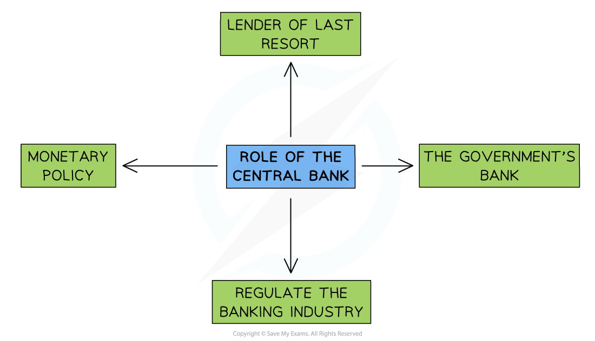

# Monetary Policy

## An Overview of Monetary Policy

> **Spec point** — `spcpt_x323T8DKCFsnNwnK`

## An Overview of Monetary Policy

- **Monetary policy** involves adjusting the the central bank's  ***interest rate***** **and the** money supply** in order to influence the total demand in an economy

  - If businesses and households borrow money, they must pay it back **plus interest**, so in effect the** price of borrowing money **is the interest paid
  - The **money supply** is the amount of money in circulation in an economy at any given moment in time
  - It consists of coins, banknotes, bank deposits and central bank ***reserves***
- Central Banks are usually responsible for setting **monetary policy**

  - **Central Bank committees usually** meet 4-8 times a year to set policy
  - In an economic crisis, the committee may sit more frequently

## The Role of the Central Bank

> **Spec point** — `spcpt_qjyFQsN7FXvJYns9`

## The Role of the Central Bank

- Central Banks play a vital role in **maintaining stability **in the financial system. Additionally, the **policy tools** at their disposal help to meet **Government economic objectives** and create economic growth

*Central Banks play four important roles in the economy*

1. **Implementation of** ***monetary policy***
This is more fully explained in  [Sub-topic 4.4.1](https://www.savemyexams.com/igcse/economics/cie/20/revision-notes/4-government-and-the-macroeconomy/4-4-monetary-policy/4-4-1-monetary-policy-measures/)
2. **Banker to the government**
The Government sets the ***annual budget*** but it is the Central Bank that manages the **tax receipts and payments.** In 2022 there were 5.7 million public sector workers in the UK who had to be paid by the Central Bank each month
3. **Banker to the banks—lender of last resort**
Commercial banks are able to borrow from the Central Bank when they run into short-term ***liquidity*** issues. Without this help, they might go **bankrupt** leading to instability in the financial system **and** a potential loss of savings for many households
4. **Regulation of the banking industry**
The high level of ***asymmetric information*** in financial markets requires that commercial banks be **regulated** in order to protect consumers

## Interest & the Base Rate

> **Spec point** — `spcpt_p38K4hNF25dYmHwR`

## Interest and the Base Rate

- Interest is the cost of borrowing money or the reward received for saving money
- The **interest rate **is the percentage charged for borrowing money or the percentage offered for saving money

  - E.g. DBS bank in Singapore offers an interest rate of 3% on savings
- The **base rate **(also know as the bank rate) is the interest rate at which the **Central Bank **lends money to **commercial banks **such as HSBC or Lloyds Bank

  - Commercial Banks use the base rate as the baseline for interest rates offered to their customers
  - E.g. If the base rate set by the Central Bank is 2%, then DBS will borrow money from the Central Bank at 2% and lend it to customers at 3%
  
    - This allows DBS to make a profit of 1% on the transaction
- Central Banks usually have a special committee that meets regularly to decide if the base rate should be modified
- The **Monetary Policy Committee (MPC) **under the **Bank of England** (UK Central Bank) is responsible for setting **monetary policy**

  - It meets roughly **eight times **a year to set policy and consists of **nine members**
  - The single most important consideration in their deliberations is the **inflation target rate **of 2% CPI
  - At this meeting, they each vote to set the central ***base rate***
  
    - A majority vote decides the policy
    - Some effects of the decision are immediate, for example, some mortgage rates are usually adjusted in line with changes of the base rate on the same day
    - It can take up to two years for the full effects of interest rate changes to be seen throughout in the economy
