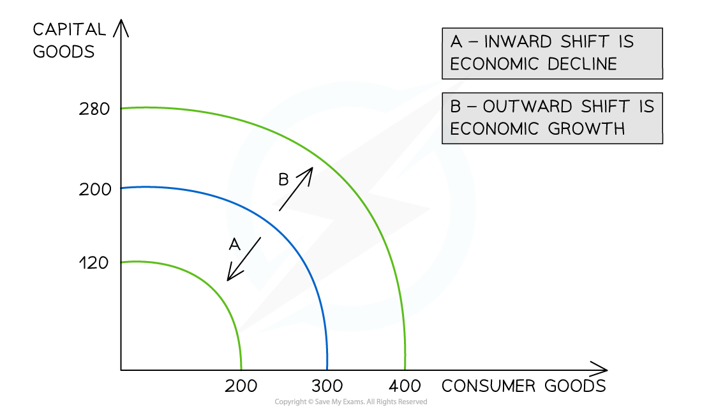

# Supply-Side Policy

## What is Supply-side Policy?

> **Spec point** — `spcpt_hHf6ckpS6nbM2prs`

## What is Supply-Side Policy?

- **Supply-side policies** aim to increase the **total supply** (productive potential) of the economy

  - This is achieved by increasing the **quality or quantity** of the factors of production
- The effect of supply-side policies can be represented through an outward shift of the productive possibility curve

***Outward shifts of a PPC show an increase in the total supply of an economy***

- The strategies used to **increase total supply** include education and training, labour market improvements, lower direct taxes, privatisation, deregulation, improving regional incentives to work and infrastructure spending
- **When any of these policies are instituted, the PPC shifts outward (Shift B) and more consumer goods** and **more capital goods** can now be produced using all of the **available resources**

## Specific Types of Supply Side Policies

> **Spec point** — `spcpt_hg9pmrmvPyJNFN4p`

## Specific Types of Supply-Side Policies

- Supply-side policies can be extremely useful in **generating long term growth**, lowering average price levels and creating new jobs in an economy

**Specific types of supply side policies**

| **Supply-Side Policy** | **Explanation** |
|---|---|
| **Privatisation** | - The transfer of Government owned assets or firms into the private sector, usually by sale of company shares - ***Privatisation*** encourages new firms to enter the market and compete, thus increasing the **total supply** and the **efficiency** in the economy |
| **Deregulation** | - This is the process of removing **government controls and laws** from markets in order to increase competition and encourage new firms to enter the market - Any regulation increases the cost of production for firms. **Deregulation decreases costs,** which may result in greater supply |
| **Education and training** | - Increasing government spending on** education** and retraining raises the quality of the workforce - Productivity increases also increase the supply of output |
| **Regional policies** | - Encouraging firms to** relocate** to high unemployment areas - Improving** transport links** to high unemployment regions - Providing subsidies to firms to** hire locally unemployed workers** |
| **Lower direct taxes** | - Reducing **income tax** rates incentivises workers to work harder (they keep more money for themselves)  and encourages more workers to join the labour force - Reducing** corporation tax  **allows firms to keep more of their profits, which they can use to invest in new machinery and technology |
| **Infrastructure spending** | - Spending on road and rail networks to **improve transport links** for goods and workers - Improving **broadband coverag**e to enable workers and firms to relocate to low-cost areas |
| **Improving incentives to work and invest** | - Restructuring the **unemployment benefits** system to incentivise the unemployed to seek work - Increased **government spending** on innovation increases the supply of potential jobs in the economy    - Direct support to firms (subsidies) increases output and promotes **international competitiveness** |

> **Worked Example**
> Which **one** of the following is an example of a supply-side policy to increase output?
> 
> **A**.     Increasing the school leaving age
> 
> **B.**     Increasing unemployment benefits
> 
> **C.**    Increasing interest rates
> 
> **D. **   Increasing income tax
> 
> **Final answer:** **The Answer is A. Increasing the school leaving age**
> 
> B is incorrect, as this will disincentivise unemployed workers from seeking a job
> 
> C is incorrect, as this is contractionary monetary policy
> 
> D is incorrect, as this is contractionary fiscal policy
