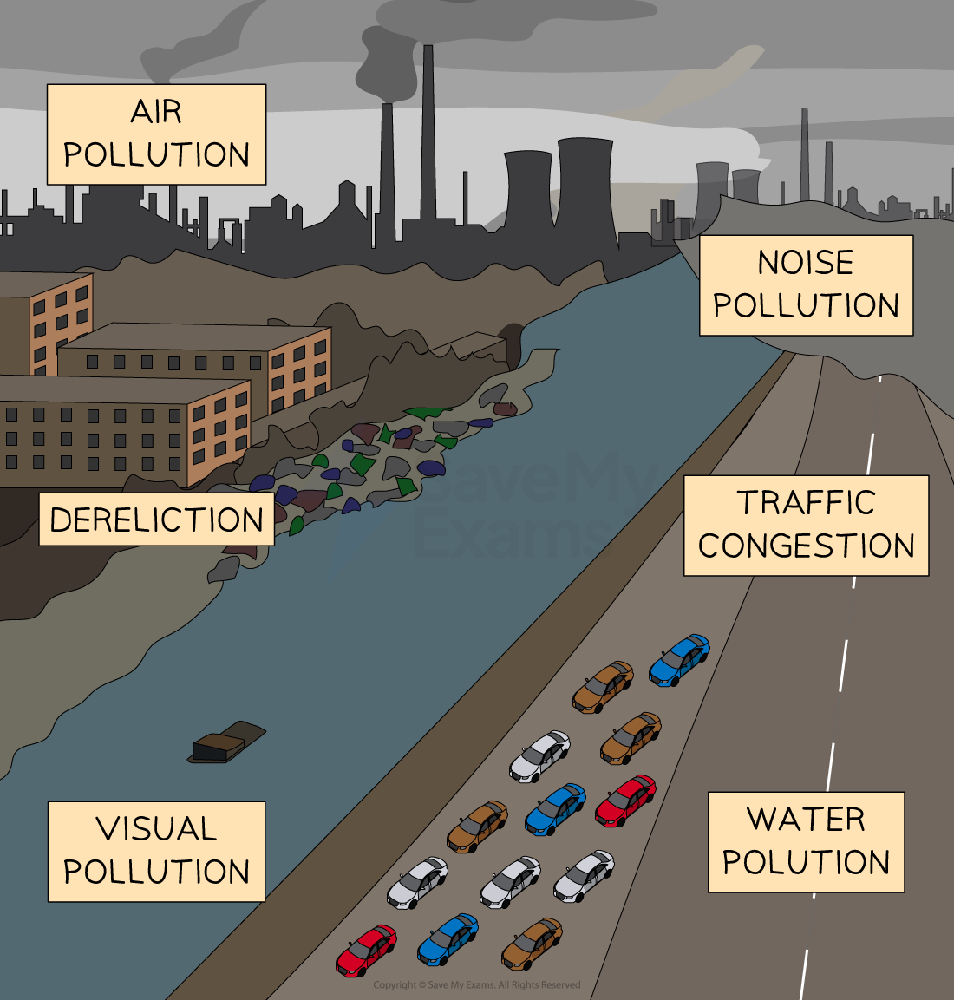

# Environmental Protection

## Business Activity & the Environment 

> **Spec point** — `spcpt_hkSksDm5FgkSTygc`

## Business Activity and the Environment

- Governments are doing more and more to set **macroeconomic targets** based around environmental protection
- Business activity can create ***external costs**** of production *when providing a good or service

  - Types of pollution that **create external costs** to the environment include visual, air, noise and water pollution

*Negative business impacts on the environment include visual, noise, air, and water pollution*

**Ways in Which Business Activity Damages the Environment**

| **Type of Pollution ** | **Explanation** | ** Example** |
|---|---|---|
| Visual Pollution | - Business activity can cause a landscape to look like an **eyesore ** - It can take the form of  litter, mine dumps or the release of chimney smoke | - Prior to plastic bag ban in Kenya, **plastic bags** could be seen littering streets, rivers  and natural environments |
| Noise pollution | - Noise pollution refers to **excessive noise** that causes stress or hearing loss - Noise can come from loud machinery, factories, traffic or even bars and restaurants | - Noise from air traffic at **Heathrow airport **from flights arriving and departing. Impacts local residents near airport |
| Air pollution | - **Greenhouse gases** are released into the atmosphere from the **burning of fossil fuels**, leading to increased air pollution - Electricity stations (using fossil fuels), factories, transportation and agricultural activities all cause air pollution | - Up to two million air pollution deaths are recorded per year in China - Beijing and Shanghai rank among the most polluted cities in Asia - This has led to health diseases, such as **respiratory and cardiovascular illnesses** |
| Water pollution | - Water pollution refers to the **contamination of rivers, lakes, and oceans **with harmful substances - This can occur because of agriculture, mining, and industrial activities. Pesticides, fertilisers or chemicals end up in water | - In Ecuador, pesticide use in banana farming has also been linked to water pollution, posing risks to rivers quality |
