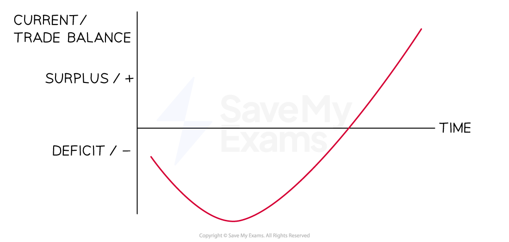

# The Impact of Exchange Rates on the Current Account

## Current Account & Exchange Rates

> **Spec point** — `spcpt_W2Z9w3JsScR7vqD7`

## Current Account and Exchange Rates

- The **exchange rate** is the relative price of one currency expressed in terms of another currency

### Impact of an appreciation

- Appreciation often **leads to a worsening **of the current account balance
- A currency **appreciation** occurs when the value of a **currency rises,** making a nation's exports relatively more expensive and its imports less expensive

  - E.g The **appreciation of the Japanese **Yen in the early 2010's made exports (cars and electronics) more expensive for foreign buyers compared to similar products from South Korea and China. This increased its trade deficit

#### Exports fall

- Foreign buyers look for **substitute products** which are priced lower

  - Exports fall, and the balance on the current account worsens

#### Imports rise

- Similarly, currency appreciation makes** imports cheaper**

  - Domestic consumers may switch demand to foreign goods, and as imports rise, the **balance on the current account worsens**

### Impact of a depreciation

- Depreciation often **leads to an improvement **in the current account balance
- A **currency depreciation** occurs when the value of a **currency falls, **making a nation's exports relatively more attractive and  its imports less attractive

  - E.g the depreciation of the British pound following Brexit helped increase exports and reduce its trade deficit

#### Exports rise

- The number of foreign buyers increases as they are attracted by the relatively cheaper prices

  - Exports rise and the balance on the current account improves

#### Imports fall

- Similarly, currency depreciation makes** imports more expensive**

  - Domestic consumers may switch from purchasing foreign goods to purchasing domestic goods, and as imports fall, the **balance on the current account improves **

## Impact of a Current Account Deficit

> **Spec point** — `spcpt_HCQbS8tyy75cgg5W`

## Impact of a Current Account Deficit

- The consequences of current account deficits include:

  - **Increasing unemployment**
  With falling demand for locally produced goods and services, fewer workers will be required and unemployment will rise
  - **Slow down in economic growth or a recession**
  Exports are a key component of the ***real GDP*** of many countries, and a fall in exports may significantly reduce the level of economic growth
  - **Lower standards of living**
  A** **fall in economic growth usually leads to a reduction in wages, which leads to a decrease in the standards of living
  - **Increased levels of borrowing**
  If the deficit is caused by increasing levels of imports, then it is likely that these imports are being paid for through higher levels of borrowing
  - **Depreciating exchange rate**
  While this may ultimately help to increase exports again, it makes the cost of imported goods and raw materials more expensive and may cause cost push inflation

## The J-Curve Effect

> **Spec point** — `spcpt_gWS5Kr24kKmsj8Xh`

## The J-Curve Effect

- It is also important to recognise that **there is a time lag** between the depreciation of the currency and **any subsequent improvement in the current account balance**
- This time lag is explained by the ***J-Curve effect***

  - It takes **time** for firms and consumers to respond to changes in price
  - Once it becomes evident that price changes will last for a longer period of time, firms and consumers change their patterns
  - E.g A firm in the USA has been importing electric scooters from the UK. If the **Euro depreciates**, the price of scooters in France becomes relatively cheaper. In the short-term, the USA firm will not switch immediately to purchasing scooters from France as the **exchange rate** may soon bounce back. They also have a good relationship with their UK suppliers. In the **long term,** they are likely to switch

#### Diagram analysis

- In the short run, the **sum of PEDs for exports and imports was less than one, which is inelastic, **so the deficit widens
- However, in the long run, combined PED of imports and exports is greater than one, and the trade balance begins to improve
- With any currency depreciation/devaluation, the trade balance will initially worsen before it improves

> **Exam Hint**
> You do not need to know the J-curve for the exam. It is helpful here to understand exchange rate and the relationship with the current account. It will enable a deeper analysis.
