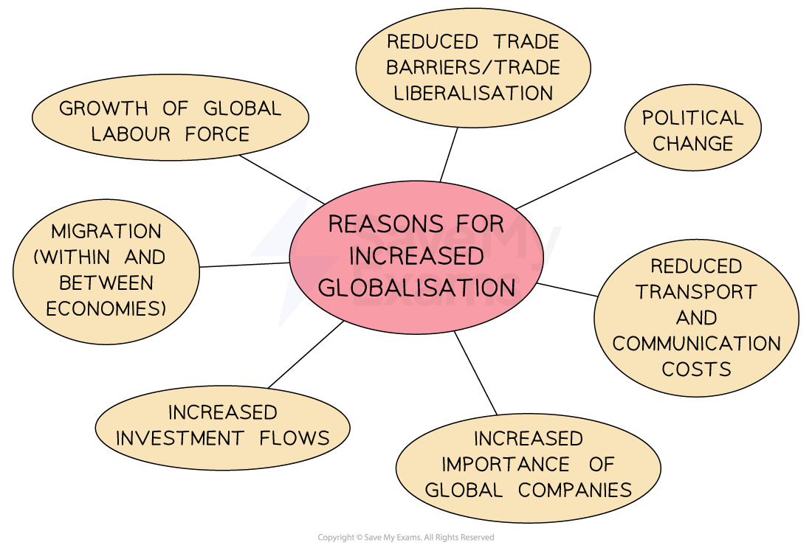

# Globalisation 

## Introduction to Globalisation

> **Spec point** — `spcpt_kXdYXbWfPrHd37Ds`

## Introduction to Globalisation

- **Globalisation** is the economic integration of different countries through increasing cross-border movement of people, goods/services, technology and finance

  - This **integration** of global economies has impacted **national cultures**, spread ideas, speeded up **industrialisation** in developing nations and led to ***de-industrialisation*** in developed nations
- Globalisation has existed for hundreds of years; it is not a new phenomenon

  - Improvements in technology and the **speed of global connections** have exponentially increased the **level of interdependence** between nations in the past 50 years
- Consumers now **source products globally** recognising **global brands** wherever they travel

  - In 2000, the value of global trade was approximately** \$6.45 trillion**. By 2023, this figure was at** \$31 trillion**

## The Causes of Globalisation

> **Spec point** — `spcpt_wjBXB5CVC377PtVj`

## The Causes of Globalisation

- Numerous factors have contributed to the **rapid increase in the pace of globalisation** including free trade, transport improvements, communication and MNCs

*Four main factors drive globalisation*

### Reasons for the rise in globalisation

#### Free trade

- The increased effectiveness of the World Trade Organisation (WTO) in negotiating new trade agreements has meant that countries are open to free trade** **(reduced *tariffs* and *quotas*)

#### Reduced cost of transport

- This allows businesses to increase the volume of goods traded globally

  - For example, containerised shipping transports goods in bulk using metal containers on a boat

#### Reduced cost of communication

- Communication costs are very low due to innovations in technology

  - E.g. Skype, WhatsApp, and WeChat make it easier for firms to connect and promote themselves globally

#### Multinational Corporations (MNCs)

- The rapid growth and influence of *MNCs *contribute to globalisation by expanding their operations and presence across borders

> **Worked Example**
> A firm is described as a multinational corporation (MNC) if it:
> 
> **A.**    has shareholders in many countries
> 
> **B.**    exports goods to other countries
> 
> **C. **   imports goods from other countries
> 
> **D.**    operates in more than one country
> 
> **Final answer:** **D is the correct answer: it operates in more than one country**
> 
> MNCs often have their headquarters in one country, but may manufacture their output in one or more different countries.
> 
> - A is incorrect, as shareholders are owners of a business and their ownership country does not indicate the firm conducts business in that country
> - B is incorrect, as the firm would be known as an exporter
> - C is incorrect, as the firm would be known as an importer
