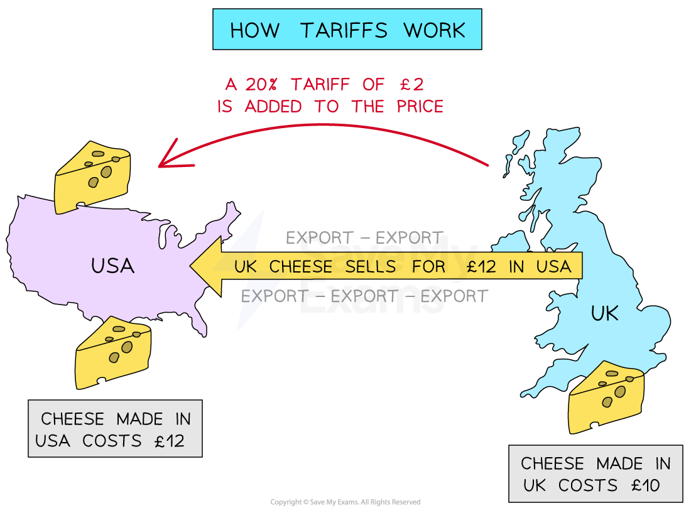

# Protectionist Tariffs

## Explanation of Tariffs

> **Spec point** — `spcpt_yTpSRpS8874pTgZZ`

## Explanation of Tariffs

- **A tariff is a tax on imported goods/services (customs duty)**

  - This increases the price of imports; therefore, domestic firms find it easier to compete and increase their market share as consumers switch from buying imports to buying domestically produced goods and services
  - Less **efficient domestic firms **can now continue to produce, but at the expense of **more efficient international firms, **which have a tax imposed on their products

*When the USA places a tariff on imported cheese from Britain, the price of British cheese in the USA rises*

- A tariff **increases the price** of imported goods, which helps **switch demand** for that product/service from foreign businesses to **domestic businesses**

- American customers are more likely to** purchase American cheese** now the tariff has made British cheese** more expensive**

*A tariff reduces the level of imports, resulting in a shift of the supply curve for cheese from S1 → S2*

### Diagram analysis

- The **pre-tariff** market equilibrium for cheese in the USA is seen at P1Q1
- **After the tariff **is imposed, less British cheese is imported, and the supply curve for cheese shifts from** *****S******1****** → S******2***
- The **new market equilibrium** is seen at P2Q2

  - Following the law of demand, the **quantity demanded contracts** from Q1 to Q2
  - The price of cheese increases from P1  → P2 

> **Exam Hint**
> Students are often confused about who pays the tariff. It is not the foreign company but the domestic company that pays the tariff. In our cheese example above, any retailers in the USA who import cheese from Britain have to pay the tariff (import tax) when it crosses the border into the USA. This policy may help cheese manufacturers in the USA, but it harms any other business that imports and sells foreign cheese as it raises their costs of production.

## An Evaluation of Tariffs 

> **Spec point** — `spcpt_9nt6VbxMwFtcZz6D`

## An Evaluation of Tariffs

- **The benefits of tariffs include:**

  - They protect ***infant industries*** so they can eventually become more competitive globally
  - They increase **government tax revenue,** which can be used to provide essential services such as healthcare
  - Reduces ***dumping*** by foreign businesses as they cannot sell below the  market price
- The **disadvantages of tariffs **include:

  - **Increases the cost** of imported raw materials, which may affect businesses that use these goods for production, leading to higher prices for consumers
  - **Reduces competition** for domestic firms, who may become more inefficient and produce poor-quality products for their customers
  - **Reduces consumer choice **as imports are now more expensive and some customers will be unable to afford them

> **Worked Example**
> In August 2023, China removed the tariff on imports of Australian barley that had been in place for the previous three years.
> 
> Which **one** of the following diagrams shows China's market for barley after the tariff on imports has been removed?
> 
> 
> 
> **Final answer:** **Answer: Diagram D**
> 
> - A is incorrect, as there has not been a rise in market demand in China for barley
> - B  is incorrect, as there has not been a fall in market demand in China for barley
> - C  is incorrect, as this would show the imposition of a tariff on barley
