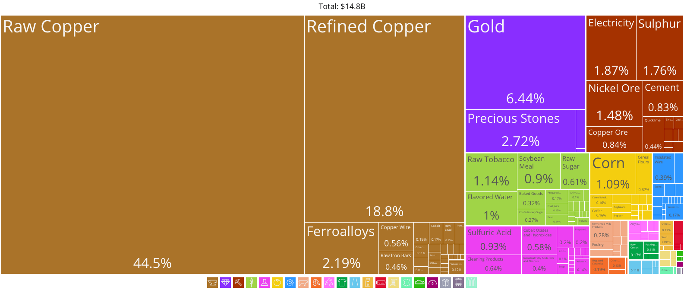

# Trade Patterns 

## Global Trade Patterns 

> **Spec point** — `spcpt_5MWYT5QtQPT6myX5`

## Global Trade Patterns

- Patterns of trade have changed **over time**

  - As countries transition from developing to more developed economies, the **volume and composition** of trade changes

*Global Export of Trade in Goods, 1950 to 2022*

Source: [Statista](https://www.statista.com/statistics/264682/worldwide-export-volume-in-the-trade-since-1950/)

### Graph analysis

- There has been a significant overall increase in **global trade** in goods from 1950 to 2022

  - Factors that influence this **increased export of goods and services** include improved transportation, technological advancements, the formation of **trading blocs**, and** *****trade liberalisation***

## Trade Patterns of Developed and Developing Countries 

> **Spec point** — `spcpt_x5nHbmftGhwwmd3M`

## Trade Patterns of Developed and Developing Countries

- Historically, *developed countries* such as UK and USA have dominated global trade
- However,  *emerging economies* like China, Brazil, India, and Thailand are now overtaking nations that previously held dominance in **trade volume**

  - China are now the world's **largest manufacturing **economy and leading exporter

*Export of Goods from China 2013–2023*

**Source*****: ***[Statista](https://www.statista.com/statistics/263661/export-of-goods-from-china/)

### Graph analysis

- China's **export growth** has been consistent between 2013-2023, with the exception of a small decrease in 2016

  - In 2023, China exported goods worth 3.38 trillion U.S. dollars, a slight decline on the previous year
  - Most of their exports are manufactured goods (e.g. electronics) that traded with United States, *ASEAN*, and the EU
- However, many **developing countries** are often still overly dependent on exporting a narrow range of **primary commodities**

*Zambia's narrow range of exports from 2022 indicate how some countries are overly dependent on a few commodities to drive their GDP growth*

Source: [Observatory of Economic Complexity](https://oec.world/en/visualize/tree_map/hs92/export/zmb/all/show/2022)

### Data analysis

- The export of raw copper accounts for 44.5% of Zambia's exports

  - The export of refined copper accounted for 18.6% of Zambia's exports
  - This means that copper exports from Zambia accounted for 63.1% of their total exports
- **Primary products account for more than **90% of their exports
- They are suffering from over specialisation, making them vulnerable to price volatility

> **Exam Hint**
> Generally, developed countries will trade mainly with other developed countries, swapping goods and services.  Developed countries require raw materials from developing countries. However, since the supply chain disruptions experienced in the global pandemic of 2020–2022, many countries have attempted to spread their dependence on imports over a wider range of countries to reduce risk.  Furthermore, with increased awareness of environmental issues and damage caused by the transportation of global goods, there has been an increase in trade with nearby countries.
