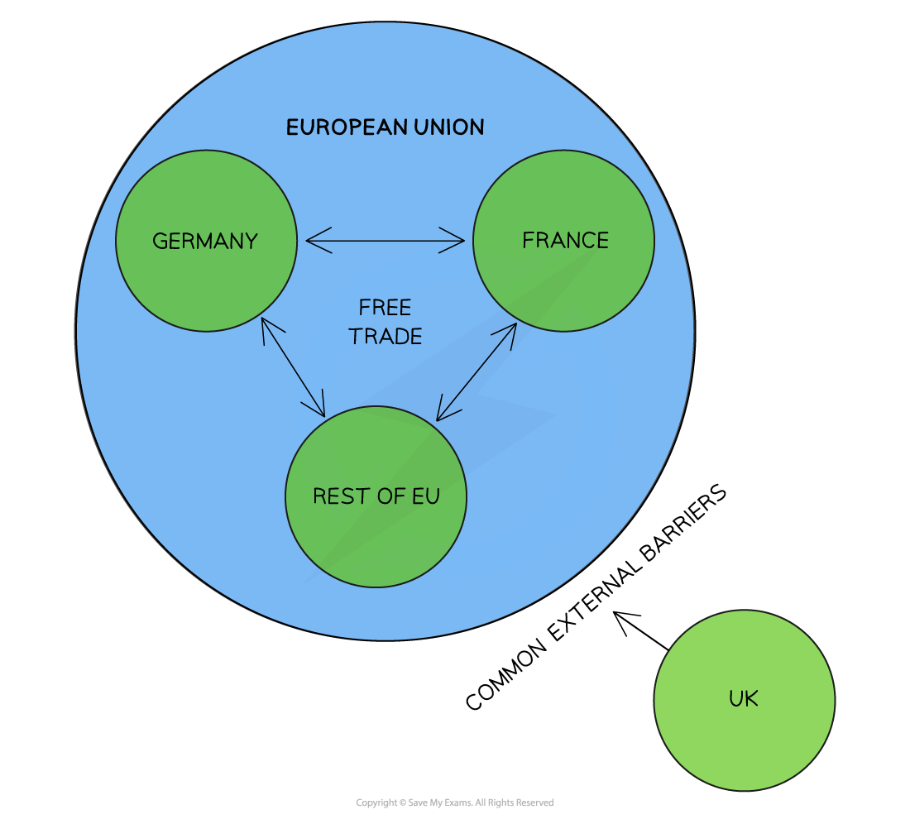

# Trading Blocs & the World Trade Organization (WTO)

## Types of Trading Blocs

> **Spec point** — `spcpt_nrknJ7byTQffypc3`

## Types of Trading Blocs

- A **trading bloc** is a group of countries who come together and **agree to reduce or eliminate any barriers to trade** that exist between them
- There are different levels of ***economic integration*** ranging from relatively low integration in a ***bilateral agreement*** to high integration in a **monetary union **e.g. the Eurozone
- Globally, there were more than 420 regional trade agreements in effect in 2022
- The trading blocs below each have an **increased level** of economic integration

### Free trade area (FTA)

- A **free trade area** is a bloc in which countries agree to **abolish trade barriers between themselves** but maintain their **own restrictions** with other countries, e.g. United States-Mexico-Canada Agreement (USMCA)

*Mexico, Canada and The USA have a free trade agreement but can deal individually with Cuba as they see fit*

- In the diagram above, Mexico, Canada and the USA have** reduced/eliminated many trade restrictions** between themselves

  - The USA **refuses to trade** with Cuba and has placed a complete ban (embargo) on all exports/imports to Cuba
  - Canada trades with Cuba but imposes **tariffs on all imports**
  - Mexico **trades freely** with Cuba

### Customs union

- A **customs union** is an agreement between countries in which all goods/services produced by members are **traded tariff free**. Additionally, countries agree on **common external tariff rate on imports** from all non-bloc countries

*Countries within the European Union trade freely between themselves and have a common external tariff with all third-party countries e.g. UK*

- In the diagram above, countries in the **European Union** have **eliminated all tariff barriers** between themselves but imposed a **common external tariff ** (CET) on third party countries such as the UK or China

### Common market

- In a common market, members act as if they are one country as far as trade is concerned.
- Goods and services are freely traded and in addition, the four ***factors of production*** can move unrestricted between member countries

  - The goal is to improve the **allocation of resources** between the common market members, lower production costs, and lower prices
  - The **European Union** is a common market

### Monetary union

- A **monetary union** takes integration a step further. Members enjoy all of the benefits of a customs union and common market, but then also establish a **common central bank **which issues a **common currency** and controls the monetary policy of member countries

  - E.g. The Eurozone countries within the European Union

## Examples of Trading Blocs

> **Spec point** — `spcpt_t3xvtTdJqKSDxcTG`

## Examples of Trading Blocs

- Three of the largest trading blocs include:

  - **The European Union (EU)**
  - **The Association of Southeast Asian Nations (ASEAN)**
  - **United States Mexico Canada Agreement (USMCA),** previously known as NAFTA (North America Free Trade Agreement)

*Free trade blocs: Countries can trade freely or with reduced restrictions *

### The European Union (EU)

- The European Union is a **common market, originally **formed in 1993
- Countries in Europe can apply to join the union and as of June 2024, there are 27 countries in the union
- Being a member of the EU includes **free movement of goods, services, labour and capital **

  - **Countries within the common market have no restrictions** between themselves
  - A common external tariff (CET) is imposed on all imports in to any of the member states
- The UK voted to leave the EU in 2016, and officially left in 2020

### Association of Southeast Asian Nations (ASEAN)

- ASEAN was originally formed in 1967
- In June 2024, ten countries were part of this **free trade area**
- The ASEAN free trade area is less integrated than the European Union as it does not allow for the free movement of people or capital between the countries

  - A free trade area aims to achieve free flow of goods and services in the region
  - Free trade areas lower business costs, increase  market size and help businesses to generate economies of scale

### United States-Mexico-Canada Agreement  (USMCA)

- This replaced NAFTA in 2020, creating an enhanced free trade area between **Canada, Mexico and the USA**.
- Many USA businesses relocated their manufacturing to Mexico as goods could be produced there much more **cost effectively **due to the lower wages paid to Mexican workers

  - The products could then be imported back into the USA without and tariffs being incurred
- Mexico benefited from this agreement as it helped to create many new industries and jobs within the country

  - However, most of the benefits occurred in the north of the country, close to the US border

## Impact of Trading Blocs 

> **Spec point** — `spcpt_BJ2ttBDyzzKBG7nT`

## Impact of Trading Blocs

- Trading blocs, such as a free trade area, common market or customs unions, can have impacts on both **member and non-member states**

**Impact of Trading Blocs on Member and Non-Member States **

| **Member States** | **Non-Member States ** |
|---|---|
| - Eliminating or reducing trade barriers among member countries leads to **more trade**    - Access to new markets offers the potential for ***economies of scale*** - With freedom of labour, there are **greater employment opportunities** - Membership in a trading bloc may allow for stronger **bargaining power** in new multilateral negotiations - **Greater political stability** and cooperation between the countries within the bloc due to the increased interdependence - However, there is a** loss of sovereignty** as nations increasingly give up their autonomy, perhaps most visible when joining a monetary union (nations lose the ability to set their own monetary policy) | - **Multilateral trading negotiations** become more challenging as countries within a trading bloc have to maintain the existing bloc rules when dealing with third-party countries - **Trade diversion** occurs when a trade agreement redirects trade away from **more efficient country outside the bloc** towards less efficient member state - **External tariffs** set against countries outside of the trading bloc may lead to **retaliation** from these countries |

## Role of the World Trade Organisation (WTO)

> **Spec point** — `spcpt_N2mCc2d7wJCWRj4S`

## Role of the World Trade Organisation (WTO)

- The World Trade Organisation (WTO) was established in 1995 to **promote free trade**

  - They believe free trade is the best way to raise global living standards, create jobs and improve people's lives
- **Trade liberalisation** is the process of rolling back the barriers to free trade, e.g. removing tariffs
- The WTO has two main roles in liberalising trade:

1. It brings countries together at conferences and encourages them to reduce or eliminate **protectionist trade barriers** between themselves, e.g. [The Doha Round](https://www.wto.org/english/tratop_e/dda_e/dda_e.htm) conferences
2. It acts as an **adjudicating body** in trade disputes. Member countries can file a complaint if they believe a trading partner has violated a trade agreement. The WTO will then run a hearing and make a judgement (often this takes many years)

- **Actions **taken by the WTO include:

  - Trade negotiations
  - Implementation and monitoring of trade agreements
  - Dispute settlement between nations
  - Building trade capacity between nations
  - Outreach to governments and influential organisations on behalf of member countries

## Conflicts Between Regional Trade Agreements and the WTO

> **Spec point** — `spcpt_6xXc9kW8w65HyMWP`

## Conflicts Between Regional Trade Agreements and the WTO

- In December 2023, there were 621 **regional trade agreements** globally
- While these are **beneficial to the members** in the agreement (as they strengthen ties and create more trade between them), they also create **conflicts** with the stated aim of the WTO, which is to** liberalise trade**

  - Regional agreements often **shift trade** from a non-member who is more efficient in producing certain goods/services, to a member country who is less efficient (trade diversion)
  - Regional trade members then often institute common **trade barriers** on non-members, which is the opposite of trade liberalisation (protectionism)
- Regional trade agreements can be beneficial for member countries but may **result in global inefficiency** in the allocation of resources
- The WTO advocates for **free trade** between all member countries

> **Exam Hint**
> Whilst the WTO may attempt to resolve trade disputes, it **may take years**, even decades, for some cases to be heard.  By that time, some industries can be destroyed by unfair actions taken by more powerful countries. Criticism of the WTO includes its **favouritism** to powerful, developed economies and for being **undemocratic.**
