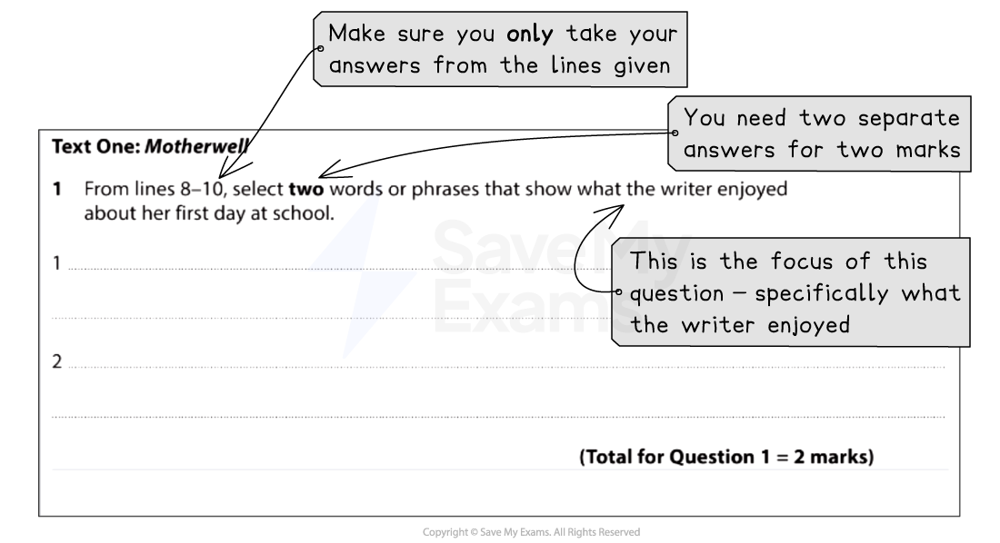

# How to Answer Question 1

Question 1 is a **quick select-and-retrieve task** worth **2 marks**. It will be based on Text One, which is the unseen extract, and tests **Assessment Objective AO1** (understanding texts and selecting relevant information from them).

The following guide includes:

- **Breaking down the question**
- **Steps to success**
- **Exam tips**

## How to Answer Question 1: Breaking down the question

> **Spec point** — `spcpt_D9gXMxHGgbkjP6kc`

## Breaking down the question

For this question, you will be guided to use certain lines from Text One. It is therefore very important that you read the question carefully and highlight:

- The key instructions in the question
- The focus of the question (what you are looking for in the text)

For example:

*Paper 1 Question 1 breakdown*

## Steps to success

> **Spec point** — `spcpt_ydr43RVKGFZswKyJ`

## Steps to success

Following these steps will give you a strategy for answering this question effectively:

1. Read the question and **highlight**:

  1. The key instructions
  2. The focus of the question (what specifically you have to look for in the text)
2. Scan the identified lines in Text One and highlight the evidence that answers the question:

  1. Remember to keep the focus of the question in mind
3. Write your answers in the lines provided:

  1. You only need to write single words or short phrases as your answers

You are advised to spend no more than 5 minutes on this question (including reading time).

## Exam tips

> **Spec point** — `spcpt_hhVfKnV269BnZngd`

## Exam tips

This question is meant to offer you a straightforward way into the paper and build your confidence. There are normally more than two possible answers.

- Ensure you highlight the line references given and only take your answers from those lines:

  - Answers taken from outside of those lines will not gain any marks
- You only need to write your answers as single words or short phrases:

  - Do not attempt to use your own words
  - Do not spend any time giving comments or explanations
- Make sure you read the focus of the question carefully and choose words or phrases that specifically answer that focus:

  - In the above example, you needed to provide two words or phrases that showed *what* the writer enjoyed about school, rather than whether she enjoyed it or not
- Do not copy out whole lines, as this does not demonstrate that you have selected the appropriate information to answer the question:

  - You need to show the skill of **selection**
