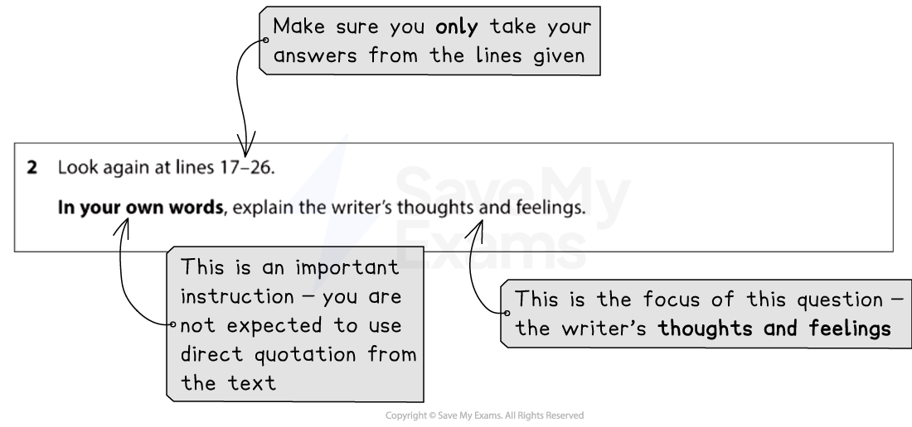

# How to Answer Question 2

Question 2 is a **short-answer question** that is worth **4 marks**. It will again be based on Text One, the unseen extract, and tests **AO1**, your ability to select and interpret information.

The following guide includes:

- **Breaking down the question**
- **Steps to success**
- **Exam tips**

## How to Answer Question 2: Breaking down the question

> **Spec point** — `spcpt_WnZDzcw5Gdv48rNZ`

## Breaking down the question

For this question, you will be guided to use certain lines from Text One. It is therefore very important that you read the question carefully and highlight:

- The key instructions in the question
- The focus of the question (what you are looking for in the text)

For example:

*Paper 1 Question 2 breakdown*

In your answer to this question it is important to summarise the focus of the question economically. The question is only worth 4 marks, so 1–2 short paragraphs, making at least 4 separate points, is enough.

## Steps to success

> **Spec point** — `spcpt_dGYngf6VTRQS4zCf`

## Steps to success

Following these steps will give you a strategy for answering this question effectively:

1. **Read the question carefully **and **highlight**:

  1. The key instructions
  2. The focus of the question (what specifically you have to look for in the text)
2. **Scan the identified lines** in Text One and **highlight the evidence** that answers the question:

  1. Remember to keep the focus of the question in mind
  2. Make sure you understand what you are reading by reading the given lines closely and carefully
3. Write your answer **in your own words:**

  1. Do not copy at length directly from the lines of text

You are advised to spend no more than 10 minutes on this question (including reading time).

## Exam tips

> **Spec point** — `spcpt_C8RTjJYR2FftmVpv`

## Exam tips

This question moves on from Question 1 by directing you to a larger section of the text. There are normally more than four possible points that you can make.

- Ensure you **highlight** the **line references given** and **only take your answers from those lines:**

  - Answers taken from outside of those lines will not gain any marks
- It is vital that you **write your answers in your own words**:

  - You will not gain marks for copying out lines from the text
  - Make sure you write at least four clear and distinct points
- You can write each point out separately:

  - However, you must not just list very brief points
  - Your response must be written in **full and complete sentences** which clearly demonstrate understanding of the text
- Do not waste time analysing the writer’s use of language and structure:

  - This is not tested in this question
- Nor do you need to offer your own opinions about the ideas expressed, or spend too long exploring only one or two points
- Ensure that the **points you make** are **supported** by the** information in the text:**

  - This means making your point and then adding “because”
  - For example: “She might be feeling down because…”
- Use connectives to structure your response:

  - Start with “firstly”, use “also”, “furthermore” or “in addition” and end with “finally”
