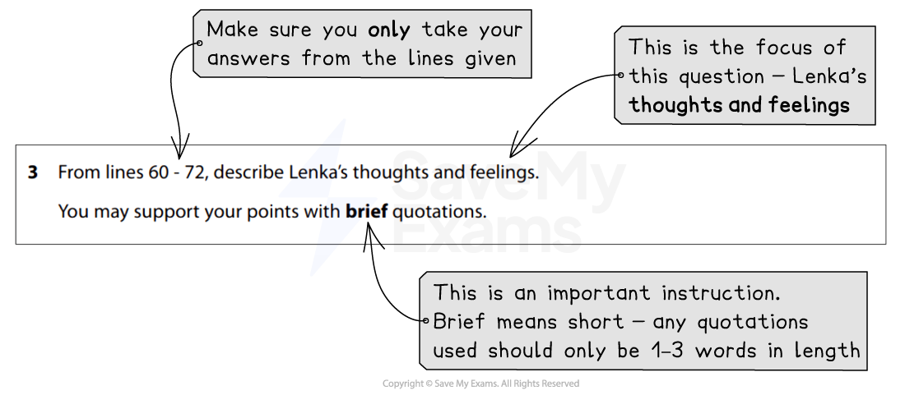

# How to Answer Question 3

Question 3 is a **short-answer question** that is worth **5 marks**. It will again be based on Text One, the unseen extract, and tests** Assessment Objective 1 (AO1)**. It requires you to show your understanding of the text by selecting and interpreting ideas, information and perspectives.

The following guide includes:

- **Breaking down the question**
- **Steps to success**
- **Exam tips**

## How to Answer Question 3: Breaking down the question

> **Spec point** — `spcpt_bQsTp2q65CVGWzD8`

## Breaking down the question

For this question, you will be guided to use certain lines from Text One. It is therefore very important that you** read the question carefully **and **highlight**:

- The key instructions in the question
- The focus of the question (what you are looking for in the text)

For example:

*Question 3 breakdown*

It is important to take information **only from the specified lines**, as if you use anything from outside of these lines, you will not be awarded a mark. It is also important to note that any **quotations** you use to **support your points** need to be **short and relevant**.

You are not being tested on language analysis in this question, so do not try to comment on the writer’s choice of words or phrases. Just describe what the question is asking you to describe.

## Steps to success

> **Spec point** — `spcpt_6mYH9Q6hMzVf7tbb`

## Steps to success

Following these steps will give you a strategy for answering this question effectively:

1. **Read the question** and **highlight**:

  1. The key instructions
  2. The focus of the question (what specifically you have to look for in the text)
2. **Scan** the** identified lines** in Text One and **highlight** the **evidence** that **answers the question:**

  1. Remember to keep the focus of the question in mind
  2. Make sure you understand what you are reading by reading the given lines closely and carefully
3. Write your answer** in your own words**:

  1. Do not copy at length directly from the lines of text
  2. Do not copy out long quotations

You are advised to spend **no more than 10 minutes** on this question (including reading time).

## Exam tips

> **Spec point** — `spcpt_TQK5MVykpTdmfjnn`

## Exam tips

This question moves on from Question 2 by suggesting you can **support your points** with **brief quotations**. There are normally more than five possible points that you can make.

- Ensure you **highlight the line references** given and **only take your answers from those lines:**

  - Answers taken from outside of those lines will not gain any marks
- Write your answers as **five clear points**:

  - Write these in **full and complete sentences**, supported by **relevant, short quotations**
  - You will not gain marks for just copying out lines from the text
  - Do not spend any time trying to analyse language or structure, as this is not assessed in this question
  - Nor is it necessary to offer your own opinions
