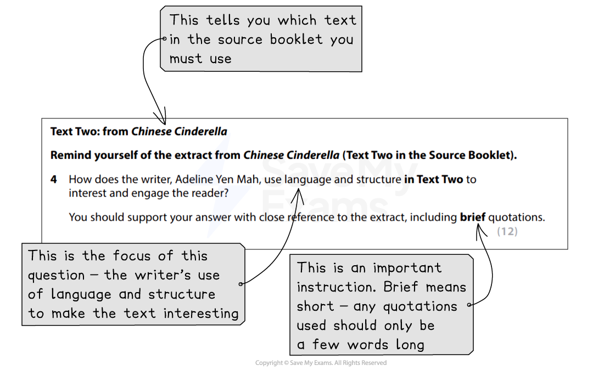

# How to Answer Question 4

Question 4 is a **language and structure analysis** question worth **12 marks**. It will be based on one of the extracts from Part 1 of the Pearson Edexcel International GCSE English Anthology, which will be provided for you in the exam. This is a longer-answer question and tests **Assessment Objective 2 (AO2)**, which tests you on your ability to understand and analyse how writers use language and structure to achieve effects.

The following guide includes:

- **Breaking down the question**
- **Steps to success**
- **Exam tips**

## How to Answer Question 4: Breaking down the question

> **Spec point** — `spcpt_WnXhbxZdtbQyG5Vt`

## Breaking down the question

Because you will be able to study the extracts in the anthology prior to the exam, you are able to prepare in advance for this question. However, it is still important to ensure you **read the question carefully** and highlight:

- The key instructions in the question
- The focus of the question (what you are looking for in the text)

For example:

*Paper 1 Question 4 breakdown*

It is important to remember that this question asks you **how** the writer uses **both language *****and***** structure.** You do not have to make an equal number of points about each one, but you **must address both aspects **of the question in your answer.

## Steps to success

> **Spec point** — `spcpt_w8sr47sNRgSJ3Yv7`

## Steps to success

Following these steps will give you a strategy for answering this question effectively:

1. **Read the question** and **highlight**:

  1. The key instructions
  2. The focus of the question (what specifically you have to look for in the text)
2. **Re-read the extract**:

  1. **Highlight** and **annotate** in the margins any specific aspects of language or structure that the writer has used in order to make the text interesting
  2. Ask yourself: What stands out? And why?
3. **Start your answer** using the **wording of the question**:

  1. Include a summary statement to show that you understand the text
  2. For example: “The writer uses an autobiographical style and a fearful tone throughout the extract to interest and engage the reader.”
4. Go into **detail:**

  1. Now you need to make **as many points as possible**, ranging **throughout the extract**
  2. It is a good idea to make your points in chronological order
  3. Use the annotations you have made in the margins to form the basis of each point
  4. For example: “The writer begins with negative language such as ‘foreboding’ and ‘nightmare’ to show the reader how she associates her family and home with dread and horror.”
  5. For the highest marks, you must **zoom in on particular word choices** and **write about their effects**, embedding your quotations into your sentences
  6. Make sure you include some points about the way the writer has structured the extract to interest and engage the reader
5. **Sum up**:

  1. Finish your answer with a “So overall…” statement

You are advised to spend **about 25 minutes** on this question (including reading time), as it is worth 12 marks.

## Exam tips

> **Spec point** — `spcpt_86H4bwxFKXydvKsx`

## Exam tips

This question is more challenging than Questions 1–3, and the **mark scheme** is therefore divided into **five levels**. There will be a wide range of language and structural features which you can analyse; the skill is to **select the aspects** that you are able to **comment on most effectively** in order to evidence your understanding and engagement with the text.

- Ensure you avoid simply “spotting” the language or structural features a writer has used:

  - Simply spotting what the writer has used, without commenting on the use and effect of the techniques, will not achieve high marks
  - Neither will simply “re-telling” the story of the text
- Make sure you **make comments** about the **whole of the text**:

  - Do not just focus on the start or the first half of the extract
- Your **supporting quotations** should be **brief** and **embedded into your sentences**:

  - This means not “introducing” your quotations separately, using statements such as “This is shown by the quote…” or just putting a quote on a separate line
  - Instead, the quotation forms part of your sentence
  - For example: “The writer describes time passing ‘relentlessly’ suggesting she feels…”
- Similarly, avoid copying out whole lines as quotations:

  - This does not demonstrate to the examiner that you are able to zoom in on particular words or phrases to analyse
- Ensure **every point you make** is directly **linked to the question**
