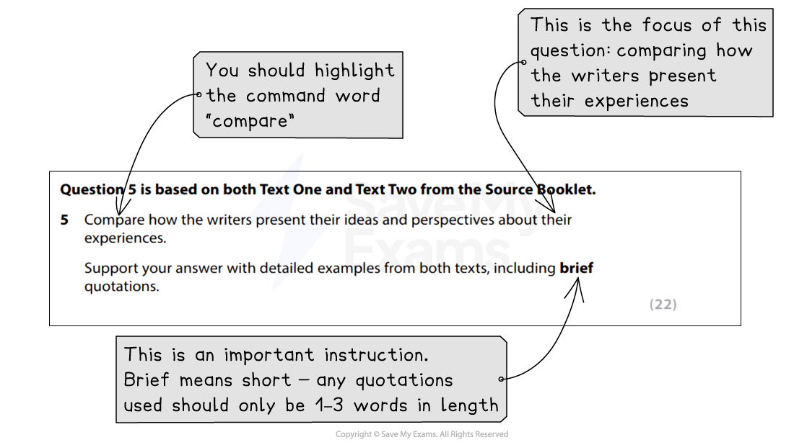

# How to Answer Question 5

Question 5 is a **comparison question** worth **22 marks**. It will be based on **both Text One and Text Two **featured in the source booklet in your exam. It tests **Assessment Objective 3 (AO3)**, which is your ability to compare and contrast subject matter, themes, language choices, narrative voice and perspective, tone and structure across both texts, supporting your points with close textual references and brief quotations from both texts.

The following guide includes:

- **Breaking down the question**
- **Steps to success**
- **Exam tips**

## How to Answer Question 5: Breaking down the question

> **Spec point** — `spcpt_7X98pbhvGtMzXnvQ`

## Breaking down the question

Question 5 has the highest marks of any reading question on Paper 1. It is therefore crucial that you ensure you have **sufficient time to answer this question**, and **read the question carefully**,** highlighting**:

- The **key instructions** in the question, including the command word “compare”
- The **focus of the question** (what specifically you are being asked to compare)

For example:

*Question 5 breakdown*

It is important that you are able to **support the points in your answer** with **close textual references **and **short quotations** from **both texts**. If you only focus on one text, you will not score high marks.

## Steps to success

> **Spec point** — `spcpt_wGzDbzxKsVgqJRqb`

## Steps to success

Following these steps will give you a strategy for answering this question effectively:

1. **Read the question** and **highlight**:

  1. The key instructions and command word
  2. The focus of the question (what specifically you are being asked to compare in the texts)
2. **Re-scan both extracts**:

  1. It is useful to make a plan before writing your answer to this question
  2. In your plan, identify key elements of similarity or difference
3. **Start your answer** by making an **overall comparison statement**:

  1. For example: “Text One and Text Two both describe parental reactions to the writers’ educations. Text One presents a negative experience, whereas Text Two depicts a more positive one.”
  2. This demonstrates to the examiner that you have understood the texts and the question
4. Go into **detail**:

  1. Start **each paragraph** with a **key point **of **similarity or difference**
  2. Then, use **close textual reference** and **short quotations** from **both texts** as evidence for your point
  3. Remember to **compare the writer’s methods**, in terms of their choices of language and/or structure
5. **Sum up**:

  1. Finish your answer with a “So overall…” statement

You are advised to spend **about 40 minutes** on this question (including planning time).

## Exam tips

> **Spec point** — `spcpt_5GwZ5M3JvTkX6CwD`

## Exam tips

This question is the most challenging question in Section A, with the **mark scheme** divided into **5 levels**. To obtain the highest level (Level 5: 19–22 marks), you must:

- Use a **varied range of comparisons **between the texts
- Include **analysis of the writers’ ideas and perspectives**, including their use of language and/or structure, across both texts:

  - However, avoid “feature spotting”
- Ensure your **quotations are relevant and fully support** the points being made
- Refer back to your plan as you write, ticking off the points made
- Make sure that your **introductory paragraph** includes a **precise and focused point of comparison**, rather than just repeating the words of the question
- Your **supporting quotations** should be **brief and embedded** into your sentences:

  - This means not “introducing” your quotations separately, using statements such as “This is shown by the quote…” or just putting a quote on a separate line
- Instead, the quotation should form part of your sentence:

  - For example: “The writer describes time passing ‘relentlessly’, suggesting she feels…”
