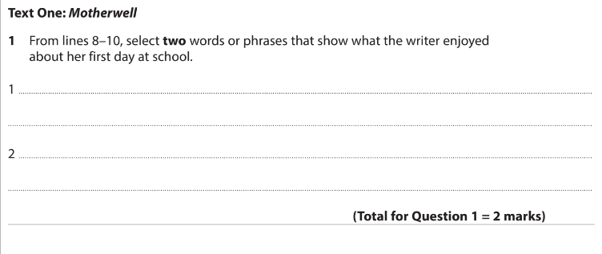
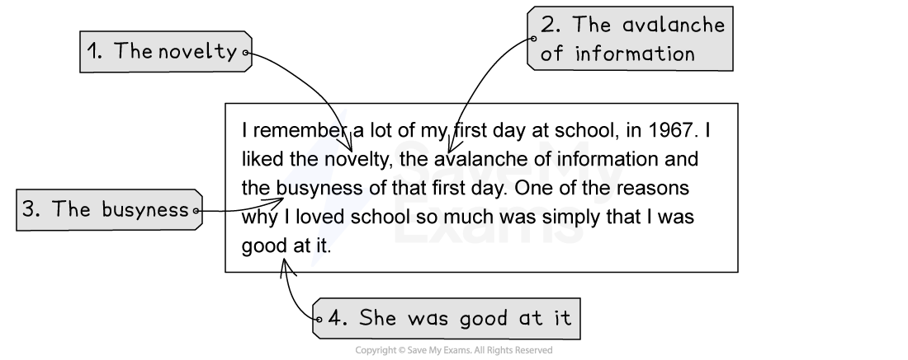

# Question 1: Example

Paper 1 Question 1 is designed to settle you down into the exam. It is only worth **2 marks** and these should be easy marks to pick up.

This guide will show you an example of this question along with suggested answers:

- **Question 1 example**
- **Question 1 suggested answers**

## Question 1 example

> **Spec point** — `spcpt_KkKtCJXykw9vVfVj`

## Question 1 example

*Edexcel IGCSE English Language A Paper 1 Q1 example*

Text One: Lines 8-10:

| I remember a lot of my first day at school, in 1967. I liked the novelty, the avalanche of information and the busyness of that first day. One of the reasons why I loved school so much was simply that I was good at it. |
|---|
|   |
|   |

## Question 1 suggested answers

> **Spec point** — `spcpt_QNzV2z8qRdMRkRGb`

## Question 1 suggested answers

Remember, this is a **short-answer question**, so you do not need to write anything other than the **specific word or phrase that answers the question**. In the example above, you are instructed to select two words or phrases that show specifically what the writer enjoyed about her first day at school.

There are normally up to four possible answers in the given lines, but you only have to write two down for two marks.

*Paper 1 Question 1 example with answers*

You would not be awarded a mark for writing “I loved school so much”, as this does not tell the examiner what specifically the writer enjoyed about it. Remember, it is also not necessary to write out any explanation, or to copy entire lines of the text.
