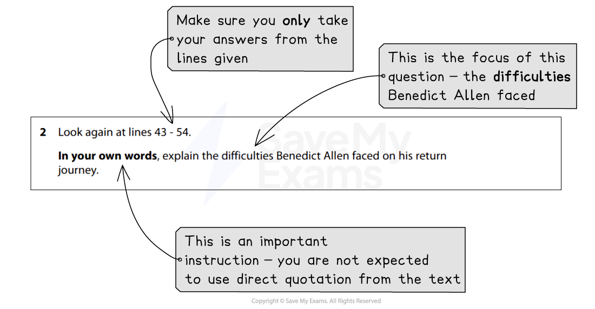

# Question 2: Model Answer

Question 2 is a **short-answer question** that is worth **4 marks**. It will again be based on Text One, the unseen extract, and tests **AO1,** your ability to select and interpret information, and present this information in your own word

The following guide will demonstrate how to answer Question 2. It includes:

- **Example question and text**
- **Question 2 model answer with annotations**
- **Summary**

## Example question and text

> **Spec point** — `spcpt_BMvnHZXKG6CjCW2W`

## Example question and text

Remember, this question will direct you to certain lines of Text One. It is important that you highlight the focus of the question (what you will be looking for in the text).

For example:

*Question 1 example*

Once you have done this, section off the lines of the text and highlight anything that directly answers the question.

For example:

| 'I was **very wet and cold**. By now I was walking through the territory of the Hewa tribe, and met people telling me I couldn't go on.'  Unbeknown to Benedict, a violet feud was raging between the Paiela tribe and Hewa people. Then, **hampered by torrential rain**, he began to **recognise signs of malaria**, which he's had five times before.  'Every night I made a shelter out of palm leaves, but each night there was a **terrible tropical storm which tore through my palm leaves and left me completely soaked through**. I was spending **four hours each night trying to repair the shelter in the mud.'**  When he did sleep, **biting centipedes and poisonous spiders the size of fists crawled around his sleeping bag***.*  But he said the worst peril was **electrical storms **that sent whole trees crashing down 'like a hammer' at night - pulverising everything in their path. |
|---|
|   |
|   |

## Question 2 model answer with annotations

> **Spec point** — `spcpt_CmkryJNjN7gZKPwP`

## Question 2 model answer with annotations

Based on the above question, the following model answer demonstrates how to  summarise the information, in your own words, in order to achieve the full 4 marks:

> **Worked Example**
> *The difficulties Benedict Allen faced on his return journey included suffering from wet weather which made him very cold, as well as extremely heavy rain which further slowed his progress.* He recognised that he was beginning to experience the symptoms of malaria, and every night he would make a shelter which was then demolished by violent storms, so he had to spend up to four hours each night re-building it. *This meant he got very little sleep*. His sleep was also disturbed by insects crawling around his shelter, *and electrical storms would cause trees to come down causing extensive damage to his surroundings.*

## Summary

> **Spec point** — `spcpt_kqXD95SGBf2Qmjyw`

## Summary

- Remember to **read the question carefully** and **highlight**:

  - The instructions (what you have got to do)
  - The focus of the question (what you are being asked to write about)
- It is important that you are able to summarise **mostly in your own words**; do not just copy and paste from the text, or directly quote from the text
- This answer must be **written in paragraph form**, or in **four separate, complete sentences **- do not use bullet points or single words:

  - However, do not spend too long on this question or write too much
  - You can only gain 4 marks so use your time wisely
